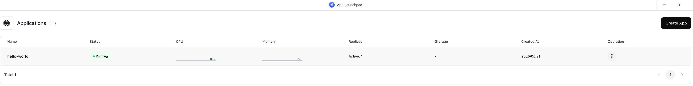
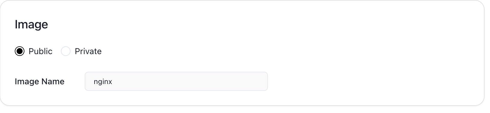
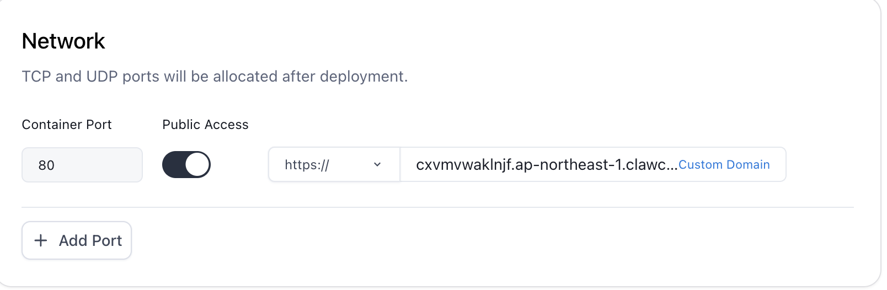
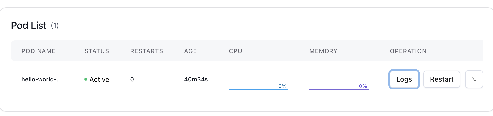

# Claw Cloud
## 優點:
- 一個免費雲端,使用Github帳號註冊可以獲得每月五美金的額
- 部署直接使用Docker image
- 不用自己設置子網(EC2需要),簡單方便部署

## 缺點:
- 伺服器卡頓
- 自由度低,很多設定都是被鎖死的
- 環境基於k8s,config需自行設定configMap,相較於Vercel學習難度較高

# 開始部署

## 準備

- 編寫Dockerfile
```dockerfile
FROM golang:1.24 AS base

WORKDIR /app

COPY go.mod .

RUN go mod download

COPY . .

ARG TARGETARCH
RUN GOARCH=$TARGETARCH go build -o main .

FROM gcr.io/distroless/base

COPY --from=base ./app/main .


EXPOSE 8080

CMD ["./main"]

```

- 將程式build成image

```bash
docker buildx build --platform linux/amd64 -t peter123ouob/iotserver:1.1 .
```

- 將image推送給docker hub

```bash
docker push peter123ouob/iotserver:1.1
```

- 設定CICD時可以使用helm chart來自定義tag

## 開始部署
- 點擊App launchpad後有個create app



- 將image改成剛剛部署到docker hub上的



- 設定Public Network



- 查看server狀態



