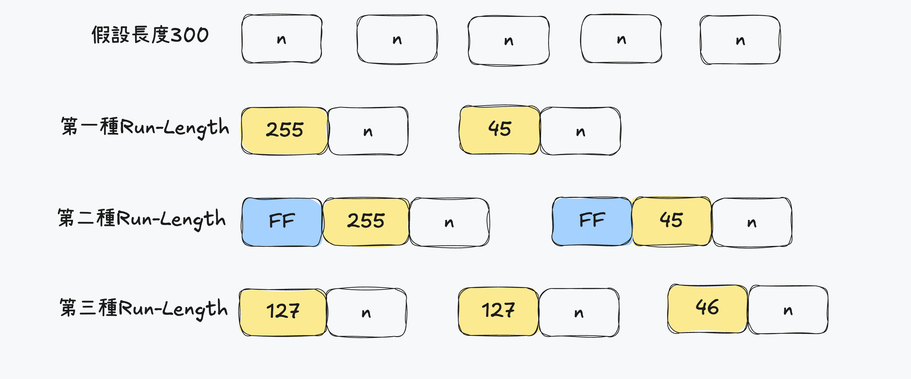

# RunLength
- 簡單來說,RunLength想法就是將遍歷數據統整出現次數和該值再重新寫入
- RunLength 有3種,其中又為第3種最常運用在BMP圖像格式以及PCX等資料格式也會使用這種方法
  1. 基本的RunLength編碼
  2. 插入表示RunLength的碼
  3. 將長度部分作為表示RunLength的碼




## 公用函數

### 讀取準備壓縮文件
```c

#define BUFFER_SIZE 102400

typedef unsigned char byte;

unsigned char buffer[BUFFER_SIZE];

int main(const int argc, char *argv[])
{
  int c;
  if(argc < 3) {
    exit(8);
  }

  FILE *fp_i = fopen(argv[1], "rb");
  if(fp_i == NULL) {
    fprintf(stderr, "Input file cannot open \n");
    exit(8);
  }

  int i = 0;
  while(i<BUFFER_SIZE && (c = fgetc(fp_i)) != EOF) {
    buffer[i] = c;
    i++;
  }

  fclose(fp_i);
  FILE* fp_o = fopen(argv[2], "wb");
  if(fp_o == NULL) {
    fprintf(stderr, "Output file cannot open \n");
    exit(8);
  }
  encode(fp_o,buffer,BUFFER_SIZE);
  fclose(fp_o);
  return 0;
}
```

### 讀取準備解壓縮文件

```c
int main(int argc,char **argv) {
    FILE* fp;
    if ((fp=fopen(argv[1],"rb")) == NULL) {
        fprintf(stderr,"Can't open file %s\n",argv[1]);
        exit(1);
    }

    decode(fp);
    fclose(fp);
    return 0;
}
```

### 獲得資料長度

```c
int getRLE(byte *img,int x,int mx,int lim,int *run,int *code) {
  int px = 0;
  px = x;
  *run = 1;
  *code = img[px];
  px++;
  while (px < mx && *code == img[px] && *run < lim) {
    px++;
    (*run)++;
  }
  return px;
}

```

## RunLength壓縮算法

### 第一種壓縮

```c
int encode(FILE *fp,byte *img,int mx) {
  int run,code;
  int x = 0;

  while (x < mx) {
    x = getRLE(img,x,mx,0xff,&run,&code);
    fputc(run,fp);
    fputc(code,fp);
  }
  return 0;
}

```

### 第一種解壓縮

```c
int decode(FILE *fp) {
    while (!feof(fp)) {
        int run = fgetc(fp);
        int code = fgetc(fp);
        for (int i=0; i<run; i++) {
            fputc(code,stdout);
        }
    }
    return 0;
}
```

### 第二種壓縮

```c
int encode(FILE *fp,byte *img,int mx) {
    int run,code;
    int x = 0;
    while (x < mx) {
        x = getRLE(img,x,mx,0xff,&run,&code);
        if (run < 2) {
            if (code != 0xff) {
                fputc(code,fp);
            }else {
                fputc(0xff,fp);
                fputc(0x01,fp);
                fputc(code,fp);
            }
        }else if (run == 2) {
            if (code != 0xff) {
                fputc(code,fp);
                fputc(0xff,fp);
            }else {
                fputc(0xff,fp);
                fputc(0x02,fp);
                fputc(code,fp);
            }
        }else {
            fputc(0xff,fp);
            fputc(run,fp);
            fputc(code,fp);
        }
    }
    return 0;
}
```

### 第二種解壓縮

```c
int decode(FILE *fp) {
    int c1;
    int run,code;

    while (!feof(fp)) {
        c1 = fgetc(fp);
        if (c1 == EOF) break;
        if (c1 == 0xff) {
            run = fgetc(fp);
            if (run == EOF) break;
            code = fgetc(fp);
            if (code == EOF) break;
            for (int i=0;i<run;i++) {
                fputc(code,stdout);
            }
        }else {
            fputc(c1,stdout);
        }
    }
    return 0;
}
```

### 第三種壓縮

```c
int encode(FILE *fp,byte *img,int mx) {
    int run,code;
    int x = 0;
    while (x < mx) {
        x = getRLE(img,x,mx,0x7f,&run,&code);
        if (run < 2) {
            if (code < 0x80) {
                fputc(code,fp);
            }else {
                fputc(0x81,fp);
                fputc(code,fp);
            }
        }else {
            fputc(0x80 | run ,fp);
            fputc(code,fp);
        }
    }
    return 0;
}

```

### 第三種解壓縮

```c
int decode(FILE *fp) {
    int c1;
    int run,code;

    while (!feof(fp)) {
        c1 = fgetc(fp);
        if (c1 == EOF) break;
        if (c1 > 0x80) {
            run = c1 - 0x80; // c1 = run | 0x80
            code = fgetc(fp);
            if (code == EOF) break;
            for (int i=0;i<run;i++) {
                fputc(code,stdout);
            }
        }else {
            fputc(c1,stdout);
        }
    }
    return 0;
}
```

# 利用資料之分布不均勻來做資料壓縮

## Huffman Tree
- Huffman Tree本質是利用資料出現的頻率來做壓縮

### 定義結構
```c
#include <stdio.h>
#include <stdlib.h>
#include <arm/limits.h>

// data define
#define BUFFER_SIZE 1024
#define TRUE 1

// Huffman tree define
#define N 256
#define NODATA 2100000000
#define DEFAULT_MIN (-100)
#define DEFAULT_CODE_SIZE 100

typedef unsigned char byte;

unsigned char buffer[BUFFER_SIZE];
```

### 公用函數
```c
void encode(FILE *fp,byte *data,int size);

void fputLong(long num, FILE *fp) {
    fputc((num >> 24) & 0xff,fp);
    fputc((num >> 16) & 0xff,fp);
    fputc((num >> 8) & 0xff,fp);
    fputc((num) & 0xff,fp);
}

int main(int argc, char **argv) {
    if (argc < 3) {
        exit(8);
    }

    FILE *fp_i = fopen(argv[1],"rb");
    if (fp_i == NULL) {
        fprintf(stderr,"Input file cannot open \n");
        exit(8);
    }

    int i = 0;
    int c;
    while (i < BUFFER_SIZE && (c=fgetc(fp_i)) != EOF) {
        buffer[i] = c;
        i++;
    }

    fclose(fp_i);

    FILE *fp_o = fopen(argv[2],"wb");
    if (fp_o == NULL) {
        fprintf(stderr,"Output file cannot open \n");
        exit(8);
    }
    encode(fp_o,buffer,i);
    fclose(fp_o);
    return 0;
}
```

### 定義Huffman tree結構

```c
// Huffman tree array
int l_node[2*N],r_node[2*N];
int parent[2*N];
```

```c
int outputHist(const int *hist,const int nn,FILE *fp) {
    for (int i=0;i<nn;i++) {
        fputLong(hist[i],fp);
    }
    return TRUE;
}

void getMin2(const int *hist,const int hm,int *d1,int *d2) {
    int min1 = INT_MAX, min2 = INT_MAX;
    *d1 = *d2 = DEFAULT_MIN;

    for (int i=0;i<hm;i++) {
        if (hist[i] != NODATA && hist[i] < min1) {
            min1 = hist[i];
            *d1 = i;
        }
    }

    for (int i=0;i<hm;i++) {
        if (i != *d1 && hist[i] != NODATA && hist[i] < min2) {
            min2 = hist[i];
            *d2 = i;
        }
    }
}

int makeTree(int *hist, int n) {
    int hm_data = n;
    for (int i=0;i < N*2;i ++) {
        l_node[i] = r_node[i] = parent[i] = 0;
    }

    int d1 ,d2;
    while (TRUE) {
        getMin2(hist,hm_data,&d1,&d2);
        if (d1 < 0 || d2 < 0) break;
        l_node[hm_data] = d1;
        r_node[hm_data] = d2;
        parent[d1] = hm_data;
        parent[d2] = hm_data;
        hist[hm_data] = hist[d1] + hist[d2];
        hist[d1] = NODATA;
        hist[d2] = NODATA;
        hm_data++;
    }
    return hm_data;
}

static int bits = 0;
static int bdata = 0;

void fputReset() {
    bits = 0;
    bdata = 0;
}

void fputBit(int bit,FILE *fp) {
    bdata = (bdata << 1) | bit;
    bits++;
    if (bits >= 8 ) {
        fputc(bdata,fp);
        fputReset();
    }
}

void flushBit(FILE *fp) {
    if (bits > 0) {
        while (bits < 8) {
            bdata <<= 1;
            bits++;
        }
        fputc(bdata,fp);
        fputReset();
    }
}

void outpurEncode(int val,int end,FILE *fp) {
    int c = 0;
    int code[DEFAULT_CODE_SIZE];

    int cur = val;
    // 利用樹的可逆性
    while (parent[cur] != 0 ) {
        int p = parent[cur];
        if (l_node[p] == cur) {
            code[c++] = 0;
        }else if (r_node[p] == cur) {
            code[c++] = 1;
        }else {
            fprintf(stderr,"this node is not belong to parent node \n");
            exit(1);
        }
        cur = p;
    }

    for (int i = c-1;i >= 0;i--) {
        fputBit(code[i],fp);
    }
}

void encode(FILE *fp,byte *data,int size) {
    int hist[N*2];
    for (int i=0;i<N*2;i++) hist[i] = 0;
    for (int i=0;i<size;i++) hist[data[i]]++;
    fputLong(size,fp);
    outputHist(hist,N,fp);
    int datas = makeTree(hist,N);
    fputReset();
    for (int i=0;i<size;i++) {
        outpurEncode(data[i],datas,fp);
    }
    flushBit(fp);
}
```
