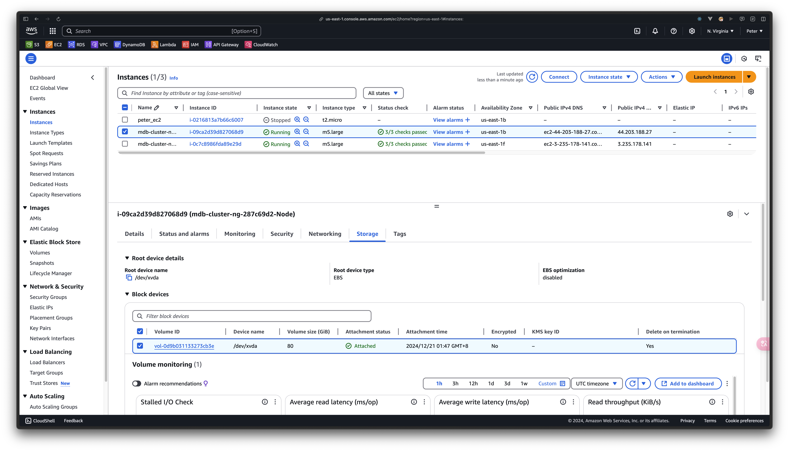
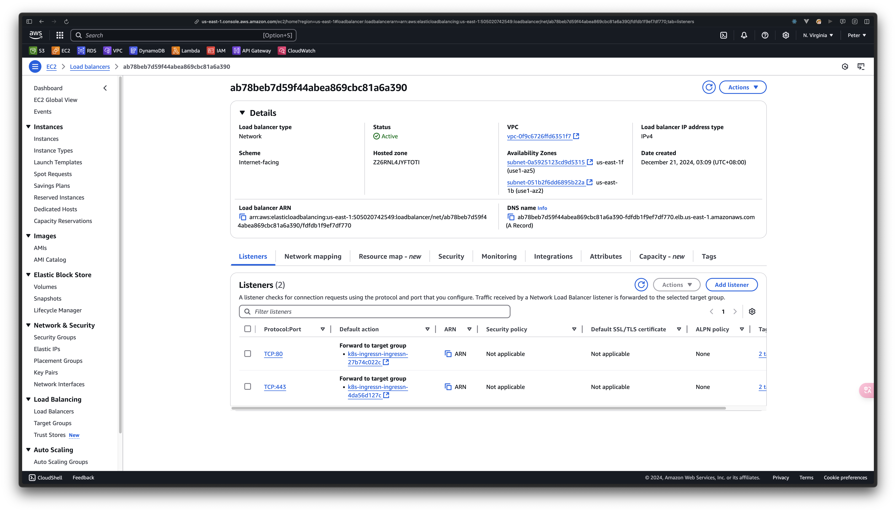
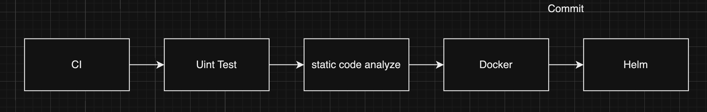
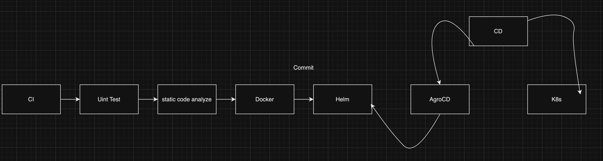
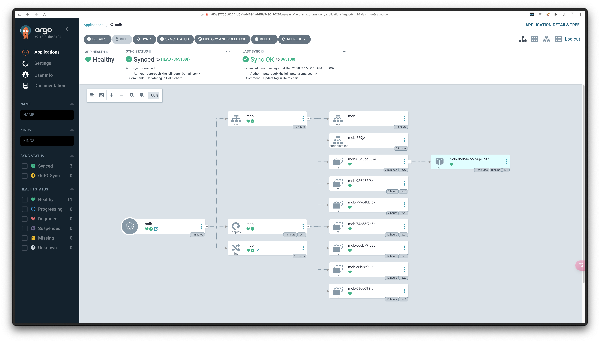

## List

1. Use Kubernetes to deploy the environment `EKS cluster`
2. Use Docker to build the image for program `image`
3. Use gitOPS to build the CICD stream

- CI:Git action
- CD:GITOPS `ArgoCD`

4. EC2 to push the website on domain with nginx to load balance
5. Helm Chart to manage the environment

## Flow Chart

```text
Ingress control -> LoadBalance(DNS) -> Export
```

## DockerFile編寫

- base 當作基礎,使用gcr小化image
- 需要依照部署環境build執行檔
  - amd or arm
- example for linux

```shell
 docker buildx build --platform linux/amd64 -t peter123ouob/mdb:v1.2 .
```

```Dockerfile
FROM golang:1.23 AS base

WORKDIR /app

COPY go.mod .

RUN go mod download

COPY . .

RUN go build -o main .

FROM gcr.io/distroless/base

COPY --from=base /app/main .

EXPOSE 8089

CMD ["./main"]
```

### build and push

```bash
docker build -t peter123ouob/mdb:v1 .
docker push peter123ouob/mdb:v1
```

## Kubernetes邊寫

- 使用manifest規格編寫,而不是直接部署在pod上,避免無法使用副本集控制器部署

  1. deployment

  ```yaml
  apiVersion: apps/v1
  kind: Deployment
  metadata:
  name: mdb
  labels:
    app: mdb
  spec:
  replicas: 1
  selector:
    matchLabels:
      app: mdb
  template:
    metadata:
      labels:
        app: mdb
    spec:
      containers:
        - name: mdb
          image: peter123ouob/mdb:v1
          ports:
            - containerPort: 8089
  ```

  2. service

  ```yaml
  apiVersion: v1
  kind: Service
  metadata:
  name: mdb
  labels:
    app: mdb
  spec:
  ports:
    - port: 80
      targetPort: 8089
      protocol: TCP
  selector:
    app: mdb
  type: ClusterIP
  ```

  3. Ingress

  ```yaml
  apiVersion: networking.k8s.io/v1
  kind: Ingress
  metadata:
  name: mdb
  annotations:
    nginx.ingress.kubernetes.io/rewrite-target: /
  spec:
  ingressClassName: nginx
  rules:
    - host: peterdefer0822.store
      http:
        paths:
          - path: /
            pathType: Prefix
            backend:
              service:
                name: mdb
                port:
                  number: 80
  ```

### 創建cluster

- 可以使用aws的cloudfront查看stack和log

```shell
 eksctl create cluster --name mdb-cluster --region us-east-1
```



### apply k8s

```shell
kubectl apply -f deployment.yaml
kubectl apply -f service.yaml
kubectl apply -f ingress.yaml
```

### k8s get

```shell
kubectl get node # 查看node
kubectl get ing # 查看正在運行服務
kubectl get svc # 查看svc
kubectl get svc -n [namespace] # 查看特定namespace
kubectl get nodes -o wide
kubectl get logs [name from pods] # 查看logs
kubectl get deploy # 查看部署檔
```

### 更改node

```shell
kubectl edit svc mdb
```

1. 將type從ClusterIP變為NodePort,目的是讓cluster產生的兩個ec2都能訪問
2. 使用kubectl get pods拿到NodePort 映射的port
3. 使用kubectl get nodes -o wide拿到外部訪問IP

## Nginx control ingress

- 安裝ingress control

```shell
 kubectl apply -f https://raw.githubusercontent.com/kubernetes/ingress-nginx/controller-v1.12.0-beta.0/deploy/static/provider/aws/deploy.yaml
```

- 查看獲得name

```shell
kubectl get pods -n ingress-nginx
```

- edit

```shell
 kubectl get edit -n ingress-nginx-controller-6568cc55cd-gnpmp -n ingress-nginx
```



### 配置Nginx

- 使用kubectl get ing 拿到Address訪問後發現是404,原因為配置ingress yaml時使用nginx映射到host
- 因此需要拿到Address的IP並且將她映射到設定的host上才行

1. netlookup Address
2. sudo vim /etc/hosts 新增映射

- example

```text

44.123.22.1 helloworld.com

```

## Helm

- 使用helm可以將docker image的tag變成類似變數的形式,取代在deployment yaml下的硬編碼

### 安裝

```shell

brew install helm
helm version # 注意golang version

```

### 建立helm應用

```shell
helm create mdb-chart
cd helm
```

- helm 中主要有三個檔案

  1. Chart yaml

     - 提供圖表數據,可以假定為元數據

  2. values yaml

  - 內容將被template當變數使用

  ```yaml
  # values.yaml
  replicaCount: 1

  image:
    repository: peter123ouob/mdb
    pullPolicy: IfNotPresent
    tag: "10008891570"

  ingress:
    enabled: false
    className: ""
    annotations: {}
    hosts:
      - host: chart-example.local
        paths:
          - path: /
            pathType: ImplementationSpecific
  ```

  3. template

     - 建議使用k8s的manifest取帶原先全部內容

  - 更改後的內容

  ```yaml
  # deployment.yaml
  apiVersion: apps/v1
  kind: Deployment
  metadata:
  name: mdb
  labels:
    app: mdb
  spec:
  replicas: 1
  selector:
    matchLabels:
      app: mdb
  template:
    metadata:
      labels:
        app: mdb
    spec:
      containers:
        - name: mdb
          image: peter123ouob/mdb:{{ .Values.image.tag }}
          ports:
            - containerPort: 8080
  ```

## CICD

- CI最後由Helm產生的版本資訊會被CD抓取並部署到k8s cluster

### CI flowchart



### CD flowchart



## write the git action

```yaml
name: CI

on:
  push:
    branches:
      - main
    paths-ignore:
      - "helm/**"
      - "k8s/**"
      - "README.md"
  pull_request:
    branches:
      - main

jobs:
  build:
    runs-on: ubuntu-latest

    steps:
      - name: Checkout repo
        uses: actions/checkout@v4
      - name: Set up Go 1.23
        uses: actions/setup-go@v4
        with:
          go-version: 1.22
      - name: Build
        run: go build -o mdb
      - name: Test
        run: go test ./...

  code-quality:
    runs-on: ubuntu-latest

    steps:
      - name: Checkout repo
        uses: actions/checkout@v4
      - name: Run golangci-lint
        uses: golangci/golangci-lint-action@v6
        with:
          version: v1.56.2

  push:
    runs-on: ubuntu-latest
    needs: build

    steps:
      - name: Checkout repository
        uses: actions/checkout@v4
      - name: Set up Docker Buildx
        uses: docker/setup-buildx-action@v3
      - name: Login to DockerHub
        uses: docker/login-action@v3
        with:
          username: ${{ secrets.DOCKERHUB_USERNAME }}
          password: ${{ secrets.DOCKERHUB_TOKEN }}
      - name: Build and Push action
        uses: docker/build-push-action@v6
        with:
          context: .
          file: ./Dockerfile
          push: true
          tags: ${{ secrets.DOCKERHUB_USERNAME }}/mdb:${{ github.run_id }}

  update-newtag-in-helm-chart:
    runs-on: ubuntu-latest
    needs: push

    steps:
      - name: Checkout repo
        uses: actions/checkout@v4
        with:
          token: ${{ secrets.TOKEN }}
      - name: Update tag in Helm chart
        run: |
          sed -i 's/tag: .*/tag: "${{ github.run_id }}"/' helm/mdb-chart/values.yaml
      - name: Commit and push changes
        run: |
          git config --global user.email "hellolinpeter@gmail.com"
          git config --global user.name "peterouob"
          git add helm/mdb-chart/values.yaml
          git commit -m "Update tag in Helm chart"
          git push
```

- 如果成功的話可以在DockerHub中找到最新創建的image且tag和最新版本的repo中helm的Values yaml裡面的一樣

## ArgoCD

### install

```shell
kubectl create namespace argocd
kubectl apply -n argocd -f https://raw.githubusercontent.com/argoproj/argo-cd/stable/manifests/install.yaml
```

### access UI

```shell
kubectl patch svc argocd-server -n argocd -p '{"spec": {"type": "LoadBalancer"}}'
```

### Get the Loadbalancer service IP

- 獲得ip後要等LoadBalance配置完成才能存取

```shell
kubectl get svc argocd-server -n argocd
```

### login ArgoCD

```text
username:admin
password另外獲得
```

#### get password

```shell
kubectl get secrets -n argocd # 獲得服務
kubectl edit secret argocd-initial-admin-secret -n argocd # 查看服務設定檔
echo [password] | base64 --decode # 解碼密碼後的才是
```

## 配置ArgoCD

- 設置selfHeal是由於我們syncPolicy設為automated,但假設今天手動訪問部署檔並更動,發生錯誤時ArgoCD會自動修復

```yaml
apiVersion: argoproj.io/v1alpha1
kind: Application
metadata:
  name: mdb
  finalizers: []
spec:
  destination:
    name: ""
    namespace: default
    server: https://kubernetes.default.svc
  source:
    path: helm/mdb-chart
    repoURL: https://github.com/peterouob/gocloud.git
    targetRevision: HEAD
    helm:
      valueFiles:
        - values.yaml
  sources: []
  project: default
  syncPolicy:
    automated:
      prune: false
      selfHeal: true
```


