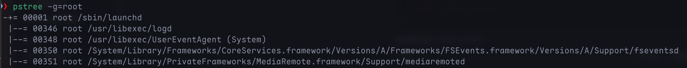
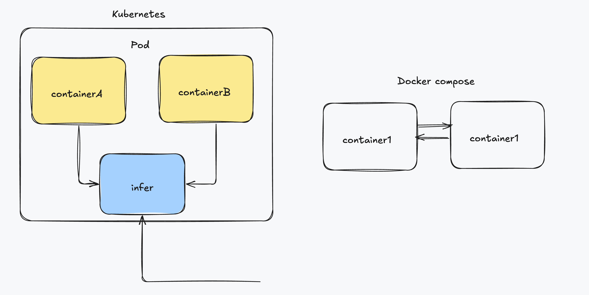

# Why pod ?
- 在學習kubernetes的時候,第一個接觸到的componment就是pod,但既然已經有container那為什麼又要需要pod呢

## 為什麼我們需要Pod
- 由container的觀念不難發現,其實container本質就是process,那既然k8s是由多個container組合而成,就不難將他視為一個os
- 使用linux 指令下的 `pstree -g=root` 可以發現 process並不是單獨執行,而是有一個組相互協作的


### 關鍵問題
- 假測現在k8s上有兩個叢集分邊是node-1 3GB, node-2 2.5GB 現在需要配置3個container
- 使用Docker Swarm並且設定 `affinity=main` 來模擬在同台機器上執行
```bash
docker run main # 需要1GB
docker run imklog # 需要1GB
docker run imuxsock # 需要1GB
```
- 這三個container都會進入Swarm queue然後main和imklog都先後出隊並調度到node-2上
- 當imuxsock出隊並開始被調度時,因為node-2上只剩下0.5GB,因此沒辦法執行imuxsock
  - 但因為設定了 `affinity=main` 因此imuxsock又只能在node-2上執行

* 這就是一個典型的成組調度(gang scheduling)沒有妥善處理的範例
* 在k8s中因為pod為k8s的原子調度單位,這就意外k8s中的調度器是依照Pod而非容器資源需求進行計算的
  * 像是imklog,imuxsock和main函數主process這樣得3個container正是一個典型由3個container組成的pod

## Pod是如何被建立出來的
- 回想pod的作用,剛剛由3個container組成的pod可被當成一個**超親密**關係,這些關係的典型特徵包括但不限於
  1. 互相之間會發生直接的檔案交換
  2. 使用localhost或socket進行通訊
  3. 發生頻繁的遠端呼叫
  4. 需要共享Linux namespace

- 除了這些超輕密關係,k8s中的pod更重要的意義是在container的設計模式
- 而關於Pod最重要的事實莫過於他只是一個邏輯概念,也就是說k8s真正處理的還是素主機上Linux container的Namespace和Cgroups,並不存在Pod的邊界或者隔離環境

### Pod 的建立
- Pod建立其實只是共享了某些容器的資源,具體來說,Pod裡面的所有容器都共享一個Network Namespace,並且可以宣告共享同一個Volumn
- 不過假設有兩個容器A,B不就可以看成兩個container然後進行共享資源即可嗎
```bash
docker run --net=b --volumes-from=b --name=a image-a ...
```
- 不過觀察上面的docker啟動,他需要先啟動container b才可以進行共享,因此就違反了Pod中所有container皆為對等關係(此處為拓樸關係)
- 因此k8s裡pod實現需要一個中間容器,這個容器叫**infra**,在pod中永遠第一個被建立,並且其他容器已Join Network Namespace的方式與Infra container關聯在一起
  - Infra容器為一個叫k8s.gcr.io/pause的鏡像,永遠處在暫停且大小非常小的container
- 當Infra容器**hold** Network Namespace後,其他容器就可以加入Infra container的Network namespace,這也意味著對Pod裡的Container A和Container B而言
  1. 他們可以直接使用localhost 通訊
  2. 他們看到的網路裝置和Infra看到的一樣
  3. 一個Pod只有一個IP,這個IP就是Pod中Network Namespace 對應的IP位址
  4. 所有網路資源都是一個Pod一份,並且被該Pod中的容器共享
  5. Pod生命週期跟Infra一樣,與其他container無關

- 和docker container比較


## 容器設計模式

### WAR包與WEB伺服器
- 假設現在有Java web 應用程式的WAR包並且需要放在Tomcat的webapps目錄下執行,在docker的情況下該如何做呢
	1. 把WAR包放在Tomcat image的webapps目錄下當成新的image
		- 如過要升級image的話就要重新製作一個image
	2. 不管WAR包,擁有只發佈一個Tomcat container,不過webapps目錄必須宣告一個hostPath類型的Volume,讓素主機上的WAR包掛載進Tomcat下執行
		- 如何讓每台宿主機都預先準備好儲存WAR包的目錄
- 使用Pod的話問題就好解決,可以把WAR和Tomcat分別做成image然後用Pod組合
```yaml
	apiVVersion: v1
	kind: Pod
	metadata:
		name: javaweb-2 # war
	spec:
		initContainers:
		- image: geektime/sample:v2
			name: war
			command: ["cp","/sample.war","/app"]
			volumeMounts:
		- mountPath: /app
			name: app-volume
		containers:
		- image: geektime/tomcat:7.0
		  name: tomcat
      command: ["sh","-c","/root/apache-tomcat-7.0.42-v2/bin/start.sh"]
      volumeMounts:
      - mountPath: /root/apache-tomcat-7.0.42-v2/webapps
      name: app-volume
      ports:
      - containerPort: 8080
        hostPort: 8081
    volumes:
    - name: app-volume
      emptyDir: {}
```

- 在這pod中定義了兩個container,第一個只有WAR包放在跟目錄,第二個則是標準Tomcat
- WAR包在這邊並非普通的container,而是一個initContainers,在pod中initContainers定義的容器會比spec.containers定義的使用者容器先啟動,並且initContainers容器會和順序逐一啟動,而使用者容器會等initContainers都啟動並且退出才啟動(保證了使用者容器不會遇到依賴容器還沒啟動就啟動的問題,類似docker container的deps)

### 執行pod流程
1. initContainers類型的WAR包容器啟動後,將application複製到/app目錄下後退出,因此/app目錄就掛載了一個叫app-volume的Volume
2. Tomcat也同樣宣告了app-volume到自己的webapps目錄下
3. 等Tomcat啟動時,他的webapps目錄下就一定存在sample.war檔案,這檔案是WAR container啟動時複製到這個Volume的,而這一個Volume被兩個container共享

- 這樣就用組合的方式解決了WAR包與Tomcat容器間的耦合關係問題
- 在這範例中,Tomcat為我們的主容器,而WAR包容器的存在只是為了提供WAR包而已,所以用initContainers的方式優先執行WAR包容器,扮演了一個sidecar的角色

### 容器的日誌收集
- 現在有一個應用程式需要不斷把日誌檔案輸出到container的/var/log目錄中
- 這時就可以很直覺的想到使用pod然後共享目錄的方式來解決

1. 把一個pod裡的volume掛載到應用程式container的/var/log上
2. 在pod裡執行一個sidcar container,他也宣告同一個volume在自己的/var/log目錄上

- 這樣sidcar container只需要不斷地從自己的/var/log中讀取log轉發到MongoDB or Elasticsearch中儲存即可

## Pod的本質
- Pod實際上是扮演蟲桶基礎設施裡**虛擬機**的角色,容器則是這個虛擬機裡執行的**使用者程式**
- 因此將傳統應用程式架構到微服務自然的過度方式應該是
1. 分析哪些porcess(componment)在這個虛擬機完成
2. 把整台虛擬機想成pod
3. 把process想成container image,並將具有順序性的定義成為Init Container

- 藉由上述的方法可以避免強行將應用程式塞入container中,甚至使用docker-in-docker的方法

# 深入理解pod

