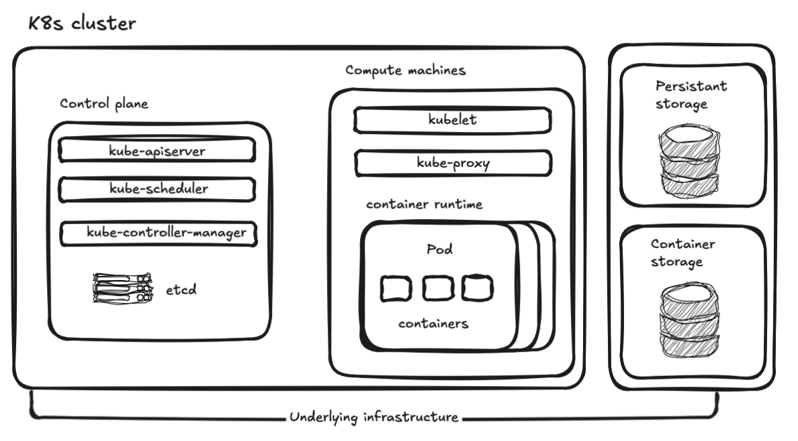
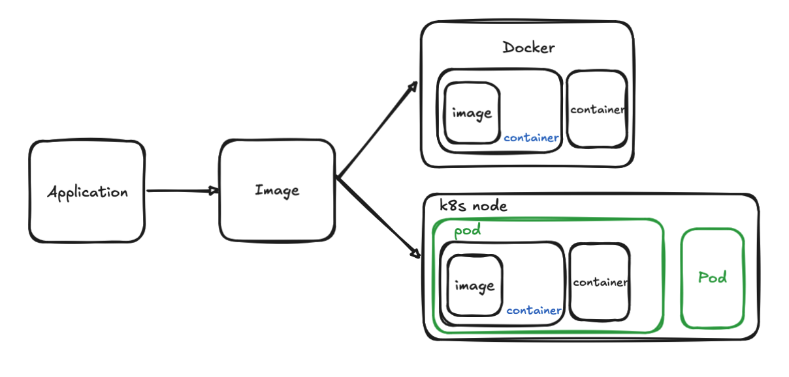

# 用Kind創建k8s cluster

- 假如某個服務器掛了,需要將上面的服務移植到其他服務器
- 為了部署k8s需要拿一個server當作Control plane
  - 當作主節點master,控制cluster和維護
  - 對k8s進行任務都會經過Control plane
- 要發送命令會先給Control plane 再發送給Compute machines
- 一個pod可以部署多個container

- 每一個Compute machines可以部署多個pod
  - 每一個pod可以部署多個container
  - container 裡面執行我們的應用程式

- 在只有一台電腦的情況下使用Kind來模擬多服務器
  - 原理就是用docker上的container來模擬多台server

- k8s中的所有資源接稱為resource,包括pod,service,ingress等等
  - 每一個resource都有一個name

- k8s支持多個namespace,底下的name不能重複,不使用namespace即為使用default
- 在高可用情況下會部署多個container plane並在上層增加代理,讓代理先接收資料
  - 多個container plane避免單點故障發生



## 使用kind部署最小cluster

- 每個node本質上使用docker模擬

```yaml
apiVersion: kind.x-k8s.io/v1alpha4
kind: Cluster
name: dqq
nodes:
  - role: control-plane
  - role: worker
  - role: worker
```

- 創建cluster
```bash
kind create cluster --config cluster-dqq.yaml
```

- 查看cluster狀態
```bash
kubectl cluster-info --context kind-dqq
```

## 部署服務



1. 再docker中建立image
```bash
docker build -t blog:v1.0.0 ./blog
```
2. 將docker上的image導入k8s
```bash
kind load docker-image blog:v1.0.0 --name dqq
```
3. 部署程式
```yaml
apiVersion: apps/v1
kind: Deployment

# 描述Deployment本身的
metadata:
  name: dep-blog #deploy name
  labels: #可以透過labe選擇resource
    app: blog

spec: #詳細描述
  replicas: 2 #副本數量
  selector: # 透過selector選擇resource,讓他被deployment調度
    matchLabels:
      app: blog #假設有兩個pod而他們的label都是app: blog的話,這兩個pod都會被調度,也就是都會有兩個副本
  template: #設定pod的訊息
    # 描述Pod本身的
    metadata:
      labels:
        app: blog #pod的label,這個label會被selector選擇
    spec: #pod的詳細描述
      containers: #pod裡面包含的容器,此為數組,可以有多個pod
        - name: blog #容器名稱
          image: blog:v1.0.0 #容器使用的映像檔
          imagePullPolicy: IfNotPresent #如果映像檔不存在,則拉取映像檔,反之則不進行拉曲
```
- 執行k8s命令,會先被control plane接收再分配
```bash
kubectl apply -f blog.yaml
```
- 獲得pod內容
```bash
kubectl get pod
kubectl get pod -o wide #獲得詳細內容
```

## service
- 現在有個問題是k8s內的服務如果因為錯誤導致pod重啟時,ip也會跟著變動,因此我們需要使用service來固定pod的ip,儘管他遭到刪除等問題后重啟,ip依然不變
