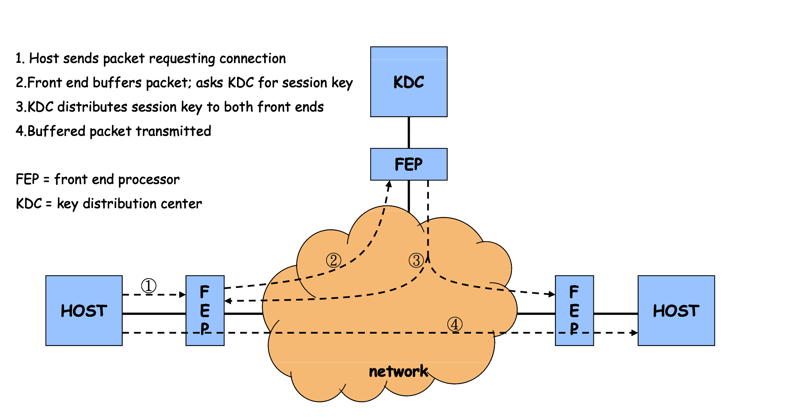
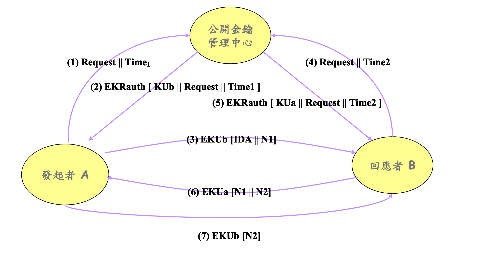
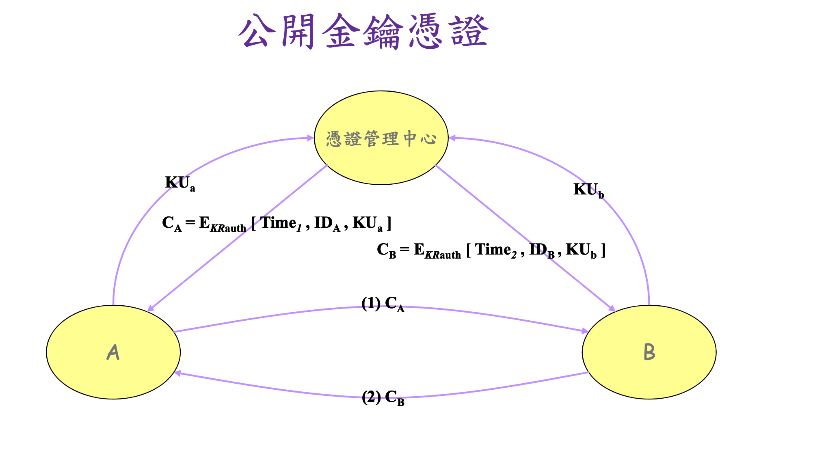
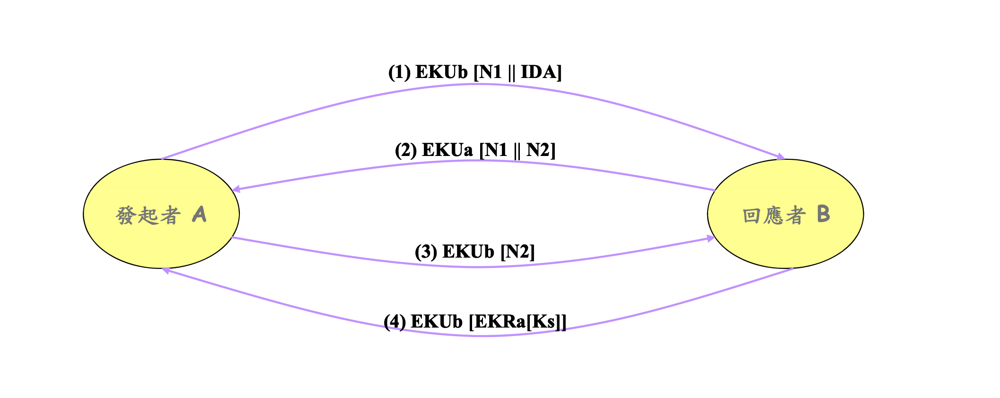

# 密碼學基礎

## 加密基本概念
- 利用某種方式將資訊打散,避免無權檢視資料內容的人檢視,並且允許獲得授權的人(擁有key)才看得了內容

## 安全服務
1. 機密性confidentiality: 不論是在傳輸或儲存中都可以利用加密隱藏資訊
2. 完整性integrity: 不論在傳輸或儲存中都可以利用加密確認資訊的完整性
3. 可說明性accountability: 加密可以用來確認資訊的來源,且可讓資訊的來源無法否認資訊的出處

## 專有名詞
1. 原文plaintext: 資訊的原始格式
2. 密文chipertext: 透過加密algo輸出的資訊
3. 演算法algorithm: 將原文處理成密文的運算法則
4. 金鑰key: 與原文無關的樹幟,可將原文轉成密文或將密文轉乘原文的過程中,協助演算法計算得資料
5. 加密encryption: 將原文經加密運算轉成密文的程序
6. 解密decryption: 為加密的逆運算,將密文轉成原文的程序

## 對稱式加密vs非對稱式加密
|         | 對稱加密（Symmetric Encryption） | 非對稱加密（Asymmetric Encryption） |
|---------|----------------------------|------------------------------|
| 金鑰數量    | 單一金鑰，用於加密與解密               | 一對金鑰（公開金鑰 + 私密金鑰）            |
| 加密/解密方式 | 兩方共享相同的金鑰                  | 公開金鑰加密，私密金鑰解密；或私密金鑰簽章，公開金鑰驗證 |
| 速度      | 加解密速度快，適合大規模數據加密           | 計算較慢，適合金鑰交換、身份驗證             |
| 安全性     | 若金鑰洩漏，所有通訊皆可被解密            | 只需保護私密金鑰，公開金鑰可自由分享           |
| 用途      | 加密大量數據、VPN、磁碟加密            | 數位簽章、SSL/TLS 金鑰交換、身份驗證       |

### 對稱加密
- 優點
  1. 運算效率高：加密與解密的計算量較小，適合處理大量數據。
  2. 密文較短：相比非對稱加密，對稱加密的密文較小，節省存儲與傳輸資源。
  3. 適合大量數據加密：應用於磁碟加密、VPN、HTTPS 會話加密等。

- 缺點
  1. 金鑰分發困難：雙方必須安全地交換金鑰，管理不當易遭竊取。
  2. 無法驗證身份：雙方使用相同金鑰，無法確保訊息發送者的真實身份。
  3. 金鑰外洩風險高：一旦金鑰被攻擊者獲取，所有訊息皆可解密。

| 演算法                               | 金鑰長度                | 特點              |
|-----------------------------------|---------------------|-----------------|
| AES（Advanced Encryption Standard） | 128 / 192 / 256-bit | 最廣泛使用，高安全性      |
| DES（Data Encryption Standard）     | 56-bit              | 已淘汰，因金鑰過短易被破解   |
| 3DES（Triple DES）                  | 112 / 168-bit       | DES 加強版，但運算速度較慢 |
| ChaCha20                          | 256-bit             | 適合移動設備，運行效率高    |
| Blowfish                          | 32–448-bit          | 靈活但較舊，適合低運算能力設備 |

### 非對稱加密
- 優點:
  1. 無需共享密鑰：公開金鑰可自由傳播，避免密鑰交換的風險。
  2. 可驗證身份：使用私密金鑰簽署，公開金鑰驗證，可用於數位簽章與身份驗證。
  3. 安全性較高：即使公開金鑰被攔截，攻擊者無法解密訊息。

- 缺點
  1. 運算速度慢：加解密計算量大，適合小規模數據傳輸與金鑰交換。
  2. 密文較長：相對於對稱加密，密文體積較大，影響傳輸效率。
  3. 不適合大規模數據加密：通常搭配對稱加密使用，如 TLS 先用非對稱加密交換對稱金鑰，再用對稱加密進行通訊。

| 演算法                              | 金鑰長度                   | 特點                       |
|----------------------------------|------------------------|--------------------------|
| RSA                              | 1024 / 2048 / 4096-bit | 最常見，安全性高但運算較慢            |
| ECC（Elliptic Curve Cryptography） | 160–512-bit            | 金鑰短但安全性與 2048-bit RSA 相當 |
| Diffie-Hellman（DH）               | 1024 / 2048-bit        | 用於金鑰交換，不直接加密數據           |
| DSA（Digital Signature Algorithm） | 1024 / 2048-bit        | 適用於數位簽章，較少用於加密           |
| EdDSA（Edwards-Curve DSA）         | 256 / 448-bit          | 高效、安全性強                  |

### 應用場景
| 應用              | 對稱加密（AES、ChaCha20） | 非對稱加密（RSA、ECC）            |
|-----------------|--------------------|---------------------------|
| 網絡通信（HTTPS、TLS） | 加密數據傳輸        | 金鑰交換與身份驗證          |
| VPN             | AES、ChaCha2 | 用 Diffie-Hellman 交換密 |
| 文件加密（磁碟、資料庫）    | AES、Blowfish    | 不適合大數據          |
| 數位簽章與身份驗證       |無法驗證身份          | RSA、ECC、EdDSA     |
| 區塊鏈與加密貨幣        |不適用             | CC、EdDSA             |

# 金鑰管理
## 金鑰分配Key Distribution
- 金鑰管理可參考**ANSI X9.17**管理項目包括
  1. 系統角色role
  2. 金鑰產生及檢測
  3. 金鑰符記token格式
  4. 金鑰註銷cancellation
  5. 金鑰回覆recovery
  6. 金鑰封存機制

### 金鑰分配只將共用金鑰送到要交換資訊的雙方,而不會讓別人知道
- 需要有一安全方法(秘密管道)提供金鑰的分送
- 其中有四種金鑰分配的方式
1. 手動方式
2. 自動化方式的金鑰分配

## 連線導向的金鑰分配
- 適用於分散式網路自動化方式的金鑰分配
- 執行步驟
1. 某一主機送出request連線封包
2. 前端處理器(Front-end processor,FEP)將封包暫存並向金鑰分發中心(Key Distribution center,KDC)要求連線金鑰
3. KDC將運用**永久的(私密)金鑰**(premanent key)產生通訊金鑰,並分配至兩端的FEP
4. FEP運用通訊金鑰金之前暫存的連線封包加密後傳送出去

### 缺點
- 採用私密金焰產生通訊金右,隨通訊點增加而需保管過多的私密金鑰,n點要保管$n(n-1)/2$個私密金鑰,易造成安全漏洞

## 公開金鑰
- 使用以下方法達成
1. 公開聲明
  - 將公開金鑰送給其他接收者,或是廣播金鑰
  - 弱點是怕被偽造,然後其他人的公開金鑰
2. 公用目錄
  - 公用目錄中註冊金鑰達到更高安全性**注意個資法**
  - 缺點是人然受到竊聽或偽裝威脅
3. 公開金鑰管理中心
  - 加強對目錄控管強化金鑰分送的安全性
  - 具有公用目錄的特性
  - 使用者必須知道目錄的公開金鑰才可以透過目錄取得所需的公開金鑰,因此需要金鑰時即時存取目錄即可

4. 公開金鑰憑證
  - 藉由憑證即可不需要即時存取公開金鑰管理中心的情況交換金鑰
  - 憑證將使用者資料和公開金鑰連結一起
  - 憑證內容必須由可靠的公開金鑰或憑證管理中心CA簽署
  - 任何知道公開金鑰管理中心裡的公開金鑰即可驗證此憑證

### 公開金鑰發送秘密金鑰
- 可用來確保秘密金鑰傳輸時的安全性與確認性
  - 但公開金鑰演算法都很慢
- 用祕密金鑰加密法來保護訊息內容通常不會直
接將祕密金鑰作加密，因為可能遭破解，故需要
一把通訊金鑰一把通訊金鑰(session key)
- 協調出通訊金鑰
  1. 簡易秘密金鑰分送法
  2. Diffie-Hellman金鑰交換Diffie Hellman金鑰交換

### 簡易秘密金鑰分送法
- 問題在可能被攔截

### Diffie-Hellman金鑰交換
1. 選擇公有參數
- 兩個用戶（假設為Alice和Bob）首先選擇一個大素數 $p$ 和一個生成元 $g$（這些可以是公開的)
2. 生成秘密金鑰
- Alice 隨即選擇一個私密金鑰 $a$，Bob 隨即選擇一個私密金鑰$b$。這些私密金鑰必須保持秘密。
3. 計算公開金鑰
- Alice 計算他的公開金鑰$A = g^a mod p$ 併發送給Bob
- Bob 計算他的公開金鑰$B= g^b mod p$併發送給Alice
4. 計算共享金鑰
- Alice 接受到公開金鑰B後使用自己的私鑰a計算共享金鑰$S = B^a mod p$
- Bob 接收到公開金鑰A後使用自己的私鑰b計算公享金鑰$S = A^b mod p$

## 共同產生金鑰協定的安全需求
- 一個可靠的金鑰協議需滿足以下安全需求，確保金鑰的安全使用
1. 已知金鑰安全性（Known-key security）
  - 即使一方已知道共享金鑰的某部分資訊，也無法有效推導出其他金鑰或秘密。
2. 完美前推安全性（Perfect forward secrecy）
  - 即使當前的金鑰被劫取，過去的通信記錄仍然保持匿名，另一方無法解碼。
3. 金鑰洩漏模仿安全性（Key-compromise impersonation security
  - 在私密金鑰洩漏的情況下，防止攻擊者偽裝成原用戶進行敏感通信。
4. 未知金鑰分享安全性（Unknown key-share security）
  - 用戶在無法預測或識別對方的私密金鑰的情況下，能安全共享金鑰。
金鑰支配安全性（Key control security）：意味著用戶必須對其使用的每把金鑰有完全的控制，並能防止未授權訪問

## 總結

### 1. 四種分送公開金鑰的一般架構
- 公用目錄（Public Directory）
  公開金鑰存放於一個可信的目錄，供使用者查詢

- 公開金鑰基礎設施（Public Key Infrastructure, PKI）
  透過憑證授權中心（CA）發行並管理公開金鑰憑證

- 基於網路的金鑰分送（Web of Trust）
  使用者彼此簽署並信任彼此的金鑰（如 PGP 模型）

- 透過金鑰分發中心（Key Distribution Center, KDC）
  集中式的金鑰管理系統，通常用於對稱加密金鑰的分發，但也可用於公開金鑰的交換

### 2. 公用目錄系統的弱點
- 目錄可能遭受攻擊
  若目錄伺服器被攻擊，攻擊者可以修改或替換存放的公開金鑰，導致通訊遭受攔截

- 金鑰未驗證
  目錄中的金鑰未必經過認證，使用者可能取得錯誤或惡意的金鑰，導致中間人攻擊（MITM)

- 更新機制可能不安全
  若沒有適當的安全機制，攻擊者可能篡改或替換某人的公開金鑰

### 3. Diffie-Hellman 金鑰協議易受中間人攻擊的原因
- 協議過程中未驗證身份
  Diffie-Hellman 本身不包含身份驗證機制，攻擊者可以在通訊雙方之間進行攔截，並與雙方個別建立獨立的共享金鑰，從而使雙方誤以為彼此直接通訊（MITM 攻擊）

- 攻擊者可代換金鑰
  攻擊者可以攔截 A 傳送給 B 的金鑰資訊，並用自己的金鑰與 A 及 B 分別建立安全通道，從而解密和修改通訊內容

### 4. Diffie-Hellman 金鑰交換法的功用
- Diffie-Hellman 金鑰交換法是一種安全協議，允許雙方在不安全通道上協商產生共享的對稱金鑰，而無需直接傳輸金鑰本身。其主要應用包括：
- 用於建立安全通訊信道（如 TLS, SSH）
- 在無線通訊或 VPN 中用來安全地交換對稱加密金鑰
- 作為混合加密系統的一部份，用於加密與解密通訊資料

# X.509數位憑證與 CA 服務

## 數位憑證概念

### 定義與功能
- 數位憑證是一種網路身份識別憑據，保障資料正確性與保密性
- 採用公開金鑰密碼學與數位簽章技術
- 可代表個人、伺服器、設備或程式

### 發行單位：Certificate Authority（CA）
- 公信力第三方機構，使用私鑰簽發憑證
- 除非取得 CA 私鑰，否則無法偽造

### 常見應用
- S/MIME 電子郵件
- SSL/TLS 網站 HTTPS
- IPSec IP 安全協定
- SET 安全電子交易
- PEM 網路郵件加密
- RSA 公開金鑰標準格式

### 憑證儲存
- 使用 X.500 目錄服務存放
- 憑證與公開金鑰一併保存於目錄中供查驗

## 鑑別程序

### 鑑別類型

<MermaidDiagram chart={`
graph TD
  A[單向認證 One-way] -->|A 傳送訊息| B
  B -->|驗證訊息| 成功

  C[雙向認證 Two-way] -->|A→B 發送| D
  D -->|B→A 回應| C

  E[三向認證 Three-way] -->|A→B 發送| F
  F -->|B→A 回傳| E
  E -->|A→B 再送 rB| F
`} />

### 單向認證
- A 傳送內容：時戳 tA、亂數 rA、IDB、加密金鑰 EKUb[Kab]
- 全部使用 A 的私鑰簽章傳送給 B
- B 驗證訊息內容與簽章正確性

### 雙向認證
- A 發送 → B 回應含 A 原亂數 rA、ID、時戳、B 的亂數 rB、加密金鑰
- 雙方皆提供認證資訊達成互信

### 三向認證
- A 傳送後接收 B 的訊息，再回傳 B 的亂數簽章確認
- 不依賴時間同步，適合非同步情境

## X.509 V3 憑證格式

### 標準欄位

| 欄位 | 說明 |
|------|------|
| version | 憑證版本 1 2 3 |
| serial number | 憑證唯一編號 |
| signature algorithm | 簽章演算法 |
| issuer | 發證單位 CA |
| validity period | 有效起迄時間 |
| subject | 憑證擁有者資訊 |
| subject public key info | 公開金鑰與參數 |
| issuer/subject UID | v2 以上專用 |
| extensions | v3 擴充欄位 |
| signature | 憑證整體簽章 |

### 擴充欄位分類

#### 1 金鑰與策略資訊

- Authority Key Identifier：辨識 CA 的金鑰
- Subject Key Identifier：辨識使用者金鑰
- Key Usage：限制金鑰功能如加密或簽章
- Private Key Usage Period：私鑰有效時間
- Certificate Policies：列出所採用的憑證政策
- Policy Mapping：用於不同 CA 之間策略對應

#### 2 擁有者與發行者屬性

- Subject Alternative Name：擁有者別名 email 或 DNS
- Issuer Alternative Name：發行者別名
- Subject Directory Attributes：X.500 目錄屬性資訊

#### 3 憑證路徑限制

- Basic Constraints：指出是否為 CA 並設定路徑長度
- Name Constraints：限制命名範圍
- Policy Constraints：限制路徑中策略對應方式

## CA 架構與服務

### CA 架構類型

<MermaidDiagram chart={`
graph TD
  Root[Root CA] --> CA1
  Root --> CA2
  CA1 --> User1
  CA2 --> User2
`} />

- 階層式架構：由 Root CA 簽發給下層 CA 再簽發給使用者
- 網狀式架構：使用者彼此簽發憑證形成信任鏈

### 憑證驗證範例

<MermaidDiagram chart={`
sequenceDiagram
  participant U1 as 使用者1
  participant CA2 as CA2
  participant CA4 as CA4
  participant U3 as 使用者3

  U1->>CA4: 取得 CA2 憑證
  U1->>CA2: 取得 U3 憑證
  U1->>U3: 驗證資訊
`} />

### 憑證廢止與 CRL

- 憑證失效情況：金鑰洩漏 不再認證 CA 憑證被破解
- CA 維護 CRL 憑證廢止清單
- 使用者需查詢 CRL 確認憑證有效

## 總結

- 憑證為身份鑑別與加密基礎
- 應用於電子商務 政府 GPKI 安全交易
- 架設 CA 須考慮金鑰壽命 安全管理與政策遵循
證與CA服務
