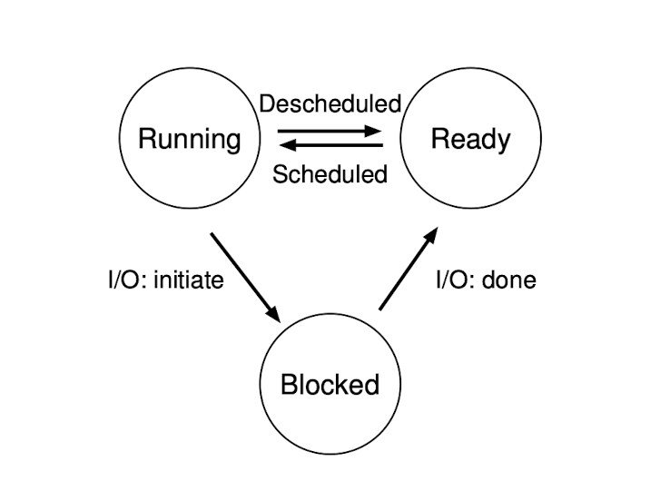

# Before Read
## 書中使用了一個問答來說明關於Virtualization的概念,我自己覺得非常好理解,也可以當作大重點,書中第一部分都會圍繞Virtualization展開

- Professor: `And thus we reach the first of our three pieces on operating systems:
virtualization.`

- Student: `But what is virtualization, oh noble professor?`

- Professor: `Imagine we have a peach.`

- Student: `A peach? (incredulous)`

- Professor: `Yes, a peach. Let us call that the physical peach. But we have many
eaters who would like to eat this peach. What we would like to present to each
eater is their own peach, so that they can be happy. We call the peach we give
eaters virtual peaches; we somehow create many of these virtual peaches out of
the one physical peach. And the important thing: in this illusion, it looks to each
eater like they have a physical peach, but in reality they don’t.`

- Student:`So you are sharing the peach, but you don’t even know it?`

- Professor: `Right! Exactly.`

- Student: `But there’s only one peach.`

- Professor:`Yes. And...?`

- Student:`Well, if I was sharing a peach with somebody else, I think I would
notice.`

- Professor: `Ah yes! Good point. But that is the thing with many eaters; most
of the time they are napping or doing something else, and thus, you can snatch
that peach away and give it to someone else for a while. And thus we create the
illusion of many virtual peaches, one peach for each person!`

- Student: `Sounds like a bad campaign slogan. You are talking about computers,
right Professor?`

- Professor: `Ah, young grasshopper, you wish to have a more concrete example.
Good idea! Let us take the most basic of resources, the CPU. Assume there is one
physical CPU in a system (though now there are often two or four or more). What
virtualization does is take that single CPU and make it look like many virtual
CPUs to the applications running on the system. Thus, while each application
thinks it has its own CPU to use, there is really only one. And thus the OS has
created a beautiful illusion: it has virtualized the CPU.`

- Student: `Wow! That sounds like magic. Tell me more! How does that work?`

- Professor:`In time, young student, in good time. Sounds like you are ready to
begin.`

- Student:`I am! Well, sort of. I must admit, I’m a little worried you are going to
start talking about peaches again.`

- Professor:`Don’t worry too much; I don’t even like peaches. And thus we be-
gin...`

# Introduce

## Definition Process
- A process is an instance of a program running in a computer

## How to provide the illusion of many CPU ?
- 在Os中CPU會使用一種叫Virtualizing的技術來創造有多顆CPU的錯覺,最基本的變為time sharing of the cpu,將會 run as many concurrent processes as they would like

## Time-sharing
- time-sharing 是一種運用在os中的基本技術,最主要的作用就是共享資源,而且這種time-sharing mechanism is employed by all modern OS

# Abstraction A Process
- To understand what constitutes a process,we need to understand the machine state first which mean a program can read or write when it is running 
- memory that the process can address `(call its address space)` is part of the process and another are registers for machine state

## Register for machine state
- program counter or PC `sometimes called the instruction pointer or IP)` tells us which instruction of the program is currently being executed.
- stack pointer and frame are used to manage the stack for function parameters, local variables,and return address.

## Separate police and mechanism 
- 對於OS來說最常見的就是Low-Level and High-Level mechanisms`(機制)`.可以想像成 mechanism as providing the answer to HOW question about a system, For exampel
  - how does an operating system perform a context switch? the policy provides the answer to a which question
  - which process should the operating system run right now? 
- Separating the two allows one easily to change polices without having to rethink the mechanism and is thus a form of modularity`(模組化)` which a general software design principle

# Process API
1. Create
2. Destroy
3. Wait
4. Miscellaneous Control
5. Status

# ProcessCreation A Little More Detail
- early operating system loading process is done eagerly,i.e.,all at once before running the program
- modern Os perform the process **lazy**,i.e.,loading pieces of code or data only as they are needed during program execution 
  - OS allocates this memory which from the stack gives ot to the process
    - C programs use the stack for local variables,function parameters,and return address
  - OS also allocates the memory for the program heap
    - In C programs,the heap is used for explicitly requested dynamically-allocated data

# Process States
1. Running
2. Ready
3. Block
    - i.e.,when a process initiates an IO request to a disk, it becomes blocked and thus some other process an use the processor


# Data Structures
- The register context will hold,for a stopped process, the contents of its registers
- System initial state that the process is in when it is being created.
  - a process placed in a final state where it has exited but has not yet been cleaned up `In Unix base system call Zombie state`
- This final state can be useful as it allows other processes `programs return zero in unix-based systems when they have accomplished a task successfully,and non-zero otherwise`
- When finished,the parent will make one final call `e.g.,wait()` to wait for the completion of the child, and also tell os can clean up any relevant data structures that referred to the now-extinct process.
## Xv6 proc data structures
- The registers xv6 will save and restore to stop and subsequently restart a process
  ```c
  struct context {
    uint edi;
    uint esi;
    uint ebx;
    uint ebp;
    uint eip;
  };
  ```
- the different states a process can be in
  ```c
    enum procstate { UNUSED, EMBRYO, SLEEPING, RUNNABLE, RUNNING, ZOMBIE };
  ```
- the information xv6 tracks about each process including its register context and state
  ```c
    // Per-process state
  struct proc {
    uint sz;                     // Size of process memory (bytes)
    pde_t* pgdir;                // Page table
    char *kstack;                // Bottom of kernel stack for this process
    enum procstate state;        // Process state
    volatile int pid;            // Process ID
    struct proc *parent;         // Parent process
    struct trapframe *tf;        // Trap frame for current syscall
    struct context *context;     // swtch() here to run process
    void *chan;                  // If non-zero, sleeping on chan
    int killed;                  // If non-zero, have been killed
    struct file *ofile[NOFILE];  // Open files
    struct inode *cwd;           // Current directory
    struct shared *shared;       // Shared memory record (0 -> none)
    char name[16];               // Process name (debugging)
  };
  ```
## Process list 
- The process list `also called task list` is the first such structure. It is one of the simpler ones, but certainly
  any OS that has the ability to run multiple programs at once will have
  something in order to keep track of all the running programs in the system
- the store information about a process as a ***Process Control Block***`also called PCB`, a way of talking about a C structure that contains information about each process`also called a process descriptor`

# Key Process terms
- The process is the major OS abstraction of a running program. At
  any point in time, the process can be described by its state which the contents of memory in its address space, the contents of CPU registers`(including the program counter and stack pointer, among others)`,
  and information about I/O `(such as open files which can be read or
  written)`.


- The process API consists of calls programs can make related to processes. Typically, this includes creation, destruction, and other useful calls.


- Processes exist in one of many different process states, including
  running, ready to run, and blocked. Different events `(e.g., getting
  scheduled or descheduled, or waiting for an I/O to complete)` transition a process from one of these states to the other.


- A process list contains information about all processes in the system. Each entry is found in what is sometimes called a process
  control block `(PCB)`, which is really just a structure that contains
  information about a specific process.