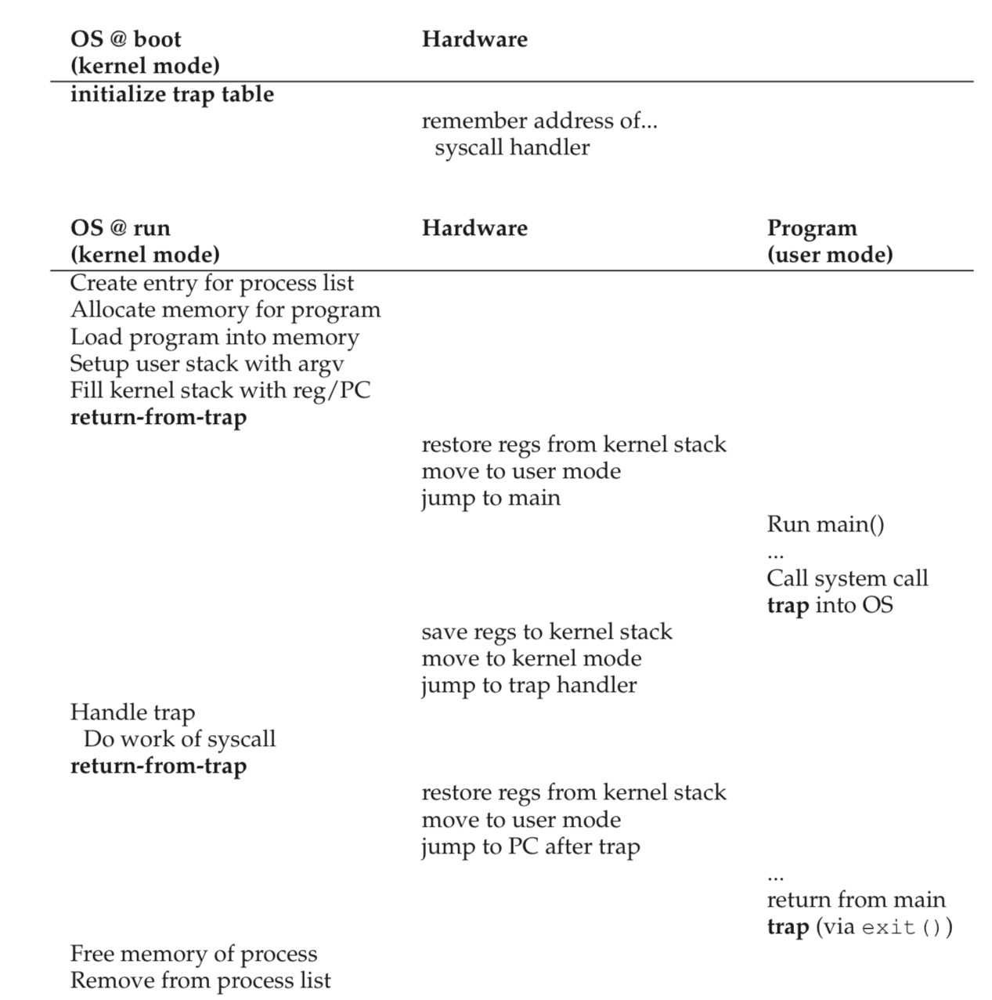

# Introduce

### The operating system needs to somehow share the physical CPU among many jobs running seemingly at the same time
- run one process for a little while, then run another one, and so forth
- By time-sharing the CPU in this manner, virtualization is achieved

### A few challenges in building such virtualization machinery
- The first is performance
  - how can we implement virtualization without adding excessive overhead to the system?
- The second is control
  - how can we run processes efficiently while retaining control over the CPU?

# Limited Direct Execution

## Basic direct execution protocol
| OS                            | Program                  | 
|-------------------------------|--------------------------|
| Create entry for process list |                          |  
| Allocate memory for program   |                          |   
| Load program into memory      |                          |   
| Set up stack with argc/argv   |                          |  
| Clear registers               |                          |  
| Execute call main()           |                          |  
|                               | Run main()               |   
|                               | Execute return from main |  
| Free memory of process        |                          |   
| Remove from process list      |                          |

### few problems in our quest to virtualize the CPU
- 該如何確保運行的程序不會做出我們不期望的事情,但任然是非常有效率的
- When we are running the process, how does the os stop it from running and switch to another process

# Problem 1. Restricted Operations
- What if the process wishes to perform some kind of restricted`限制` operation

## How to perform restricted operations
- A process must be able to perform I/O and some other restricted operations, but without giving the process complete control over the system.
  How can the OS and hardware work together to do so?

- if we wish to build a file system that checks permissions before granting access to file
  - if we simply any user process issue IO to the disk, a process could simply read or write the entire disk, and thus all protections would be lost

## User mode
- we can run in user mode is restricted in what it can do
  - for example, we are running in user mode; a process cannot issue IO requests; if we did, the os will kill the process

### Introduce
- user mode is kernel mode, which the operating system or kernel runs in. 
  - In this mode, code that runs can do what it likes

## However, what should a user process dfo when it wishes to perform time kind of privileged operation?
- virtually all modern hardware provides the ability for user programs to perform a system call.
  - to execute a system call, a program must execute a special **trap** instruction

### Trap instruction
- this instruction simultaneously jumps into the kernel and raises the privilege level to kernel mode
  - in kernel mode, the system can perform whatever privileged operations are needed, and thus do the required work for the calling process
  - when finished, the os calls ap special return-from-trap instruction, returns into the calling user program while simultaneously reducing the privilege level back to user mode

- when we perform the trap instruction, the system must be careful.
  - for example, the process will push the program counter, flags, ad a few other registers onto a per-process kernel stack
  - the return-from-trap will pop these values off the stack and resume execution of the user mode program

### How Does the trap know which code to run inside the os?
- the calling process cannot specify an address to jump to. to jump anywhere into the kernel which clearly is a **Very Bad Idea**
#### Trap Table
- the kernel does so by setting up a trap table at boot time. When the machine boots up, it does so in privileged or kernel mode
- One of the first things is
  - tell the hardware what code to run when certain exceptional events occur. Once the hardware is informed, it remembers the location of these handlers until the machine is next rebooted
- to specify the exact system call, a **system-call number** is usually assigned to each system call. it is valid the number when handling the system call inside the trap handler, and if it is, executes the corresponding code.
- This level of indirection serves as a from of protection; user code cannot specify an exact address to jump to 
- Trap table is a very powerful capability, it is also a privileged operation.

### What horrible things could you do to a system if you could install your own trap table? Could you take over the machine?


- In the first, the kernel initializes trap table, and the CPU remembers its location for subsequent use
- In the second, the kernel sets up a few things before using a return-from-trap instruction to start th execution of the process
  - switches the CPU to user mode and begins running the process.
- When the process wishes to issue a system call,it turns back into the OS, which handles it and once again returns control via a return-from-trap
  to the process.
- The process then completes its work, and returns from main; At this point,OS cleans up, and we are done

## Use Protected control Transefer
- The hardware assists the OS by providing different modes of execution.
  - In user mode, applications do not have full access to hardware resources.
  - In kernel mode, the OS has access to the full resources of the machine.
- Special instructions to trap into the kernel and return-from-trap back to
  user-mode programs are also provided, as well as instructions that allow
  the OS to tell the hardware where the trap table resides in memory.

# Problem 2. Switching Between Processes
- Switching between processes should be simple, right? But it actually is a little bit tricky
  - If a process is running on the CPU this by definition means the OS is not running
  - If the OS is not running, how can it do anything at all

## How to regain control of the cpu
- How can the operating system regain control of the CPU so that it can
  switch between processes?

### A Cooperative Approach Wait For System Calls
- One approach that some systems have taken in the past is known as the **cooperative** approach
  - In this style, the OS **trusts** the processes of the system to behave reasonably

- How does a friendly process give up the CPU in this utopian world
  - transfer control of the CPU to the OS quite frequently by making system calls
    - for example, to open a file and subsequently read it, or to send a message to another machine, or to create a new process.
- Systems like this often include an explicit **yield** system call,which does nothing except to transfer control
  to the OS so it can run other processes
- Application also transfers control to OS when they do something illegal`非法的`,
  - if an application divides by zero 
  - tries to access memory that it should not be able to access
- it will generate a trap to the OS.The OS will then have control of the CPU again

#### If a process (whether malicious, or just full of bugs) ends up in an infinite loop, and never makes a system call? What can the OS do then?

### A Non-Cooperative Approach The OS Takes Control
- OS cannot do much at all when a process refuses to make system calls or mistakes and thus return control to the OS
- When a process gets stuck in an infinite loop is to resort to the age-old solution to all problems in computer system: **reboot the machine**

### How to gain control without cooperation
- How can the OS gain control of the CPU even if processes are not being
  cooperative? 
- What can the OS do to ensure a rogue process does not take
  over the machine?

#### Time interrupt

- A timer device can be programmed to raise an interrupt every so many milliseconds;when the interrupt is raised, the currently running process is **halted**, and pre-configured **interrupt handler** in the OS runs.
- When the timer interrupt occurs
  - First: at boot time
  - Second: Also during the boot sequence, the OS must start the timer, which is of course a privileged operation
- Once the timer has begun, the OS can thus feel safe in that control will eventually be returned to it, and thus the OS is free to run user programs.
- The timer can also be turned off
- 
### Use the timer interrupt to regain control
- the addition of a timer interrupt gives the OS the ability to run again on a CPU

### Reboot is useful
- infinite loops under cooperative preemption is to reboot the machine
- reboot or in general, starting over some piece of software can be a hugely useful tool in building robust systems
- reboot is useful because it moves software back to a known and likely more tested state. Reboots also reclaim stale or leaked resources `e.g.,memory` which may otherwise be hard to handle
- when the interrupt occured such that a subsequent return-form-trap instruction will be able to resume the running program correctly
#### Use reboot likely using a time-tested approach to improving the behavior of a computer system

### Saving and Restoring Context
- Whether to continue running the currently-running process, or switch to a different one. This decision is made by a part of the operating system known as the **scheduler**
- If the decision is made ti switch, the OS then executes a low-level piece of code which we refer to as a **context switch**
  - all the OS has to do is save a few register values for the currently-executing process and restore a few for the soon-to-be-executing process
- To save the context of the currently-running process, the OS will execute some code to save the general purpose registers, PC, and the kernel stack pointer of the currently-running process, and then restore
- By switching stacks, the kernel enters the call to the switch code in the context of one process and returns in the context of another
- When the OS finally executes a **return-form-trap** instruction, the soon-to-be-executing process becomes the currently running process.

### Switch 
- In the timer interrupt handler, the OS decides to switch from running Process A to Process B. it calls **switch**
  - save current register values, into the process structure of A 
  - restores the registers of Process B, from its process structure entry
  - switches contexts, specifically by changing the stack pointer to use **B's** kernel stack and not **A's**

```asm
# Context switch
#
#   void swtch(struct context **old, struct context *new);
# 
# Save the current registers on the stack, creating
# a struct context, and save its address in *old.
# Switch stacks to new and pop previously-saved registers.

.globl swtch
swtch:
  movl 4(%esp), %eax
  movl 8(%esp), %edx

  # Save old callee-saved registers
  pushl %ebp
  pushl %ebx
  pushl %esi
  pushl %edi

  # Switch stacks
  movl %esp, (%eax)
  movl %edx, %esp

  # Load new callee-saved registers
  popl %edi
  popl %esi
  popl %ebx
  popl %ebp
  ret
```
- First, the user registers of the running process are implicitly saved by the **hardware**, using the kernel stack of that process
- Second, when the OS decides to switch from A to B; in this case, the **kernel registers** are explicitly saved by the **software** `(i.e.,the OS)`

### Worried About Concurrency
- during interrupt or trap handling, another interrupt occurs is called concurrency.
- One simple thing an OS might do is disable interrupts during interrupt processing, but disable interrupt for too long could lead to lost interrupts which is bad.
- Also developed a number of sophisticated **locking** schemes to protect concurrent access to internal data structures.
  - This enables multiple activities to be ongoing within the kernel at the same time
  - locking can be complicated and lead to a variety of interesting and hard-to-find bugs

## Summary

# Key CPU virtualization terms
- The CPU should support at least two modes of execution: a restricted user mode and a privileged (non-restricted) kernel mode.


- Typical user applications run in user mode, and use a system call
to trap into the kernel to request operating system services.


- The trap instruction saves register state carefully, changes the hardware status to kernel mode, and jumps into the OS to a pre-specified
destination: the trap table.


- When the OS finishes servicing a system call, it returns to the user
program via another special return-from-trap instruction, which re-
duces privilege and returns control to the instruction after the trap
that jumped into the OS.


- The trap tables must be set up by the OS at boot time, and make
sure that they cannot be readily modified by user programs. All
of this is part of the limited direct execution protocol which runs
programs efficiently but without loss of OS control.


- Once a program is running, the OS must use hardware mechanisms
to ensure the user program does not run forever, namely the timer
interrupt. This approach is a non-cooperative approach to CPU
scheduling.


- Sometimes the OS, during a timer interrupt or system call, might
wish to switch from running the current process to a different one,
a low-level technique known as a context switch.
thus readied, you can let your baby roam freely, secure in t

# Homework 
- Measurement the system calls and the context
  ```c
  #define _GNU_SOURCE
  #include <stdio.h>
  #include <stdlib.h>
  #include <unistd.h>
  #include <string.h>
  
  #include <fcntl.h>
  #include <sched.h>
  
  #include <sys/time.h>
  #include <sys/wait.h>
  
  #define M 1000000
  const int SIZE = 5;
  
  int main(){
    
    struct timeval start,end;
    char *arg[3];
    arg[0] = strdup("wc");
    arg[1] = strdup("1.c");
    arg[2] = NULL;
  
    printf("start system call caclute");
    gettimeofday(&start,NULL);
    for(int i=0;i<100;i++){
      execv(arg[0],arg);
    }
    gettimeofday(&end,NULL);
    printf("sysyem call:%f microseconds\n\n",
            (float)(end.tv_sec*M+end.tv_usec-
                start.tv_sec*M+start.tv_usec)/100);
   
  
  
    struct timeval start_,end_;
    char buf[SIZE];
    cpu_set_t set;
    CPU_ZERO(&set);
    CPU_SET(sched_getcpu(),&set);
    if(sched_setaffinity(0,sizeof(cpu_set_t),&set)==-1){
      fprintf(stderr,"sched_setaffinity\n");
      exit(1);
    }
    
    int p1[2],p2[2];
    if(pipe(p1)<0||pipe(p2)<0){
      fprintf(stderr,"pipe failed\n");
      exit(1);
    }
  
    
    int rc = fork();
    if(rc < 0){
      fprintf(stderr,"process failed\n");
      exit(1);
    }else if(rc == 1){
      close(p1[1]);
      close(p2[0]);
      
      write(p2[1],"hello",SIZE);
      read(p1[0],buf,SIZE);
         
      close(p1[0]);
      close(p2[1]);
    }else{
        // parent process execute first
        // pipe one write first and pipe two read first
          printf("start context call caclute");
    
      gettimeofday(&start_,NULL);
      close(p1[0]);
      close(p2[1]);
      write(p1[1],"hello",SIZE);
      read(p2[0],buf,SIZE);
      close(p1[1]);
      close(p2[0]);
  
      gettimeofday(&end_,NULL);
      printf("context call:%f microseconds\n\n",
            (float)(end_.tv_sec*M+end_.tv_usec-
                start_.tv_sec*M+start_.tv_usec));
      }
  
     wait(NULL);
  } 
  ```
