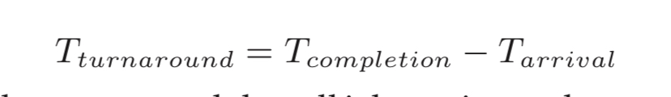
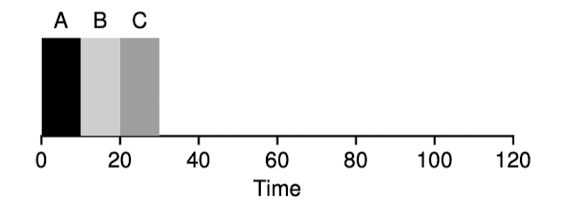
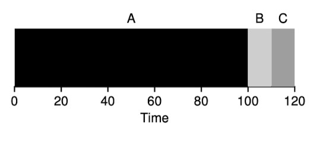
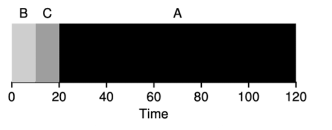
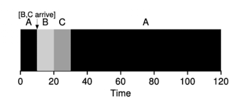
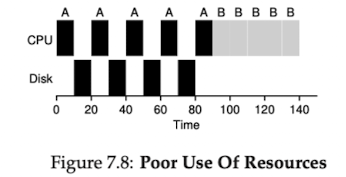

# Introduce

- we will now do just that, presenting a series of **scheduling policies** sometimes called **disciplines** 

# Workload Assumptions
- the process running in the system called **workload**
- We wil make the following assumptions`假設` about the processes, simetimes called the jobs, that are running in the system
  - Each jobs runs for the same amount of time
  - All jobs arrive at the same time
  - Once started, each job runs to complete
  - All jobs only us CPU (i.e.,they perfrom not IO)
  - The run-time of each job is known

# Scheduling Metrics
- Beyond making workload assumptions, we also need one more thing to enable us to compare different scheduling policies: a **scheduling metric**
- A metric is just something that we use to **measure** something, and there are a number of different metrics that make sense in scheduling

## turnaround time
- the turnaround time of a job is defined as the time at which the job completes minus the time at which the job arrived in the system
  
- turnaround time is a **performance metric**
- Performance and fairness are often at odds in scheduling
  - for example; may **optimize performance** but **decrease fairness** because of the cost of preventing a few jobs from running

# FIFO (First In First Out)
- First In, First Out scheduling or sometimes called First Come, First Served (FCFS)
- Now we have an example
  
  - the average turnaround time for the three job is simply 
    - `10+20+30/3 = 20`
- but..., how about when the three jobs have different length of time
- For example;
  
  - the average turnaround is `100+110+120/3 = 110`, but it is more than B job or C job
- this problem is generally referred to as the **convoy effect**
  - where number of relatively short consumers of a resource get queued behind a **heavyweight** resource consumer
- So what should do can solve the problem which is run for different amounts of time of jobs

# Shortest Job First (SJF)
- this new scheduling discipline is known as **Shortest Job First (SJF)**, and the name should be easy to understand this algorithm
- because the relatively short consumers been stuck by heavyweight consumers, so we execute B, C and A
  
  - the average turnaround time will be `10+20+120/3 = 50`
- In fact, given our assumptions about jobs all ariving at the same time, we could prove **SJF** is indeed on **optimal** scheduling algorithm
- Now we assumptions A arrive at `T=0` but B and C arrive at `T=10`
  
  - now the average arround is `100+(110-10)+(120-10)/3 = 103.3`
  - because B and C arrived shortly after A, they still are forced to wait until A has completed

# Shortest Time-to-Completion First (STCF)
- use timer interrupts and context switching, the scheduler can certainly do something else when B and C arrive: it can **preempt** job A and decide to run another job
  - SJF by our definition is a **non-preemptive** scheduler
- There is a scheduler which does exactly that **add preemption to SJF**, known as the **Shortest Time-to-Completion First(STCF)** or **Preemptive Shortest Job First(PSJF)**
- The STCF determines which of the remaining jobs `(including the new job)` has the least time left, and schedules that one
  - For example, STCF would preempt A and run B and C to completion, only when they are finished would A's remaining time be scheduled.
  
  - the average turnaround time will be `(120-0)+(20-10)+(30-10)/3`

## A new Metric: Response Time
- STCF would be great policy. In fact, for a number of early batch computing system, these types of scheduling algorithm made some sense
- However, the **time-shared** machines changed all that, and new metric was born: **response time** 
  
# Round Robin (RR)
- To solve this problem, a new scheduling algorithm, classically referred to as **Round-Robin(RR)**
  - the basic idea is simple: instead of running jobs to completion, RR runs a job for a **time slice** (sometimes called a **scheduling quantum**) and then switches to the next job in the run queue
  - 如此一來就有效化的優化response time, 但如果time slice太長, 則 RR 和 SJF 沒什麼兩樣, 但如果time slice太短, context switch的時間會造成巨大影響
  
    - time response for SFJ is `0+5+10/3 = 5`
    - time response for RR is `0+1+2/3 = 1`
- RR, with a reasonable time slice, is thus an excellent scheduler if response time is our only metric
  - But RR is indeed one of the **worst** policies if turnaround time is our metric
- Because turnaround time only. cares about when jobs **finish**, RR is nearly pessimal`最差的`,even worse than simple FIFO in many case
- Any policy (such as RR) that is **fair** will perform poorly on metrics such as turnaround time
  - if you are being **unfair** can run shorter jobs to completion, and turnaround time will be better, but the cost of response time is lowered

# Incorporating IO
- we will relax assumption 所有的task都不執行IO
- clearly has a decision`決定` to make when a job initiates an IO request
  - the currently running job will not be using CPU during the IO, it is **blocked** waiting for IO completion
- The scheduler also has to make a decision when the IO completes.
  - When that occurs, an interrupt is raised, and the OS runs and moves the process that issued the IO **from blocked back to the ready state**
  
- 要解決這個問題我們需要將CPU burst是為independent job, 則底下的所有工作都是independent的
  - 需要各自10 time until 的 task A (sub job)
  - 需要50 time until 的 task B
## 流程
- 當第一個task A 完成,此時task A做IO
- 我們就可以把CPU拿來執行task B
- 當task A的IO完成時, task A的第二個sub job 進入queue中
- 這時STCF scheduler 會將CPU交給task A的sub job, 因為completion time較短

## Overlap
- 上述的行為就overlap,可以最大化系統的使用率

# Summary
- Both are bad where the other is good
  - The first runs the shortest job remaining and thus optimizes turnaround time
  - The second alternates between all jobs and thus optimizes response time
- Now we solve three problems
  - task execute for the same amount of time
  - task arrive at the same time
  - task perform no I/O
- But have still not solved the problem of the fundamental`基本的` invability`不可變性` of the OS to see into the futurer
- Building a scheduler that uses the recent past to **predict the future** is known as **multi-level feedback queue**

# Homework
### 1.
```bash
./scheduler.py -p SJF -l 200,200,200 -c
./scheduler.py -p FIFO -l 200,200,200 -c
```
### SJF
- turnaround time : `(200+400+600)/3 = 400`
- response time : 200

### FIFO
- turnaround time : `(200+400+600)/3 = 400`
- response time : 200

### 2.
```bash
./scheduler.py -p SJF -l 100,200,300 -c
```

### SJF
- turnaround time: `100+300+600 / 3 = 333.3`
- response time :
  - Job 0 done 100 wait 0
  - Job 1 done 300 wait 100
  - Job 2 done 600 wait 300
  - average : `0 + 100 + 300 / 3 = 133.3`

### FIFO
- 跟SJF一樣

### 3.
```bash
./scheduler.py -p RR -q 1 -l 100,200,300 -c
```
### RR
- job 0 時間便n倍即為完成時間,其中的n為剩餘job數量
- turnaround time :
  - Job 0 完成前每個都執行300, Job 0 結束去掉`Job 1和Job 2時間 = 298`
  - Job 1 完成500,去掉多算的`job 2 = 499`
  - Job 2 完成600
  - average : `600+499+298 / 3 = 465.67`
- response time :
  - Job 0 done 1 wait 0
  - Job 1 done 2 wait 1
  - Job 2 done 3 wait 2
  - average : `0 + 1 + 2 / 3 = 1`
### 4.
- 當作業長度按照升序排列的時候

### 5.
- quantum length為多久切換job
- 當job length相同且RR的quantum length和job length相同
### 6.
- it will increase
```bash
./scheduler.py -p SJF -l 100,100,100 -c
./scheduler.py -p SJF -l 400,400,400 -c
```
### 7.
- 當 `quantum length <= job length`
  - when quantum lengths increase, the response time will increase
- 回應時間的增長與量子長度呈線性關係，具體取決於有多少作業排在前面。
- worst case
  - 第n-1個job completion, get response time so the worstcase equal (n-1) * quantum length
- 排在最後的作業需要等待所有 N−1 個作業完成它們的第一個時間片，這是最長的回應時間