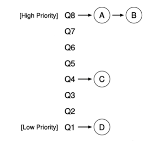
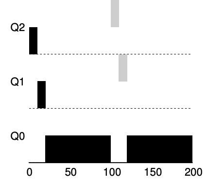
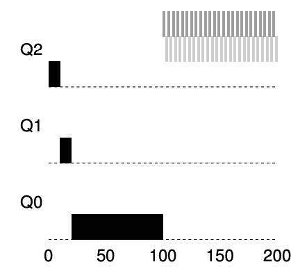
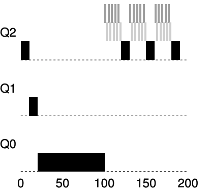
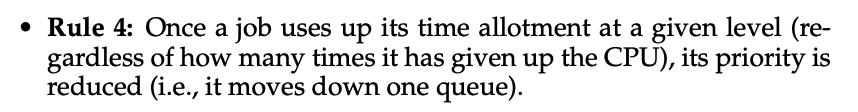
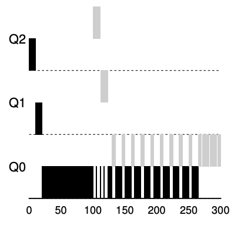

# Introduce
- **Multilevel Feedback Queue (MLFQ)** tries to address two-fold
  - First: it would like to optimize **turnaround time**, but the OS cannot know how long a job will run for, exactly the knowledge that algorithm like SJF or STCF require
  - Second: MLFQ would like to make system feel **response to interactive users**, and thus minimize **response time**

# MLFQ basic rule
- The **key** to MLFQ scheduling therefore lies in how the scheduler sets
  priorities. Rather than giving a fixed priority to each job

- the MLFQ has a number of distinct **queue**, each assigned a different **priority level**
- MLFQ uses priorities to decide which job should run at a given time: a job with higher priority is chosen to run
  
- MLFQ **varies** the priority of a job base on its **observed behavior**, for example
  - a job repeatedly relinquishes the CPU while waiting for input from the keyboard, MLFQ will keep its priority high
  - a job uses the CPU intensively`密集的` for long periods`期間` of time, MLFQ will reduce its priority
- MLFQ will try to **learn** about processes as they run, and thus use the **history** of the job to **predict** its **future** behavior
- 如果想要了解靜態隊列的話是遠遠不夠的,如下圖
  
- 可以看到在high priority的A和B,中間的C和最低的D
  - 藉由我們目前已知的MLFQ原理,會將time slice分配給A和B,C和D將會無法分配到time slice,這顯然非常unfair

# How to Change Priority
- 我們現在需要決定如何在job的life time改變他的priority, 也就是所在隊列的位置,因此我們需要考慮他的workload
  - a mix of interactive jobs that are short-running (and may frequently relinquish the CPU)
  - some longer-running **CPU-bound** jobs that need a lot of CPU time but where response time isn’t important
- 要解決這個問題,需要一個new concept, which we called the job's allotment
  - allotment指的是一個job的priority可以停留的時間,如果超過這段時間,concept將會降低他的priority

### Example 1. A Single Long-Running Job

- job在Q2上執行一段時間後被concept降級到Q1,job在Q1執行一段時間過後再被concept降級到Q0

### Example 2. Along Came A Short Job

- Job A (shown in black) is running along in the lowest-priority queue
  - as would any long-running CPU-intensive jobs
- Job B (shown in gray) arrives at time T = 100
  - thus is inserted into the highest queue,because it's arrive time is bigger than Job A
  - as its run-time is short (only 20 ms)
- 由於concept沒辦法 **提前** 知道job will be a short job or a long-running job
  - 因此先*assumes**為short job,thus giving the high priority
  - If it actually is a short job,it will run quickly and complete
  - If it is not a short job, it will slowly move down the queues, and thus soon prove itself to be a long-running more batch-like`批次的` process

### Example 3. What About I/O?
- 藉由上述4b的規則可以知道
  - if a process gives up the processor before using up its allotment, we keep it at the same priority level.
- for example, is doing a lot of IO such as waiting for user input from keyboard or mouse
  - it will relinquish`放棄` CPU before its allotment is complete, we don’t wish to penalize`懲罰` the job and thus simply keep it at the same level

  - Job B (shown in gray) that needs the CPU only for 1 ms before performing an I/O competing
  - Job A (shown in black) with a long-running batch job for the CPU
    - The MLFQ approach keeps B at the highest priority because B keeps releasing`or say it relinquish` the CPU
    -  If B is an interactive job, MLFQ further`進一步` achieves its goal of running interactive jobs quickly

# Problems With Our Current MLFQ
- First, the problem of starvation`飢餓` if there are **too many** jobs in the system
  - they will combine to consume **all** CPU time, and thus long-running job will **never** receive any CPU time(they starve)
- Second, user could rewrite their program to **game the scheduler**
  - because our cpu before the allotment is used, issue an IO operation will and thus relinquish the CPU
    - 具體來說, 當程序接近分配上限才釋放, 既不會觸發decrease priority rule(4a),又可以保證high priority, the job could nearly`幾乎` monopolize`壟斷` the CPU
- Finally, a program may change its behavior overtime
  - what was CPU-bound transition to a phase`階段` of interactivity`互動性`, 但按照現在的rule, 沒辦法像其他互動性program被對待

# The Priority Boost
- if we can avoid the problem of starvation. What could we do in order to guarantee`保證` that CPU-bounds jobs will make some progress`進展`
  - periodically`定期` boost the priority of all the jobs in the system

- This new rule solves two problems
  - First, processes are guaranteed not to starve, by sitting in the top queue, a job will share the CPU with other high-priority jobs in a round-robin fashion
  - Second, if a CPU-bound job has become interactive, the scheduler treats it properly once it has received the priority boost
- for example
  - there is not priority Boost, and thus the long-running job gets starved until the two short jobs arrive
  
  - there is a priority boost every 100ms, and thus we at least guarantee that the long-running job will make some progress
  
# Better Accountin
- we now have one more problem to solve: how to prevent gaming of our scheduler?
  - the problem is because 4a,4b rules, which let a job retain its priority by relinquishing the CPU before its allotment expires
- The solution here is to perform better **accounting** of CPU time at each level of the MLFQ

- The solution here is to perform better **accounting** of CPU time at each level of the MLFQ
  - concept應該追蹤process在某個priority時所花費時間, 而不是forgetting how much time slice
  - 一旦jobs用完分配的time slice，就應降低其priority。不管這些時間是一次性耗盡還是分多次用完
  
- for example
  - workload tries to game the scheduler with the old Rules 4a and 4b.
    - without any protection from gaming, a process can issue an IO before its allotment ends, thus staying at the same priority level, and dominating CPU time.
    
  - workload with better accounting in place
    - regardless of the IO behavior of the process, it slowly moves down the queues, and thus cannot gain an unfair share of the CPU.
    
# Tuning MLFQ And Other Issues
- One big question is how to parameterize such a scheduler
- key parameterize
  - queue 數量,應該有多少層queue
  - time slice, 每層要有多少time slice
  - time allotment, allotment 要多少才合適
  - priority boost 頻率, 應該多久進行一次priority boost to avoid starvation and change behavior
- 這些參數沒有明確的最佳值，只能通過經驗、對工作負載的觀察和調整來找到平衡
- Time slice 的調整
  - high priority
    - 分配較短的time slice, 因為這些隊列中的工作多為互動式作業，快速切換能提高響應速度
  - low priority
    - 分配較長的time slice, 因為這些隊列中的工作多為長期運行的 CPU 密集型作業

## MLFQ實現範例
- Solaris 的 Time-Sharing(TS)調度器:
  - 使用配置表來定義每個進程的priority調整規則,time slice長度和priority boost頻率。
  - 預設值:60 個隊列,時間片從 20 毫秒（最高優先級）到數百毫秒（最低優先級）,priority boost約每 1 秒執行一次。系統管理員可自定義表格以調整調度器行為
- FreeBSD 調度器(4.3 版)
  - 使用數學公式根據進程使用的 CPU 時間計算當前priority
  - 引入 CPU 使用率的衰減機制,隨時間降低使用量,實現與priority boost類似的效果

# MLFQ Summary
- it has **multiple levels** of queues
- uses **feedback** to determine the priority of a given job
- **History** is its guide: pay attention to how jobs behave over time and treat them accordingly
## Rule

## Why MLFQ
- MLFQ can deliver excellent overall performance (similar to SJF/STCF) for short-running interactive jobs
- and MLFQ is fair and makes progress for long-running CPU-intensive workloads.
