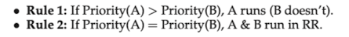
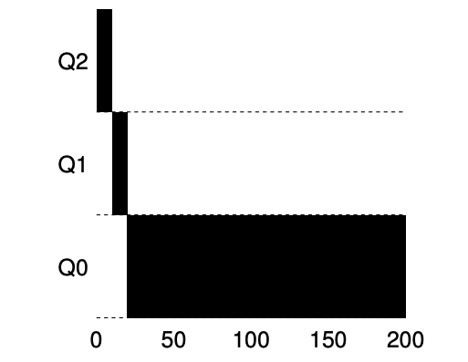

# Introduce
- **Multilevel Feedback Queue (MLFQ)** tries to address two-fold
  - First: it would like to optimize **turnaround time**, but the OS cannot know how long a job will run for, exactly the knowledge that algorithm like SJF or STCF require
  - Second: MLFQ would like to make system feel **response to interactive users**, and thus minimize **response time**

# MLFQ basic rule
- The **key** to MLFQ scheduling therefore lies in how the scheduler sets
  priorities. Rather than giving a fixed priority to each job

- the MLFQ has a number of distinct **queue**, each assigned a different **priority level**
- MLFQ uses priorities to decide which job should run at a given time: a job with higher priority is chosen to run
  
- MLFQ **varies** the priority of a job base on its **observed behavior**, for example
  - a job repeatedly relinquishes the CPU while waiting for input from the keyboard, MLFQ will keep its priority high
  - a job uses the CPU intensively`密集的` for long periods`期間` of time, MLFQ will reduce its priority
- MLFQ will try to **learn** about processes as they run, and thus use the **history** of the job to **predict** its **future** behavior
- 如果想要了解靜態隊列的話是遠遠不夠的,如下圖
  
- 可以看到在high priority的A和B,中間的C和最低的D
  - 藉由我們目前已知的MLFQ原理,會將time slice分配給A和B,C和D將會無法分配到time slice,這顯然非常unfair

# How to Change Priority
- 我們現在需要決定如何在job的life time改變他的priority, 也就是所在隊列的位置,因此我們需要考慮他的workload
  - a mix of interactive jobs that are short-running (and may frequently relinquish the CPU)
  - some longer-running **CPU-bound** jobs that need a lot of CPU time but where response time isn’t important
- 要解決這個問題,需要一個new concept, which we called the job's allotment
  - allotment指的是一個job的priority可以停留的時間,如果超過這段時間,concept將會降低他的priority

### Example 1. A Single Long-Running Job

- job在Q2上執行一段時間後被concept降級到Q1,job在Q1執行一段時間過後再被concept降級到Q0

### Example 2. Along Came A Short Job

- Job A (shown in black) is running along in the lowest-priority queue 
  - as would any long-running CPU-intensive jobs
- Job B (shown in gray) arrives at time T = 100
  - thus is inserted into the highest queue,because it's arrive time is bigger than Job A
  - as its run-time is short (only 20 ms)
- 由於concept沒辦法**提前**知道job will be a short job or a long-running job
  - 因此先*assumes**為short job,thus giving the high priority
  - If it actually is a short job,it will run quickly and complete
  - If it is not a short job, it will slowly move down the queues, and thus soon prove itself to be a long-running more batch-like`批次的` process

### Example 3. What About I/O?
- 藉由上述4b的規則可以知道
  - if a process gives up the processor before using up its allotment, we keep it at the same priority level.
- for example, is doing a lot of IO such as waiting for user input from keyboard or mouse
  - it will relinquish`放棄` CPU before its allotment is complete, we don’t wish to penalize`懲罰` the job and thus simply keep it at the same level

  - Job B (shown in gray) that needs the CPU only for 1 ms before performing an I/O competing 
  - Job A (shown in black) with a long-running batch job for the CPU
    - The MLFQ approach keeps B at the highest priority because B keeps releasing`or say it relinquish` the CPU
    -  If B is an interactive job, MLFQ further`進一步` achieves its goal of running interactive jobs quickly
  
# Problems With Our Current MLFQ
