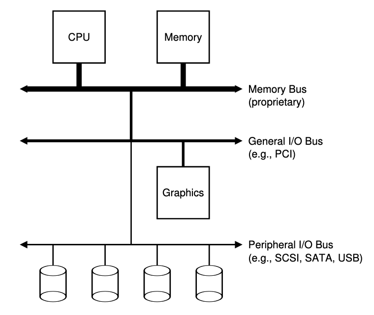
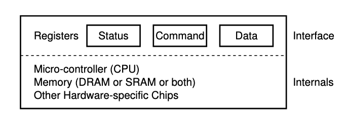
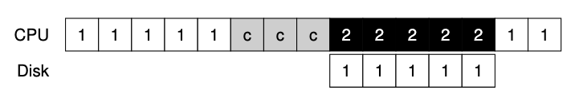
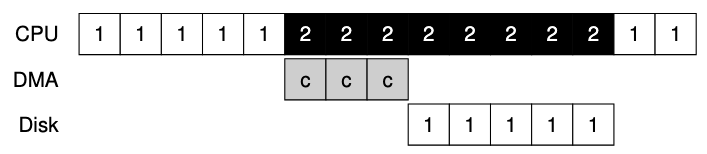

# IO

## System Architecture

- 之所以有這樣連接IO和其他設備的原因是因為通常高性能的memory沒有足夠多的空間連接太多設備,且線的成本也相對較高
  - 因此系統設計採用了分層的方式,將disk和其他低速設備連在外面,優點之一是可以連接大量設備

## A Canonical Device

- interface的部分是為了讓系統軟體控制操作,因此所有設備都有自己的interface和交互協議
- internal structure 負責實現設備展示給系統的abstract interface

##  Lowering CPU Overhead With Interrupts
- 因為中斷的關係,系統不再需要使用輪詢的方式,而是發生中斷時讓CPU執行預先定義的ISR,或更簡單的interrupt handler
  - 由於中斷的引入,當發生IO中斷的時後,原先的CPU不再只有空等待,而是可以做其他事情,直到觸發IO的中斷返回
### 中斷一定比較好嗎
- 中斷的引入雖然減少了CPU的輪詢時間,但也帶來了額外的開銷
  - 每次中斷都需要保存當前CPU狀態,並且在中斷處理完成後恢復狀態
  - 中斷處理需要額外的上下文切換,這會增加系統的延遲

- 因此並不是任何時候都會採用中斷,尤其遇到高性能設備(處理請求非常快),或是網路(假設每一個封包都會發生中斷,會觸發os的livelock,即不斷處理中斷而無法處理用戶layer請求)
- 更多時候會採用hybird策略,先輪詢一段時間後,再交給中斷
- 或使用合併(coalescing)的方式,將多個中斷合併成一個,當然因為等待時間長而增加請求的延遲,但這是os對中斷的一種折中方式

## DMA
- 使用編程的IO將一大塊數據傳給設備,圖中會依賴CPU進行繁瑣操作

- 從圖上來看不難發現, process 1 需要進行IO操作,而這期間還需要先讓CPU進行COPY到IO設備上才可以,需要等待到IO設備開始運作,CPU才可以繼續運行其他process

- 解決方式使用DMA(Direct Memory Access),DMA為了能夠將數據傳送給設備,因此os會透過程式告訴DMA引擎數據在memory中的位址,要拷貝的大小以及要拷貝過去的設備,接下來就可以全權交給DMA處理
  - 當DMA完成後,DMA Controller會拋出一個interrupt來告訴os完成數據傳輸

## Methods Of Device Interaction
1. 使用指令的方式讓io間進行交互,這些指令通常是privileged,因此會產生危險性
2. 使用memory-mapped IO,透過這種方式,hardware將設備register當作memory address提供,當需要訪問時,os讀取或寫入到該memory address,然後hardware會將R/W轉移到設備上,而非physical address

# HardDisk Driver

## interface
  - 現在的harddisk都是由512byte組成,並且有0~n-1的編號,這些編號也相當於是address space
  - 唯一保證的是單個512byte寫入為atomic,因此假設寫入的數據大於512byte並且剛好斷電,則會變成不完整寫入(torn write)
  - 通常可以假設靠近的block訪問速度會比相遠的block快

## A Simple Disk Drive

- 下圖為一個簡單disk範例圖示,其中只有12個扇區(sectors),每個扇區512byte,並且用0~11的編號

<Image src="../../public/d4.png" width="800" height="400" />
<Image src="../../public/d5.png" width="800" height="400" />

### Single-track Latency: The Rotational Delay
- 簡單的disk中,disk不需要做太多得工作,主要是等待期忘的sectors旋轉到disk head下,而這便是所謂的rotational delay
- 如果完整旋轉延遲是$R$,disk必然產生大約為$R/2$的旋轉延遲,已等待0來到讀/寫disk head下(如果從6開始)

### Multiple Tracks: Se

- 這張圖表面有3條tracks,最內圈的包含sectors 24~35,最外面則是0~11
<Image src="../../public/d6.png" width="1000" height="400" />
- 假設我們現在要讀取sector 11
  1. driver首先將disk arm移動到正確的sector上,這個過程稱為seek(seek 和 rotation為最昂貴的操作之一)
  2. 開始進行seek的動作,會分為
    - disk arm加速階段
    - disk arm全速移動而慣性滑動
    - disk arm在正確的track停下
  3. seek之後就會在正確的track上
  4. 等待rotational delay,直到sector 11來到disk head下
  5. 當sector 11來到disk head下,就可以開始最後的IO階段,這階段也被稱為transfer,數據從表面讀取或寫入表面

- 完整IO時間圖分成
1. seek time
2. rotational delay
3. transfer time

### Multiple track的一些細節
1. driver會採用某種形式的track skew,以確保跨越 track boundaries時也可以順序讀取服務
2. sector也會偏斜,避免遇到切換track時,原本的sector剛剛被經過,而需要等待完整的rotation delay
3. 外圈track具有更多的sectors,這些track通常被稱為multi-zoned disk driver
4. disk driver都會有一個緩存,也稱為track buffer,當disk讀取sector時,driver決定讀取該track上的所有sector並緩存
  - 在寫入時應該要將data放入memory(write back,有時也稱為immediate reporting)還是寫入實際disk再回報(write through),write back 緩存有時候會比driver更快但更危險

## IO time
- IO時間可以分為3個主要部分
$$
  T_{IO} = T_{seek} + T_{rotation} + T_{transfer}
$$
- 通常比較driver用IO的速率
$$
  R_{IO} = \frac{Size_{transfer}}{T_{IO}}
$$

- 計算平均seek時間

$$
\begin{align*}
&\text{計算從 } 0 \text{ 到 } N \text{ 任意兩 track } x \text{ 和 } y \text{ 之間的 seek 距離} \\
&\sum_{x=0}^{N} \sum_{y=0}^{N} \left| x - y \right| \\[1em]

&\text{改用積分方式估算總和} \\
&\int_{0}^{N} \int_{0}^{N} \left| x - y \right| \, dx \, dy \\[1em]

&\text{將絕對值分段處理：} \\
&\int_{0}^{N} \left( \int_{0}^{x} (x - y) \, dy + \int_{x}^{N} (y - x) \, dy \right) dx \\[1em]

&= \int_{0}^{N} \left[ \left( xy - \frac{1}{2}y^2 \right) \Big|_{y=0}^{y=x} + \left( \frac{1}{2}y^2 - xy \right) \Big|_{y=x}^{y=N} \right] dx \\[1em]

&= \int_{0}^{N} \left( x^2- Nx  + \frac{1}{2}N^2  \right) dx \\
&= \left( \frac{1}{3}x^3-\frac{N}{2}x^2+\frac{n^2}{2}x \right) \big|_{0}^{N} \\
&= \frac{N^3}{3} \\

&\text{除以track總數已計算平均seek距離} \\
& \frac{\frac{N^3}{3}}{N^2}=\frac{N}{3}

\end{align*}
$$

- 由此可知平均seek時間為完整seek時間的$\frac{1}{3}$

## Disk scheduling
- 每個任務的時間都是不確定的,因此對於disk scheduling可以用猜測的方式知道會花費多長時間,通過估計請求的查找和可能的rotation delay
- Disk scheduling會遵守SJF(Shortest Job First)原則,即優先處理最短的請求,這樣可以減少平均等待時間

### SSTF(Shortest Seek Time First)
- SSTF是一種基於當前磁頭位置的調度算法,每次選擇距離當前磁頭位置最近的請求進行處理
- 優點是能夠有效減少平均尋道時間,特別是在請求集中在某些區域的情況下
- 缺點之一是可能導致某些請求長時間得不到服務,即產生飢餓現象
- 另外一個問題是os無法看到driver的幾何結構,而制止會看到一系列的block
  - 使用NBF(Nearest-Block-Frist)然後用最近block的address來調度請求
### SCAN
- 如果請求的block所屬的track已經被掃過了,就不會立即處理,而是排隊等待下一次掃描
- F-SCAN,會先將掃描的請求放入qeueue中,已便稍後處理,利用這種方法避免遠距離的reqest starvation,延遲了遲到請求的服務(此服務比之前的服務和disk head的距離更近)
- C-SCAN(Circular SCAN),會將磁頭移動到最外圈,然後從最外圈開始掃描,這樣可以確保所有請求都能夠被處理,並且避免了飢餓現象

**SCAN或是SSTF都沒有遵守SJF原則,因為接忽視了旋轉**

### SPTF(Shortest Positioning Time First)
- 有時也被稱為Shortest Access Time First(SATF)
- SPTF會考慮到磁頭的當前位置和請求的距離,選擇最短的請求進行處理(簡單來說會視情況而定LIVNY定律)
- 現代的drive中,查找和旋轉大致相同,因此SPTF可以提高性能,但在os中實現較為困難(因為os並不知道track bound在哪,也不知道disk head當前位置),因此SPTF通常在drive內部執行

### IO merging
- 假設讀取的block為33,8,34.這種情況下scheduler應該將block 33,34合併成一個request,從而減少開銷
- disk發出IO前系統應該要等待一段時間,即所謂的non-work-conserving方法,透過等待,更好的request可能會到達disk從而提高效率

# RAID(Redundant Array of Inexpensive Disks)
- 外部來看RAID是一個disk,一組可以RW的block
- 內部來看RAID非常像一個os,專門管理一組disk,其中內部含有多個disk,memory(包含持久性(ROM)和非持久性(RAM)),以及一個或多個CPU來管理系統
- RAID能夠並行使用都個disk增加性能,並且能夠容忍一個disk的故障(在多個disk上並且沒有使用RAID技術,會使數據容易受到一個disk丟失影響)

## RAID Interace
- RAID將自己展現為線性的block,這些block都可以由file system或其他client進行RW
- 在高層面上RAID是一個專業的os,有cpu,memory和disk然後他不是運行應用程式,而是運行RAID專們的操作軟體

## 故障模型
- RAID必須要檢測到這些磁盤故障並且恢復
### 1. 停止(fail-stop)故障模型
- disk可以有兩種狀態,分別是**工作狀態*和**故障狀態**
  - 工作狀態:磁盤可以正常讀寫
  - 故障狀態:磁盤無法正常讀寫,並且我們認定為丟失
- 停止模型的關鍵檢測在於**假定**,當disk發生故障時,在RAID陣列中有控制硬體或軟體可以立即檢測到何時發生故障
- 因此不必擔心更複雜的**無聲**故障(如磁盤損壞),或是disk無法訪問單個block(扇區錯誤)

# 評估RAID
1. 容量(capacity)
    - 給定N個磁盤情況,RAID的client容量有多少(理想情況為N).如果有一個系統保存每個block的兩個副本,獲得$\frac{N}{2}$的容量
2. 可靠性(reliability)
    - RAID系統能夠容忍多少個磁盤故障而不會丟失數據
3. 性能(performance)
    - 性能比較難評估,因為取決於disk array提供的工作負載,因此只考慮典型的工作負載
      1. RAID 0級(條帶化)
      2. RAID 1級(鏡像)
      3. RAID 4/5級(基於奇偶效驗的攏於)

## 詳細評估性能
1. 單請求延遲,了繳單個IO請求對RAID滿意度,主要用來揭示單個logic IO操作期間能存在多少並行性
2. RAID穩態吞吐量,即為並發請求的總帶寬
- 工作服載只考慮
  1. 順序(sequential)一個請求訪問1MB數據,始於block(B),終于block(B+1MB)就為認為是連續
    - disk以最高速行駛,花費很少的時間seek並等待rotation,大部分時間都會在transport上
  2. 隨機(random)在logic address 10的地方訪問4KB,然後在400的時候訪問.就被認為是隨機
    - 大部分時間花在seek和等待rotation,花在transport上時間較少

## 開始分析
- 使用 $S MB/s$ 代表順序傳輸數據
- 使用 $R MB/s$ 代表隨機傳輸數據

$$
  \begin{align*}
  \text{Average seek time} &= 7_{ms} \\
  \text{Average rotation delay} &= 3_{ms} \\
  \text{Transfer rate of disk} &= 50MB/s
  \end{align*}
$$

$$
  \begin{align*}
  T_{transfer} &= \frac{10MB}{50MB} &= 200_{ms} \\
  \text{Time \ to \ access} &= T_{transfer} + T_{seek} + T_{rotation} &= 210_{ms} \\
  S &= \frac{Amount \ of \ Data}{Time \ to \ access} &= \frac{10MB}{210_{ms}} &= 47.62MB/s
  \end{align*}
$$

$$
  \begin{align*}
  \text{Amount \ of  Data }KB &= \frac{10KB}{1024} &= 0.0097MB \\
  T_{transfer} &= \frac{0.0097MB}{50MB/s} = 0.195ms \\
  \text{Time \ to \ access} &= T_{transfer} + T_{seek} + T_{rotation} &= 10.195_{ms} \\
  R &= \frac{Amount \ of \ Data}{Time \ to \ access} &= \frac{10KB}{10.195_{ms}} &= 0.981MB/s
  \end{align*}
$$

## RAID映射問題
- 假設A為邏輯地址A,RAID可以使用兩個簡單的公式輕鬆計算要訪問的磁盤和偏移量
$$
\begin{align*}
\text{disk} &= A \% \text{number\_of\_disks} \\
\text{Offset} &= A \% \text{number\_of\_disks}
\end{align*}
$$

# RAID 0級: striping
- striping可以作為性能和容量上限,在系統上的disk上將block進行striping
- 從穩態吞吐的角度,我們期望獲得系統的全部帶寬

$$
throughput = N(the \ number \ of \ disks) \ast S(the \ sequential \ bandwidth \ of \ signal \ disk)
$$

|disk0|disk1|disk2|disk3|
|-----|-----|-----|-----|
|0|1|2|3|
|4|5|6|7|
|8|9|10|11|
|12|13|14|15

- 以輪轉方式將disk array的block分布在disk上,目的是在對array連續block進行request時,從array中獲取最大的並行性
  - 將同一row的block稱為strip,因此0,1,2,3在相同strip上

## Chunk Size
- 大小較小的chunk意外著許多文件將跨多個disk進行striping,從而增加了對單個file的rw並行性
  - 但是定位時間也會增加,因為整個request的請求定位時間由所有drive上請求的最大定位時間決定
- 較大的chunk大小減少了文件內的並行性,因此依靠多個並發請求來實現高吞吐量

# RAID 1級 (Mirror)
- 在striping的基礎上為每一個block生成多個副本,並且放在一個單獨的disk上以容忍disk故障

|disk0|disk1|disk2|disk3|
|-----|-----|-----|-----|
|0|0|1|1|
|2|2|3|3|
|4|4|5|5|
|6|6|7|7|

- 在讀取時可以從任一副本中讀取,寫入時則必須保證副本內容皆一致(可以並行寫入)

## RAID 1級分析
1. 容量(capacity)
    - 對於N個disk,Mirror可用容量為 $N/2$
2. 可靠性(reliability)
    - 鏡像級別為2時(每個block都有一個自己的副本),最多可以容忍 $N/2$ 個disk故障
3. 性能(performance)
    - 需要兩次物理寫入,但由於並行的關係,會和一次物理寫入大致相同
      - 然而因為logic寫入必須等待物理寫入完成,因此遭到兩個請求中最差的seek和rotation delay,平均而言消耗時間略高於比單個寫入
    - 因為要同時寫入副本,因此帶寬為 $ \frac{N}{2} \cdot S $,原因是不會同時處理所有請求
      - 隨機寫入 $ \frac{N}{2} \cdot R MB/s $,獲得一半可用帶寬實際上相當不錯,因為許多小請求的帶寬只能達到我們看到striping的一半

# RAID 4級parity
- 用時間換取空間,藉由奇偶效驗的方式試圖使用較少的容量,克服由mirror付出的巨大空間損失

|disk0|disk1|disk2|disk3|disk4|
|-----|-----|-----|-----|-----|
|0|1|2|3|P0|
|4|5|6|7|P1|
|8|9|10|11|P2|
|12|13|14|15|P3|

- 使用XOR來承受條帶中任何一block的損失

|C0|C1|C2|C3|P|
|--|--|--|--|--|
|0|0|1|1|XOR(0,0,1,1)=0|
|0|1|0|0|XOR(0,1,0,0)=1|

- 只需要讀取該row中的所有值(包含XOR的奇偶效驗位)並且重構(reconstruct)正確答案,就可以利用奇偶效驗訊息從故障中回覆

