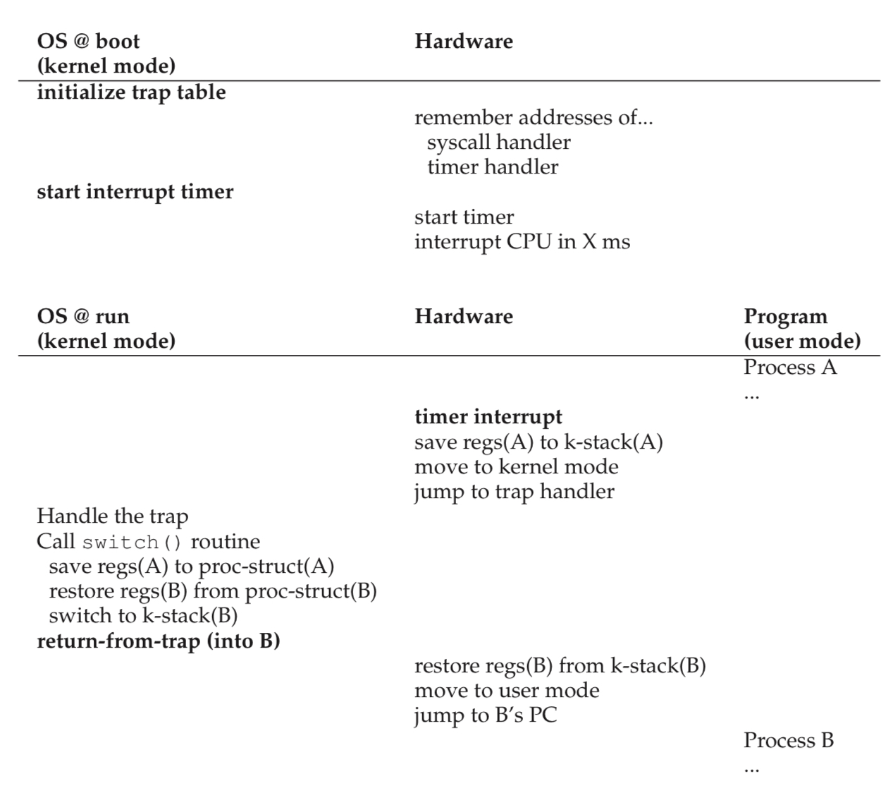
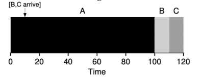
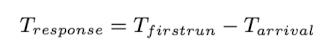
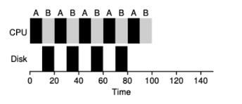
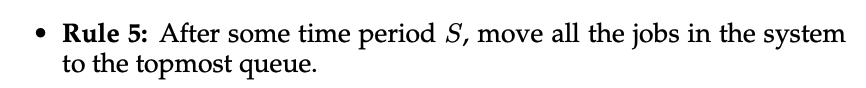
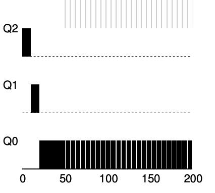
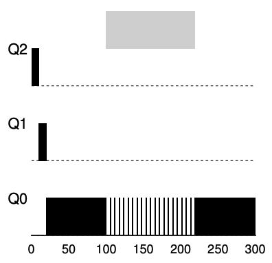
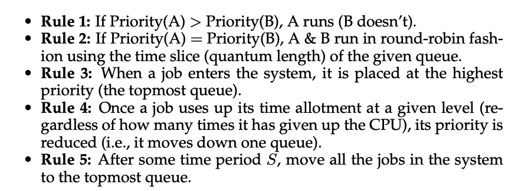

# Process

## Definition Process
- A process is an instance of a program running in a computer

## How to provide the illusion of many CPU ?
- 在Os中CPU會使用一種叫Virtualizing的技術來創造有多顆CPU的錯覺,最基本的變為time sharing of the cpu,將會 run as many concurrent processes as they would like

## Time-sharing
- time-sharing 是一種運用在os中的基本技術,最主要的作用就是共享資源,而且這種time-sharing mechanism is employed by all modern OS

## Abstraction A Process
- To understand what constitutes a process,we need to understand the machine state first which mean a program can read or write when it is running
- memory that the process can address `(call its address space)` is part of the process and another are registers for machine state

### Register for machine state
- program counter or PC `sometimes called the instruction pointer or IP)` tells us which instruction of the program is currently being executed.
- stack pointer and frame are used to manage the stack for function parameters, local variables,and return address.

### Separate police and mechanism
- 對於OS來說最常見的就是Low-Level and High-Level mechanisms`(機制)`.可以想像成 mechanism as providing the answer to HOW question about a system, For exampel
  - how does an operating system perform a context switch? the policy provides the answer to a which question
  - which process should the operating system run right now?
- Separating the two allows one easily to change polices without having to rethink the mechanism and is thus a form of modularity`(模組化)` which a general software design principle

## Process API
1. Create
2. Destroy
3. Wait
4. Miscellaneous Control
5. Status

## ProcessCreation A Little More Detail
- early operating system loading process is done eagerly,i.e.,all at once before running the program
- modern Os perform the process **lazy**,i.e.,loading pieces of code or data only as they are needed during program execution
  - OS allocates this memory which from the stack gives ot to the process
    - C programs use the stack for local variables,function parameters,and return address
  - OS also allocates the memory for the program heap
    - In C programs,the heap is used for explicitly requested dynamically-allocated data

## Process States
1. Running
2. Ready
3. Block
    - i.e.,when a process initiates an IO request to a disk, it becomes blocked and thus some other process an use the processor


## Data Structures
- The register context will hold,for a stopped process, the contents of its registers
- System initial state that the process is in when it is being created.
  - a process placed in a final state where it has exited but has not yet been cleaned up `In Unix base system call Zombie state`
- This final state can be useful as it allows other processes `programs return zero in unix-based systems when they have accomplished a task successfully,and non-zero otherwise`
- When finished,the parent will make one final call `e.g.,wait()` to wait for the completion of the child, and also tell os can clean up any relevant data structures that referred to the now-extinct process.
### Xv6 proc data structures
- The registers xv6 will save and restore to stop and subsequently restart a process
  ```c
  struct context {
    uint edi;
    uint esi;
    uint ebx;
    uint ebp;
    uint eip;
  };
  ```
- the different states a process can be in
  ```c
    enum procstate { UNUSED, EMBRYO, SLEEPING, RUNNABLE, RUNNING, ZOMBIE };
  ```
- the information xv6 tracks about each process including its register context and state
  ```c
    // Per-process state
  struct proc {
    uint sz;                     // Size of process memory (bytes)
    pde_t* pgdir;                // Page table
    char *kstack;                // Bottom of kernel stack for this process
    enum procstate state;        // Process state
    volatile int pid;            // Process ID
    struct proc *parent;         // Parent process
    struct trapframe *tf;        // Trap frame for current syscall
    struct context *context;     // swtch() here to run process
    void *chan;                  // If non-zero, sleeping on chan
    int killed;                  // If non-zero, have been killed
    struct file *ofile[NOFILE];  // Open files
    struct inode *cwd;           // Current directory
    struct shared *shared;       // Shared memory record (0 -> none)
    char name[16];               // Process name (debugging)
  };
  ```
## Process list
- The process list `also called task list` is the first such structure. It is one of the simpler ones, but certainly
  any OS that has the ability to run multiple programs at once will have
  something in order to keep track of all the running programs in the system
- the store information about a process as a ***Process Control Block***`also called PCB`, a way of talking about a C structure that contains information about each process`also called a process descriptor`

## Key Process terms
- The process is the major OS abstraction of a running program. At
  any point in time, the process can be described by its state which the contents of memory in its address space, the contents of CPU registers`(including the program counter and stack pointer, among others)`,
  and information about I/O `(such as open files which can be read or
  written)`.


- The process API consists of calls programs can make related to processes. Typically, this includes creation, destruction, and other useful calls.


- Processes exist in one of many different process states, including
  running, ready to run, and blocked. Different events `(e.g., getting
  scheduled or descheduled, or waiting for an I/O to complete)` transition a process from one of these states to the other.


- A process list contains information about all processes in the system. Each entry is found in what is sometimes called a process
  control block `(PCB)`, which is really just a structure that contains
  information about a specific process.

# System Call API

## How to create and control a process
- Unix presents one of the most ways to create a new process
  - fork
  - exec
- A process can use a thread routine to wait for a process it has created to complete
  - wait

## The fork System Call
- the fork system call is used to create a new process
  ```c
  #include "os.h"

  int main(int argc,char *argv[]){
      printf("hello world (pid:%d)\n", (int) getpid());
      int rc = fork();
      if (rc < 0){
          fprintf(stderr, "fork failed\n");
          exit(1);
      }else if(rc == 0){
          printf("hello, I am child of %d (pid:%d)\n",rc, (int) getpid());
      }else{
          printf("hello, I am parent of %d (pid:%d)\n", rc, (int) getpid());
      }
      return 0;
  }
  ```
- the process is created is an **exact copy of the calling process**
- the new process which parent creates we called it child process, and it does not run at the main function, and the child process is not an exact copy

## The wait System call
### Call fork and Wait
- if you have waited here, the parent will wait for the child to finish and continue to execute a parent process even the parent process runs first, it will wait the child process to finish, and return wait
- for this example, we can know that the child will always print first
- if the parent does happen to run first,it will immediately call wait; thus system call will not return until the child has run and exited
  ```c
  #include "os.h"

  int main(){
      printf("hello world (pid:%d)\n", (int) getpid());
      int rc = fork();
      if (rc < 0){
          fprintf(stderr, "fork failed\n");
          exit(1);
      }else if(rc == 0){
          printf("hello, I am child of %d (pid:%d)\n",rc, (int) getpid());
      }else{
          int rc_wait = wait(NULL);
          printf("hello, I am parent of %d (rc_wait = %d) (pid:%d)\n", rc,rc_wait, (int) getpid());
      }
  }
  ```
## The exec system call
- this system call is useful when you want to run a program that is different from the calling program.
- for example, calling fork is only useful if you want to keep running copies of the same program. However, often you want to run a **different** program, exec does just that
  ```c
  #include "os.h"
    int main(int argc,char *argv[]){
      printf("hello world (pid:%d)\n", (int) getpid());
      int rc = fork();
    if(rc < 0){
      fprintf(stderr, "fork failed\n");
      exit(1);
    }else if(rc == 0){
      printf("hello, I am child of %d (pid:%d)\n",rc, (int) getpid());
      char *myargs[3];
      // execvp is  guaranteed not to modify those strings so if not use strdup is ok
      // https://stackoverflow.com/questions/69505245/why-is-strdup-used-here
      myargs[0] = strdup("wc");
      myargs[1] = strdup("p3.c");
      myargs[2] = NULL;
      execvp(myargs[0], myargs);
      printf("this shouldn't print out");
    }else{
      int rc_wait = wait(NULL);
      printf("hello, I am parent of %d (rc_wait = %d) (pid:%d)\n", rc,rc_wait, (int) getpid());
    }
  }
  ```
  - What it does: first, given the name of an executable`(e.g.,,wc)`, and some arguments`(e.g.,p3.c)`,it loads code `and static data` from that executable and overwrites its current code segment `and static data`
  - the heap and stack and other parts of the memory space of the program are re-initialized

## Motivating the API
- the shell is just a user program. It shows you a prompt and then waits for you to type something into it
- This example lets the output of the program wc is redirected into the output file
  ```c
  #include "os.h"

  int main(int argc,char **argv){
      int rc = fork();
      if(rc < 0){
          fprintf(stderr, "fork failed\n");
          exit(1);
      }else if (rc == 0){
          close(STDOUT_FILENO);
          open("./p4.output",O_CREAT|O_WRONLY|O_TRUNC,S_IRWXU);

          //exec wc
          char *myargs[3];
          myargs[0] = strdup("wc");
          myargs[1] = strdup("p4.c");
          myargs[2] = NULL;
          execvp(myargs[0],myargs);
      }else{
          int rc_wait = wait(NULL);
      }

      return 0;
  }
  ```
## Process Control And Users
- Beyond fork,exec,and wait,there are a lot of other interfaces for interacting with a process in a Unix system
- In most Unix shells, certain keystroke combinations are configured to deliver a specific signal to the currently running process

### What is root
- users generally can only control their iwn processes but root can control all process
- for example, while most users cannot kill other users process, the superuser can.


### Key Process API Terms
- Each process has a name; in most systems, that name is a number
known as a process ID (PID).


- The `fork()` system call is used in UNIX systems to create a new process. The creator is called the parent; the newly created process is
called the child. As sometimes occurs in real life,the child
process is a nearly identical copy of the parent.


- The `wait(I)` system call allows a parent to wait for its child to complete execution.


- The `exec()` family of system calls allows a child to break free from
its similarity to its parent and execute an entirely new program.


- A UNIX shell commonly uses `fork()`, `wait()`, and `exec()` to
launch user commands; the separation of fork and exec enables features like input/output redirection, pipes, and other cool features,
all without changing anything about the programs being run.


- Process control is available in the form of signals, which can cause
jobs to stop, continue, or even terminate.

- Which processes can be controlled by a particular person is encapsulated`封裝的` in the notion of a user; the operating system allows multiple
users onto the system, and ensures users can only control their own
processes.


- A superuser can control all processes `(and indeed do many other
things)`; this role should be assumed infrequently and with caution
for security reasons.

# Limited Direct Execution

## The operating system needs to somehow share the physical CPU among many jobs running seemingly at the same time
- run one process for a little while, then run another one, and so forth
- By time-sharing the CPU in this manner, virtualization is achieved

## A few challenges in building such virtualization machinery
- The first is performance
  - how can we implement virtualization without adding excessive overhead to the system?
- The second is control
  - how can we run processes efficiently while retaining control over the CPU?

## Basic direct execution protocol
| OS                            | Program                  |
|-------------------------------|--------------------------|
| Create entry for process list |                          |
| Allocate memory for program   |                          |
| Load program into memory      |                          |
| Set up stack with argc/argv   |                          |
| Clear registers               |                          |
| Execute call main()           |                          |
|                               | Run main()               |
|                               | Execute return from main |
| Free memory of process        |                          |
| Remove from process list      |                          |

### few problems in our quest to virtualize the CPU
- 該如何確保運行的程序不會做出我們不期望的事情,但任然是非常有效率的
- When we are running the process, how does the os stop it from running and switch to another process

## Problem 1. Restricted Operations
- What if the process wishes to perform some kind of restricted`限制` operation

### How to perform restricted operations
- A process must be able to perform I/O and some other restricted operations, but without giving the process complete control over the system.
  How can the OS and hardware work together to do so?

- if we wish to build a file system that checks permissions before granting access to file
  - if we simply any user process issue IO to the disk, a process could simply read or write the entire disk, and thus all protections would be lost

### User mode
- we can run in user mode is restricted in what it can do
  - for example, we are running in user mode; a process cannot issue IO requests; if we did, the os will kill the process

#### Introduce
- user mode is kernel mode, which the operating system or kernel runs in.
  - In this mode, code that runs can do what it likes

## However, what should a user process dfo when it wishes to perform time kind of privileged operation?
- virtually all modern hardware provides the ability for user programs to perform a system call.
  - to execute a system call, a program must execute a special **trap** instruction

### Trap instruction
- this instruction simultaneously jumps into the kernel and raises the privilege level to kernel mode
  - in kernel mode, the system can perform whatever privileged operations are needed, and thus do the required work for the calling process
  - when finished, the os calls ap special return-from-trap instruction, returns into the calling user program while simultaneously reducing the privilege level back to user mode

- when we perform the trap instruction, the system must be careful.
  - for example, the process will push the program counter, flags, ad a few other registers onto a per-process kernel stack
  - the return-from-trap will pop these values off the stack and resume execution of the user mode program

### How Does the trap know which code to run inside the os?
- the calling process cannot specify an address to jump to. to jump anywhere into the kernel which clearly is a **Very Bad Idea**
#### Trap Table
- the kernel does so by setting up a trap table at boot time. When the machine boots up, it does so in privileged or kernel mode
- One of the first things is
  - tell the hardware what code to run when certain exceptional events occur. Once the hardware is informed, it remembers the location of these handlers until the machine is next rebooted
- to specify the exact system call, a **system-call number** is usually assigned to each system call. it is valid the number when handling the system call inside the trap handler, and if it is, executes the corresponding code.
- This level of indirection serves as a from of protection; user code cannot specify an exact address to jump to
- Trap table is a very powerful capability, it is also a privileged operation.

### What horrible things could you do to a system if you could install your own trap table? Could you take over the machine?


- In the first, the kernel initializes trap table, and the CPU remembers its location for subsequent use
- In the second, the kernel sets up a few things before using a return-from-trap instruction to start th execution of the process
  - switches the CPU to user mode and begins running the process.
- When the process wishes to issue a system call,it turns back into the OS, which handles it and once again returns control via a return-from-trap
  to the process.
- The process then completes its work, and returns from main; At this point,OS cleans up, and we are done

### Use Protected control Transefer
- The hardware assists the OS by providing different modes of execution.
  - In user mode, applications do not have full access to hardware resources.
  - In kernel mode, the OS has access to the full resources of the machine.
- Special instructions to trap into the kernel and return-from-trap back to
  user-mode programs are also provided, as well as instructions that allow
  the OS to tell the hardware where the trap table resides in memory.

## Problem 2. Switching Between Processes
- Switching between processes should be simple, right? But it actually is a little bit tricky
  - If a process is running on the CPU this by definition means the OS is not running
  - If the OS is not running, how can it do anything at all

### How to regain control of the cpu
- How can the operating system regain control of the CPU so that it can
  switch between processes?

### A Cooperative Approach Wait For System Calls
- One approach that some systems have taken in the past is known as the **cooperative** approach
  - In this style, the OS **trusts** the processes of the system to behave reasonably

- How does a friendly process give up the CPU in this utopian world
  - transfer control of the CPU to the OS quite frequently by making system calls
    - for example, to open a file and subsequently read it, or to send a message to another machine, or to create a new process.
- Systems like this often include an explicit **yield** system call,which does nothing except to transfer control
  to the OS so it can run other processes
- Application also transfers control to OS when they do something illegal`非法的`,
  - if an application divides by zero
  - tries to access memory that it should not be able to access
- it will generate a trap to the OS.The OS will then have control of the CPU again

#### If a process (whether malicious, or just full of bugs) ends up in an infinite loop, and never makes a system call? What can the OS do then?

### A Non-Cooperative Approach The OS Takes Control
- OS cannot do much at all when a process refuses to make system calls or mistakes and thus return control to the OS
- When a process gets stuck in an infinite loop is to resort to the age-old solution to all problems in computer system: **reboot the machine**

### How to gain control without cooperation
- How can the OS gain control of the CPU even if processes are not being
  cooperative?
- What can the OS do to ensure a rogue process does not take
  over the machine?

#### Time interrupt

- A timer device can be programmed to raise an interrupt every so many milliseconds;when the interrupt is raised, the currently running process is **halted**, and pre-configured **interrupt handler** in the OS runs.
- When the timer interrupt occurs
  - First: at boot time
  - Second: Also during the boot sequence, the OS must start the timer, which is of course a privileged operation
- Once the timer has begun, the OS can thus feel safe in that control will eventually be returned to it, and thus the OS is free to run user programs.
- The timer can also be turned off
-
### Use the timer interrupt to regain control
- the addition of a timer interrupt gives the OS the ability to run again on a CPU

### Reboot is useful
- infinite loops under cooperative preemption is to reboot the machine
- reboot or in general, starting over some piece of software can be a hugely useful tool in building robust systems
- reboot is useful because it moves software back to a known and likely more tested state. Reboots also reclaim stale or leaked resources `e.g.,memory` which may otherwise be hard to handle
- when the interrupt occured such that a subsequent return-form-trap instruction will be able to resume the running program correctly
#### Use reboot likely using a time-tested approach to improving the behavior of a computer system

### Saving and Restoring Context
- Whether to continue running the currently-running process, or switch to a different one. This decision is made by a part of the operating system known as the **scheduler**
- If the decision is made ti switch, the OS then executes a low-level piece of code which we refer to as a **context switch**
  - all the OS has to do is save a few register values for the currently-executing process and restore a few for the soon-to-be-executing process
- To save the context of the currently-running process, the OS will execute some code to save the general purpose registers, PC, and the kernel stack pointer of the currently-running process, and then restore
- By switching stacks, the kernel enters the call to the switch code in the context of one process and returns in the context of another
- When the OS finally executes a **return-form-trap** instruction, the soon-to-be-executing process becomes the currently running process.

### Switch
- In the timer interrupt handler, the OS decides to switch from running Process A to Process B. it calls **switch**
  - save current register values, into the process structure of A
  - restores the registers of Process B, from its process structure entry
  - switches contexts, specifically by changing the stack pointer to use **B's** kernel stack and not **A's**

```asm
# Context switch
#
#   void swtch(struct context **old, struct context *new);
#
# Save the current registers on the stack, creating
# a struct context, and save its address in *old.
# Switch stacks to new and pop previously-saved registers.

.globl swtch
swtch:
  movl 4(%esp), %eax
  movl 8(%esp), %edx

  # Save old callee-saved registers
  pushl %ebp
  pushl %ebx
  pushl %esi
  pushl %edi

  # Switch stacks
  movl %esp, (%eax)
  movl %edx, %esp

  # Load new callee-saved registers
  popl %edi
  popl %esi
  popl %ebx
  popl %ebp
  ret
```
- First, the user registers of the running process are implicitly saved by the **hardware**, using the kernel stack of that process
- Second, when the OS decides to switch from A to B; in this case, the **kernel registers** are explicitly saved by the **software** `(i.e.,the OS)`

### Worried About Concurrency
- during interrupt or trap handling, another interrupt occurs is called concurrency.
- One simple thing an OS might do is disable interrupts during interrupt processing, but disable interrupt for too long could lead to lost interrupts which is bad.
- Also developed a number of sophisticated **locking** schemes to protect concurrent access to internal data structures.
  - This enables multiple activities to be ongoing within the kernel at the same time
  - locking can be complicated and lead to a variety of interesting and hard-to-find bugs

## Summary

### Key CPU virtualization terms
- The CPU should support at least two modes of execution: a restricted user mode and a privileged (non-restricted) kernel mode.


- Typical user applications run in user mode, and use a system call
to trap into the kernel to request operating system services.


- The trap instruction saves register state carefully, changes the hardware status to kernel mode, and jumps into the OS to a pre-specified
destination: the trap table.


- When the OS finishes servicing a system call, it returns to the user
program via another special return-from-trap instruction, which re-
duces privilege and returns control to the instruction after the trap
that jumped into the OS.


- The trap tables must be set up by the OS at boot time, and make
sure that they cannot be readily modified by user programs. All
of this is part of the limited direct execution protocol which runs
programs efficiently but without loss of OS control.


- Once a program is running, the OS must use hardware mechanisms
to ensure the user program does not run forever, namely the timer
interrupt. This approach is a non-cooperative approach to CPU
scheduling.


- Sometimes the OS, during a timer interrupt or system call, might
wish to switch from running the current process to a different one,
a low-level technique known as a context switch.
thus readied, you can let your baby roam freely, secure in t

#  CPU Scheduling

- we will now do just that, presenting a series of **scheduling policies** sometimes called **disciplines**

## Workload Assumptions
- the process running in the system called **workload**
- We wil make the following assumptions`假設` about the processes, simetimes called the jobs, that are running in the system
  - Each jobs runs for the same amount of time
  - All jobs arrive at the same time
  - Once started, each job runs to complete
  - All jobs only us CPU (i.e.,they perfrom not IO)
  - The run-time of each job is known

## Scheduling Metrics
- Beyond making workload assumptions, we also need one more thing to enable us to compare different scheduling policies: a **scheduling metric**
- A metric is just something that we use to **measure** something, and there are a number of different metrics that make sense in scheduling

### turnaround time
- the turnaround time of a job is defined as the time at which the job completes minus the time at which the job arrived in the system
  
- turnaround time is a **performance metric**
- Performance and fairness are often at odds in scheduling
  - for example; may **optimize performance** but **decrease fairness** because of the cost of preventing a few jobs from running

## FIFO (First In First Out)
- First In, First Out scheduling or sometimes called First Come, First Served (FCFS)
- Now we have an example
  
  - the average turnaround time for the three job is simply
    - $10+20+30/3 = 20$
- but..., how about when the three jobs have different length of time
- For example;
  
  - the average turnaround is $100+110+120/3 = 110$, but it is more than B job or C job
- this problem is generally referred to as the **convoy effect**
  - where number of relatively short consumers of a resource get queued behind a **heavyweight** resource consumer
- So what should do can solve the problem which is run for different amounts of time of jobs

## Shortest Job First (SJF)
- this new scheduling discipline is known as **Shortest Job First (SJF)**, and the name should be easy to understand this algorithm
- because the relatively short consumers been stuck by heavyweight consumers, so we execute B, C and A
  
  - the average turnaround time will be $10+20+120/3 = 50$
- In fact, given our assumptions about jobs all ariving at the same time, we could prove **SJF** is indeed on **optimal** scheduling algorithm
- Now we assumptions A arrive at $T=0$ but B and C arrive at $T=10$
  
  - now the average arround is $100+(110-10)+(120-10)/3 = 103.3$
  - because B and C arrived shortly after A, they still are forced to wait until A has completed

## Shortest Time-to-Completion First (STCF)
- use timer interrupts and context switching, the scheduler can certainly do something else when B and C arrive: it can **preempt** job A and decide to run another job
  - SJF by our definition is a **non-preemptive** scheduler
- There is a scheduler which does exactly that **add preemption to SJF**, known as the **Shortest Time-to-Completion First(STCF)** or **Preemptive Shortest Job First(PSJF)**
- The STCF determines which of the remaining jobs `(including the new job)` has the least time left, and schedules that one
  - For example, STCF would preempt A and run B and C to completion, only when they are finished would A's remaining time be scheduled.
  
  - the average turnaround time will be $(120-0)+(20-10)+(30-10)/3$

## A new Metric: Response Time
- STCF would be great policy. In fact, for a number of early batch computing system, these types of scheduling algorithm made some sense
- However, the **time-shared** machines changed all that, and new metric was born: **response time**
  
## Round Robin (RR)
- To solve this problem, a new scheduling algorithm, classically referred to as **Round-Robin(RR)**
  - the basic idea is simple: instead of running jobs to completion, RR runs a job for a **time slice** (sometimes called a **scheduling quantum**) and then switches to the next job in the run queue
  - 如此一來就有效化的優化response time, 但如果time slice太長, 則 RR 和 SJF 沒什麼兩樣, 但如果time slice太短, context switch的時間會造成巨大影響
  
    - time response for SFJ is $0+5+10/3 = 5$
    - time response for RR is $0+1+2/3 = 1$
- RR, with a reasonable time slice, is thus an excellent scheduler if response time is our only metric
  - But RR is indeed one of the **worst** policies if turnaround time is our metric
- Because turnaround time only. cares about when jobs **finish**, RR is nearly pessimal`最差的`,even worse than simple FIFO in many case
- Any policy (such as RR) that is **fair** will perform poorly on metrics such as turnaround time
  - if you are being **unfair** can run shorter jobs to completion, and turnaround time will be better, but the cost of response time is lowered

## Incorporating IO
- we will relax assumption 所有的task都不執行IO
- clearly has a decision`決定` to make when a job initiates an IO request
  - the currently running job will not be using CPU during the IO, it is **blocked** waiting for IO completion
- The scheduler also has to make a decision when the IO completes.
  - When that occurs, an interrupt is raised, and the OS runs and moves the process that issued the IO **from blocked back to the ready state**
  
- 要解決這個問題我們需要將CPU burst是為independent job, 則底下的所有工作都是independent的
  - 需要各自10 time until 的 task A (sub job)
  - 需要50 time until 的 task B
## 流程
- 當第一個task A 完成,此時task A做IO
- 我們就可以把CPU拿來執行task B
- 當task A的IO完成時, task A的第二個sub job 進入queue中
- 這時STCF scheduler 會將CPU交給task A的sub job, 因為completion time較短

## Overlap
- 上述的行為就overlap,可以最大化系統的使用率

## Summary
- Both are bad where the other is good
  - The first runs the shortest job remaining and thus optimizes turnaround time
  - The second alternates between all jobs and thus optimizes response time
- Now we solve three problems
  - task execute for the same amount of time
  - task arrive at the same time
  - task perform no I/O
- But have still not solved the problem of the fundamental`基本的` invability`不可變性` of the OS to see into the futurer
- Building a scheduler that uses the recent past to **predict the future** is known as **multi-level feedback queue**

# Multilevel Feedback Queue Scheduling
- **Multilevel Feedback Queue (MLFQ)** tries to address two-fold
  - First: it would like to optimize **turnaround time**, but the OS cannot know how long a job will run for, exactly the knowledge that algorithm like SJF or STCF require
  - Second: MLFQ would like to make system feel **response to interactive users**, and thus minimize **response time**

## MLFQ basic rule
- The **key** to MLFQ scheduling therefore lies in how the scheduler sets
  priorities. Rather than giving a fixed priority to each job


- the MLFQ has a number of distinct **queue**, each assigned a different **priority level**
- MLFQ uses priorities to decide which job should run at a given time: a job with higher priority is chosen to run
  
- MLFQ **varies** the priority of a job base on its **observed behavior**, for example
  - a job repeatedly relinquishes the CPU while waiting for input from the keyboard, MLFQ will keep its priority high
  - a job uses the CPU intensively`密集的` for long periods`期間` of time, MLFQ will reduce its priority
- MLFQ will try to **learn** about processes as they run, and thus use the **history** of the job to **predict** its **future** behavior
- 如果想要了解靜態隊列的話是遠遠不夠的,如下圖
  
- 可以看到在high priority的A和B,中間的C和最低的D
  - 藉由我們目前已知的MLFQ原理,會將time slice分配給A和B,C和D將會無法分配到time slice,這顯然非常unfair

## How to Change Priority
- 我們現在需要決定如何在job的life time改變他的priority, 也就是所在隊列的位置,因此我們需要考慮他的workload
  - a mix of interactive jobs that are short-running (and may frequently relinquish the CPU)
  - some longer-running **CPU-bound** jobs that need a lot of CPU time but where response time isn’t important
- 要解決這個問題,需要一個new concept, which we called the job's allotment
  - allotment指的是一個job的priority可以停留的時間,如果超過這段時間,concept將會降低他的priority


### Example 1. A Single Long-Running Job

- job在Q2上執行一段時間後被concept降級到Q1,job在Q1執行一段時間過後再被concept降級到Q0

### Example 2. Along Came A Short Job

- Job A (shown in black) is running along in the lowest-priority queue
  - as would any long-running CPU-intensive jobs
- Job B (shown in gray) arrives at time T = 100
  - thus is inserted into the highest queue,because it's arrive time is bigger than Job A
  - as its run-time is short (only 20 ms)
- 由於concept沒辦法 **提前** 知道job will be a short job or a long-running job
  - 因此先*assumes**為short job,thus giving the high priority
  - If it actually is a short job,it will run quickly and complete
  - If it is not a short job, it will slowly move down the queues, and thus soon prove itself to be a long-running more batch-like`批次的` process

### Example 3. What About I/O?
- 藉由上述4b的規則可以知道
  - if a process gives up the processor before using up its allotment, we keep it at the same priority level.
- for example, is doing a lot of IO such as waiting for user input from keyboard or mouse
  - it will relinquish`放棄` CPU before its allotment is complete, we don’t wish to penalize`懲罰` the job and thus simply keep it at the same level

  - Job B (shown in gray) that needs the CPU only for 1 ms before performing an I/O competing
  - Job A (shown in black) with a long-running batch job for the CPU
    - The MLFQ approach keeps B at the highest priority because B keeps releasing`or say it relinquish` the CPU
    -  If B is an interactive job, MLFQ further`進一步` achieves its goal of running interactive jobs quickly

## Problems With Our Current MLFQ
- First, the problem of starvation`飢餓` if there are **too many** jobs in the system
  - they will combine to consume **all** CPU time, and thus long-running job will **never** receive any CPU time(they starve)
- Second, user could rewrite their program to **game the scheduler**
  - because our cpu before the allotment is used, issue an IO operation will and thus relinquish the CPU
    - 具體來說, 當程序接近分配上限才釋放, 既不會觸發decrease priority rule(4a),又可以保證high priority, the job could nearly`幾乎` monopolize`壟斷` the CPU
- Finally, a program may change its behavior overtime
  - what was CPU-bound transition to a phase`階段` of interactivity`互動性`, 但按照現在的rule, 沒辦法像其他互動性program被對待

## The Priority Boost
- if we can avoid the problem of starvation. What could we do in order to guarantee`保證` that CPU-bounds jobs will make some progress`進展`
  - periodically`定期` boost the priority of all the jobs in the system

- This new rule solves two problems
  - First, processes are guaranteed not to starve, by sitting in the top queue, a job will share the CPU with other high-priority jobs in a round-robin fashion
  - Second, if a CPU-bound job has become interactive, the scheduler treats it properly once it has received the priority boost
- for example
  - there is not priority Boost, and thus the long-running job gets starved until the two short jobs arrive
  
  - there is a priority boost every 100ms, and thus we at least guarantee that the long-running job will make some progress
  
## Better Accountin
- we now have one more problem to solve: how to prevent gaming of our scheduler?
  - the problem is because 4a,4b rules, which let a job retain its priority by relinquishing the CPU before its allotment expires
- The solution here is to perform better **accounting** of CPU time at each level of the MLFQ


- The solution here is to perform better **accounting** of CPU time at each level of the MLFQ
  - concept應該追蹤process在某個priority時所花費時間, 而不是forgetting how much time slice
  - 一旦jobs用完分配的time slice，就應降低其priority。不管這些時間是一次性耗盡還是分多次用完
  
- for example
  - workload tries to game the scheduler with the old Rules 4a and 4b.
    - without any protection from gaming, a process can issue an IO before its allotment ends, thus staying at the same priority level, and dominating CPU time.
    
  - workload with better accounting in place
    - regardless of the IO behavior of the process, it slowly moves down the queues, and thus cannot gain an unfair share of the CPU.
    
## Tuning MLFQ And Other Issues
- One big question is how to parameterize such a scheduler
- key parameterize
  - queue 數量,應該有多少層queue
  - time slice, 每層要有多少time slice
  - time allotment, allotment 要多少才合適
  - priority boost 頻率, 應該多久進行一次priority boost to avoid starvation and change behavior
- 這些參數沒有明確的最佳值，只能通過經驗、對工作負載的觀察和調整來找到平衡
- Time slice 的調整
  - high priority
    - 分配較短的time slice, 因為這些隊列中的工作多為互動式作業，快速切換能提高響應速度
  - low priority
    - 分配較長的time slice, 因為這些隊列中的工作多為長期運行的 CPU 密集型作業


## MLFQ實現範例
- Solaris 的 Time-Sharing(TS)調度器:
  - 使用配置表來定義每個進程的priority調整規則,time slice長度和priority boost頻率。
  - 預設值:60 個隊列,時間片從 20 毫秒（最高優先級）到數百毫秒（最低優先級）,priority boost約每 1 秒執行一次。系統管理員可自定義表格以調整調度器行為
- FreeBSD 調度器(4.3 版)
  - 使用數學公式根據進程使用的 CPU 時間計算當前priority
  - 引入 CPU 使用率的衰減機制,隨時間降低使用量,實現與priority boost類似的效果

##  Summary
- it has **multiple levels** of queues
- uses **feedback** to determine the priority of a given job
- **History** is its guide: pay attention to how jobs behave over time and treat them accordingly

## Rule

## Why MLFQ
- MLFQ can deliver excellent overall performance (similar to SJF/STCF) for short-running interactive jobs
- and MLFQ is fair and makes progress for long-running CPU-intensive workloads.

# Lottery scheduling
- different type of scheduler known as a proportional-share scheduler, also called as a **fair-share** scheduler
- 定期抽籤讓Loterry scheduler決定哪一個process應該執行
- 讓更常執行的process贏得更多的Loterry
- 由於使用機率性抽籤來達成近似公平性，與Round Robin相比能更好的達到資源分配，並且允許process動態調整weight

## How to Share the CPU proportional

### Basic Concept: Tickets Represent Your Share
- tickets 代表了哪一個process獲得的source額度,假設A有75張的彩票,B有25張,
  - 我們會希望A佔用了75%的cpu resource,B則是25%的cpu resource

## Ticket Mechanisms
1. ticket currency
    - 假設有A和B都有各100張彩票,A分配給A1,A2各Acurrency張彩票
    - B只有一個工作給B1(100*(n/m))張彩票
    - 接著再從講池裡面抽A1,A2 or B

<MermaidDiagram chart={`
graph TD;
A --> Acurrency;
Acurrency --> A1
Acurrency --> A2
A1 --> 60
A2 --> 40
60 --> A's_global
40 --> A's_global
B --> Bcurrency;
Bcurrency --> B1;
B1 --> global-A's_global
`} />

2. ticket transfer
    - 在client,server端特別有用,client請求後可以transfer self ticket to server, let serbver speeder itself
3. ticket inflation
    - 假設process知道自己需要更多CPU,可以inflation self ticket來告素OS,這過程不需要告訴其他process,但也可能會產生starvation,因為自身提高weight的關係，倒置其他process分配不到資源

## 實現Lottery scheduling
```c
#include <stdio.h>
#include <stdlib.h>
#include <string.h>
#include <assert.h>

struct node_t {
    int tickets;
    struct node_t *next;
};

struct node_t *head = NULL;

int g_tickets = 0;

void insert(int ticket) {
    struct node_t *tmp = malloc(sizeof(struct node_t));
    assert(tmp != NULL);
    tmp -> tickets = ticket;
    tmp -> next = head;
    head = tmp;
    g_tickets += ticket;
}

void print_list() {
    struct node_t *cur = head;
    while(cur) {
        printf("[%d]",cur->tickets);
        cur = cur->next;
    }
    printf("\n");
}

int main(int argc, char **argv) {
    if(argc != 3) {
        fprintf(stderr,"usage: ./ls <seed> <loops>\n");
        exit(1);
    }
    int seed = atoi(argv[1]);
    int loops = atoi(argv[2]);
    srandom(seed);

    insert(50);
    insert(100);
    insert(25);

    print_list();

    for(int i=0;i<loops;i++){
        int counter = 0;
        int winner = random() % g_tickets;
        struct node_t *cur = head;
        while(cur) {
            counter = counter + cur->tickets;
            if(counter > winner)
                break;
            cur = cur->next;
        }

        print_list();
        printf("winner: %d %d\n\n",winner,cur->tickets);
    }
    return 0;
}
```
