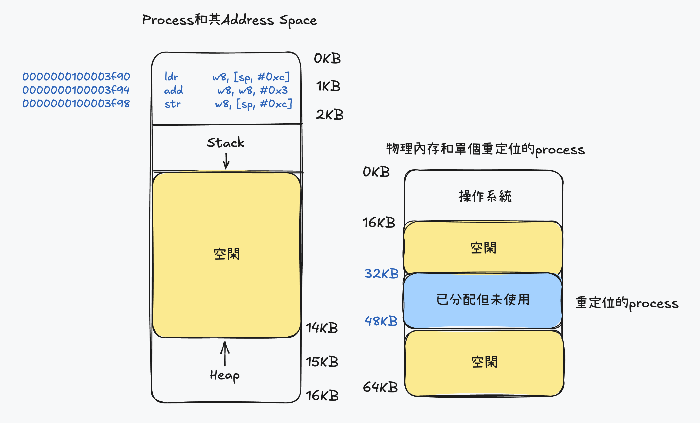
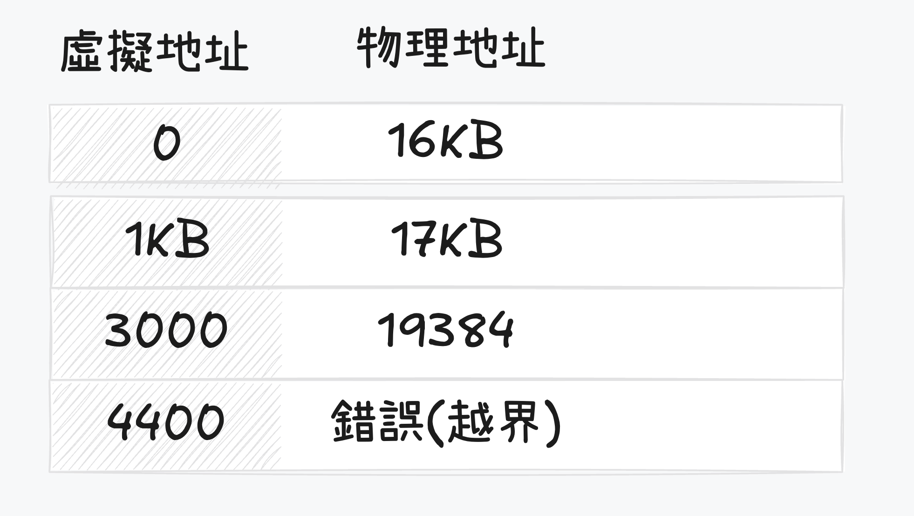
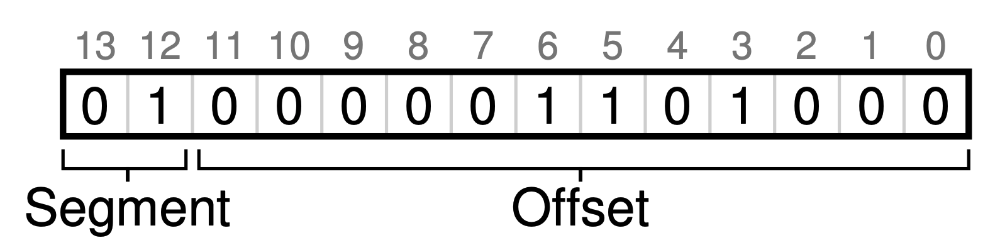
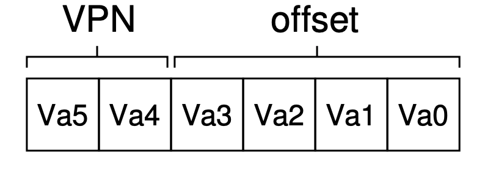
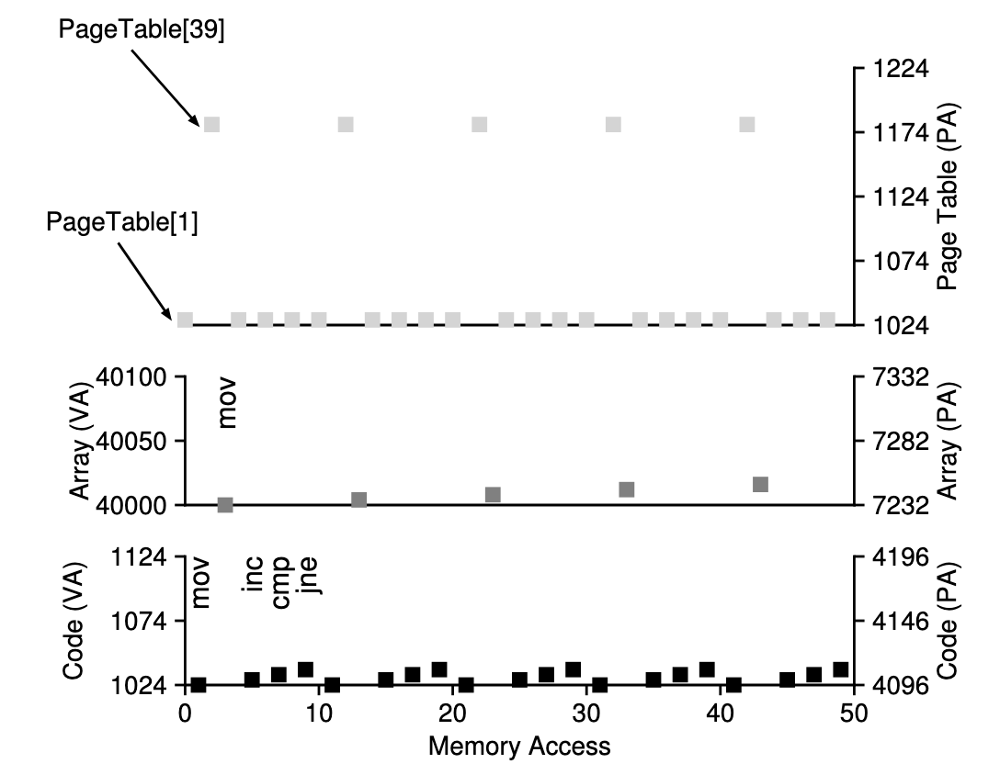

# The Abstraction: Address Space

## Multiprogramming and Time sharing
- 為了避免process之間的互相等待,因此從signalprogramming進步到multiprogramming,但在效能提升的同時,如和避免process之間互相干擾成了另一個問題

## Address Space
- Address space是process的虛擬記憶體,每個process都具備自己的address space
- process的address space包含運行程序的所有記憶體狀態,比如code必須在記憶體中,因為他們在因為他們在address space裡
  * 當程式運行時利用stack保存函數調用訊息,分配空間給局部變量
  * 利用heap管理動態分配的以及用戶管理的記憶體

## 虛擬Memory的目標
1. transparency: process感知不到memory被虛擬化的事實,反而認為自己擁有自己的private physical memory
2. efficiency: os追求虛擬化盡可能的effiecnt,包括在時間和空間上.在實現高效率虛擬memory時,os不得不依靠硬體
3. protection: os應該確保process受到保護不會受到其他process影響,os本身也不會受到任何process影響.當一個prcess執行load,store或指令提取時,不應該用任何方式訪問或影響其他prcess以及os本身的memory

### 你看到所有地址都不是真的
- 使用C語言打應出來的地址是虛擬地址,並且將由os轉換成物理地址
```c
#include <stdio.h>
#include <stdlib.h>

int main(int argc, char *argv[]) {
  printf("location of code: %p\n", (void *)main);
  printf("location of heap: %p\n", (void *)malloc(1));
  int x = 3;
  printf("location of stack: %p\n", (void *)&x);
}
```

# Mechanisms: Address Translation
- 實現CPU虛擬化時,我們遵循的準則被稱為Limited Direct Execution (LDE)
  * LDE原則是os盡量不干擾CPU執行process,只有在關鍵時才及時介入(interposing)來保持對硬體得控制
- 利用基於硬體的地址轉換(hardware-based address translation)又稱address translation 來保證高效靈活的虛擬化
  * 使用address translation,硬體對每次memory訪問進行處理都將指令中的victual address轉為十集的physical address來實現受限執行
  * 因此每次memory訪問時,硬體都會進行address translation,將應用程式的memory引用重定位到memory實際位置

## Example
- 編寫一段C語言程式碼
```c
int main() {
  int x;
  x = x + 3;
}
```
- 使用otool來反編譯程式成ASM code
```asm
0000000100003f90	ldr	w8, [sp, #0xc] # 載入x變量
0000000100003f94	add	w8, w8, #0x3 # 將x變量加3
0000000100003f98	str	w8, [sp, #0xc] # 將結果存回x變量
```
### 使用匯編的角度來看
1. 從地址3f90獲得指令
2. 執行指令(從地址0xc載入數據)
3. 從地址3f94獲得指令
4. 執行指令(沒有memory訪問)
5. 從地址3f98獲得指令
6. 執行指令(將結果存回0xc地址)

### 使用程式角度
- 他的address space從0開始到16KB結束,所有的memory引用都在這範圍內
- 然後虛擬memory來說,os希望將這些位址放在物理memory的不同地方,不一定從地址0開始,那我們該如何重定向這個process以及對該process保持transparent
- 底下圖片說明process的address space被放入物理memory後可能的樣子,從圖可以看到操作系統第一塊物理memory留給自己,並將上述地址空間重店味道從32KB開始的物理memory地址,剩下的兩塊memory空閒




## Dynamic Address Translation
- CPU需要兩個硬體Register分別是base register和bound register(也稱為limit register)
  * base register: os決定process在其裡memory中的實際address,並將起始的address記錄在base register中
  * bound register: os決定process在其裡memory中的結束address,並將結束的address記錄在bound register中
- 當CPU訪問memory時,會將虛擬地址與base register和bound register進行比較
  * 如果虛擬地址小於base register或大於bound register,則會報錯
  * 如果虛擬地址在base register和bound register之間,則將虛擬地址加上base register的值來獲得物理地址
- 由上述可以得出一個公式
$\text{physical address} = \text{virtual address} + \text{base register}$

### Bound Register作用
- bound register是為了確保process不會超過其address space的範圍,如果process試圖訪問超出其address space的memory,則會報錯
- 進而隔離當前process和其他process,確保process之間不會互相干擾


- process中使用德的memory引用都是virtual address,硬體接下來將vitrual address加上base register的值來獲得physical address
- 底下簡化先前的asm code中指令的位址
  - 簡化0000000100003f90成128(數字代替表達,不考慮轉換以及值是否正確)
```asm
128 ldr	w8, [sp, #0xc] # 載入x變量
```

### 流程
1. 當PC首先被設置為128後
2. 硬體需要獲得這條指令時,先將這個值(128)加上base register的值32KB(32768)來獲得實際的物理位址(32896)
3. process從virtual address 15KB的加載,處理器同樣需樣virtual address 15KB加上base register的值32KB(32768)來獲得物理位址(48768)
4. 有了物理位址後,處理器可以從物理memory中讀取數據

- 將虛擬地址轉換為物理地址的過程稱為address translation技術ㄓ,而當這種address translation在運行時發生,並且我們甚至可以在process運行後改變其address space,這種技術被稱為dynamic address translation

## Dynamic Address Translation要求
1. 硬體必須提供base and bound registers,因此每個CPU的Memory Management Unit (MMU)都必須額外擁有這兩個register
2. 硬體提供一些privileged指令,只有在kernel模式下指行,其作用為修改base register和bound register的值
3. 當用戶嘗試非法訪問memory時(越界訪問),CPU必須能夠產生異常(exception)並安排os的exception handler來處理這個問題

| 硬體要求                       | 解釋                               |
|----------------------------|----------------------------------|
| 特權模式                       | 需要,以防用戶模式的process執行特權操作          |
| base/bound register        | 每個CPU需要一對register來支持地址轉換和bound檢查 |
| 能夠轉換virtual address並檢查是否越界 | 電路完成轉換和檢查bound                   |
| 優改base/bound register的特權指令 | 再讓用戶程式運行之前,os必須能夠設定值             |
| 註冊異常處理的特權指令                | os必須能夠告訴硬體,當異常發生時執行那些程式          |
| 觸發異常                       | 如果process試圖使用特權指令或越界訪聞           |

## OS: The New Problem
- 為了支持dynamic address tanslation,硬體支持和操作系統管理結合在一起,實現了一個簡單的虛擬內存系統,因此在關鍵時刻os**需要**介入,已實現base bound方式的虛擬Memory

1. 當process創建時,os必須找到足夠的memory address,而整個操作都會圍繞在Free list上
  - 可以把整個物理Memory想像成一組抽屜,標記了空閑或以使用,當new process創建時ㄝos檢索這一個抽屜,為新的address space找到位址,並標記成已被使用
2. 當process終止時,os也必須做一些工作,回收他的所有Memory,給其他process使用,當process終止時,os將會把這些Memory放回空閑列表,並根據需要清除相關的數據結構
3. 在context switch時,os必須執行一些額外的工作,由於每個CPU都只有一組base and bound register,因此os必須保存和恢復base和bound register
  - 當process停止時(即終止運行),os可以改變其地址空間的物理位置
    * 要移動process的address space步驟
    1. os讓process停止運行
    2. 將address space拷貝到新的位置
    3. 更新保存的base register(在process結構中)
    4. 指向新位置
  - 當process恢復執行時,其(新)base register就會被恢復,顯然他的指令和數據都在新的Memory位址

4. os必須提供exception handler,或要一些function,當process越界訪問Memory時,CPU會觸發異常,os必須要能夠終止這些process

|  操作系統的要求                      | 解釋                               |
|----------------------------|----------------------------------|
| 內存管理                       |  需要為新process分配Memory|
|                               | 從終止的process回收Memory |
|                               | 一般通過free list來管理Memory      |
| base bound 管理       | 必須在context switch時正確設置base和bound register |
| 異常處理 | 當異常發生時執行的程式,可能的動作是終止犯錯的process                  |


### 補充: FreeList
[FreeList](/blog/freeList)

## 基於時間線展示硬體和os的互動
### Boot

| OS @boot (kernel mode)                            | Hardwarre                  |
|-------------------------------|--------------------------|
| initialize trap table |                          |
|    |     remember address of...                     |
|       |     system call handler                     |
|    |     timer handler                     |
|             |     illegal mem-access handler                     |
|            |     illegal instruction handler                     |
|                               | Run main()               |
|                               | Execute return from main |
| start interrupt timer       |                          |
|      |start timer;interrupt after $\text{X}_\text{ms}\ $                          |
| initialize process table| |
| initialize free list | |

### Run
| OS @run (kernel mode)                            | Hardwarre                  | Program (user mode)
|-------------------------------|--------------------------|--------------------------|
| To start processA: |                          | | |
| 1. allocate entry in process table | | |
| 2. alloc memory for process | | |
| 3. set base and bound registers | |  |
| 4. return-from-trap (into A) | | |
|                           |restore registers of A move to user mode jump to A's(initial) PC | |
| | | Process A runs Fetch instruction |
| | translate virtual address perform fetch | |
| | | Execute instruction |
| | if explicit load sotre | |
| | 1. ensure address is legal | |
| | 2. translate virtual address | |
| | 3.perform load and store | |
| | | Process A runs |
| | Timer interrupt | |
| | move to kernel mode | |
| | jump to handler | |
| Hnadle timer | | |
| 1. decide: stop A, run B | | |
| 2. call switch() routine | | |
| 3. save register(A) to process-struct(A) (include base and bound registrer)| | |
| 4. restore register(B) from process-struct(B) (include base and bound registrer)| | |
| 5. return-from-trap (into B) | | |
| | restore register of B | |
| | move to user mode | |
| | jump to B's PC | |
| | | Process B runs Execute bad load |
| | Load is out-of-bounds | |
| | move to kernel mode | |
| | jump to trap handler | |
| Handle the trap | | |
| decide to kill process B | | |
| deallocate B's memory | | |
| free B's entry in process table | | |

## 目前問題
- 簡單的Dynamic Address translation能夠支持Process transparent但還有問題無法解決
- 重定位process使用了從 $\text{32KB}$ 到 $\text{48KB}$ 的物理地址,但由於process的stack和heap並不是很大,導致這塊Memory中大量的空間被浪費
  - 這種浪費稱為intrenal fragmentation

### internal fragmentation
- 指的是已經分配的Memory單元內部有未使用的空間(即fragmentation).造成了浪費,
  - 因為這些fragmentation無法被其他process使用(不足其他process的需求)
- 在我們當前的方式中,即使有足夠的物理Memory容納更多process,但我們目前要求將adress spoace放在固定大小的抽屜,因此出現了internal fragmentation

# Segmentation
- 目前的情況都是將所有的process載入到Memory中,並且使用base/bound register來讓os將不同的process進行address translation到不同的physical address,但這樣會發現在stack和heap間存在很大的空閑區塊


## Segmentation 范化的base/bound
- 在MMU中引入不只base/bound register,而是給address space內的每個segment一對,一個segment只是address space中的連續定長區域,典型的segment有3個部分
  1. code
  2. stack
  3. heap
- segment讓os將不同的segment放到不同的physical address,從而避免了虛擬address space中未使用但佔用physical memory的問題

|segment|base|bound|
|-------|----|-----|
|code|32KB|2KB|
|heap|34KB|2KB|
|stack|28KB|2KB|

- 假設現在引用virtual address為100的地址,MMU將base加上偏移量得到實際的physical address $100+32KB=32868$ , 然後再檢查該地址是否在bound內(這邊的地址指的不是實際physical address,而是vitrualaddress 的地址) $100 < 2KB$ , 發現再bound內部後就發起調用

- 再看到圖1的範例,假設現在要引用的是heap的地址,假設直接將4200加上stack的base 34KB的話會是錯的,因為4200的基底是從4KB(4096)開始,因此應該是 $4200-4096=104$, 然後再檢查該地址是否在bound內,確認在bound內後再將 $104+32KB=34920$ 得到實際的physical address

- 當我們試圖訪問超過bound的address時,就會發生segmentation violation 或是 segmentation fault

## 怎麼知道調用的是那個Segment


- 由圖中可以知道前兩位代表的是告hardware説調用的是哪一個段(stack,heap,code),剩下的12位則是偏移量
  - 因此先使用前兩位找到相對應的segment後再使用偏移量+基底address就可以獲得實際的物理位址
- 現在可以將上述所做轉換成程式碼的形式,也因為偏移量簡化了對bound的判斷,因此只需要檢查偏移量是否小於bound而非大於bound的非法地址

```c
#define SEG_MASK 0x3000
#define SEG_SHIFT 12
#define OFFSET_MASK 0xFFFF

// get top 2 bits of 14-bit
Segment = (VirtualAddress & SEG_MASK) >> SEG_SHIFT

// get offset
Offset = VirtuaalAddress & OFFSET_MASK

if (Offset >= Bounds[Segment])
  RaiseException(PROTECETION_FAULT)
else
  PhysAddr = Base[Segment] + Offset
  Register = AccessMemory(PhysAddr)
```

- 這邊只使用兩個段是因為,假設使用3個段表示的話,有可能會造成其中一個被浪費,因此有些系統會將heap和stack當成一個段,然後用一bit來做標示
- 在implicit方式中,硬體功過address產生的方式來確定段
  - 例如: 如果地址由pc產生,即為指令獲取,則位址在code段, 假設基於stack或base指針則一定在stack段,其他地址在heap段

## How about Stack
- 在上圖中可以看到stack被重定位到28KB的地方,但和其他不同的地方在於stack是反向增長的,也就是始於28KB增長到26KB,相對應的虛擬地址也是從16KB到14KB
- 因此硬體需要額外已1bit來區分是否為反相增長(1代表正向,0代表反向)

|segment|base|bound|reverse|
|-------|----|-----|-------|
|code|32KB|2KB|1|
|heap|34KB|2KB|1|
|stack|28KB|2KB|0|

- 因為反向的緣故,在計算address transtaltion時會有所不同
  - 假設現在要訪問的是15KB的虛擬地址,對應到的物理地址為27KB

1, 先將15KB轉換成2進制形式 11 1100 0000 0000,利用前兩位來指定段,並且計算出偏移量為3KB
2. 為了得到正確的偏移量,因此要將現在的偏移量減去最大的段地址(即為bound的上界地址)

$ 3KB - 4KB = -1KB $

3. 此時再將偏移量加上base address得到實際的physical address

$ -1KB + 28KB = 27KB$

4. 進行bound檢查,確保偏移量的 *絕對值* 小於sagment的大小

## Support Shared
- 為了節省Memory,有時會在address space之間共向segment是有用的行為,因此硬體會需要新增protecetion bit來標示是否能夠對segment進行RW
- 將code segment標示為只讀時,可以讓他被多個process共享但不會破壞process 間的隔離

|segment|base|bound|reverse|protect|
|-------|----|-----|-------|-------|
|code|32KB|2KB|1|Read-Excute|
|heap|34KB|2KB|1|Read-Write|
|stack|28KB|2KB|0|Read-Write|

- 有了protection bit後前面虛擬地址是否越界外,還需要檢查特定的訪問是否允許,如果從事非法訪問hard會拋出異常並且讓os來handle這些error

## 操作系統支持
- 現在當系統運行時,address space會被不同的segment重定位到physical memory中,相比於之前使用base/bound的方法節省了不少的physical memory
  - 具體來說 stack和heap不需要再分配physical memory,讓我們能將更多的address space放入 physical memory

### 遇到的問題
1. os在進行Context switch 時該做些什麼

- 各個segment register中的內容必須保存和恢復,因為每個process都有自己獨立的vritual address space, 因此os必須在process運行前確保被正確設置

2. physical address 中充滿了許多free space的小洞,這些洞很難再分配給新的segment或是擴充原有的segment,這類的問題被稱為(external fragmentation)

- 第一種解法是compact physical memory
  - os 將所有的process終止後,將數據複製到連續的memory區域中,並且改變他們的segment register內的值,指向新的物理地址,從而獲得足夠大的連續空間
  - 但這樣造成的問題是成本很高,因為copy segment是memory intensive(密集),因此會佔用大量的processor(處理器)時間
- 第二種解法是利用 free-space management算法,試圖保留較大的memory區塊來進行分配

# Page

- os 有兩種方法管理和解決空間問題
  1. 分片:將空間分成不同的分片(segment),就像 virtual memory 中管理,但將空間切成不同長度的分片後空間會碎片化(framented),導致時間越長越難分配
  2. 分頁:將空間分成固定長度的分片,和分片不同的是分頁不是將一個process的address space分割成不同長度的logic段,而是把physical memory看成*定長*曹塊的陣列(page frame)
    - 每個page frame包含一個virtual memory page

- 下圖是一個關於page的簡單範例,左邊的 virtual memory而右邊是對應到的 physical memory
  - 可以看到改進了原先使用segment的靈活性,通過完善分頁方法可以有效提供address space,不管process如何使用address space,並且也提供了 free list管理的簡單性
    - os希望將64 byte的小address space放到8page的physical address space中只需要從free list找到4個空閑就可以

<div class="flex">
<Image src="../../public/v5.png" width="1000" height="400" />
<Image src="../../public/v4.png" width="800" height="400" />
</div>

- 為了記錄address space中每個virtual page放在physical memory中的位置, os 會為每個process保存名為page table的數據結,主要存放為virtual page 的address translatiion
  - 使用右邊的圖當作範例, page table會有以下4個條目
  - $\text{virtual page} \equiv \text{VP}$
  - $\text{physical frame} \equiv \text{PF}$
$$
\begin{align*}
1. \text{VP}0 \rightarrow \text{PF}3 \\
2. \text{VP}1 \rightarrow \text{PF}7 \\
3. \text{VP}2 \rightarrow \text{PF}5 \\
4. \text{VP}3 \rightarrow \text{PF}2
\end{align*}
$$

## translation
- 現在要從virtual memory找到對應的physical memory
- 假設我們擁有64byte的process正在訪問memory

```asm
movl <virtual address>, %eax
```

- 為了translate該過程生成的virtual address,必須將 virtual address分成兩個組件
  1. virtual page number, VPN
  2. page中的偏移量, offset

- 從剛剛virtual memory中的圖可以知道將64byte空間分成4個page,因此每個page為16byte
$$
  64Byte/4Byte = 16Byte
$$
- 然後virtual address space總共為64byte,因此地址總共需要6位
$$
  \log_2{64} = 6
$$
- 此時就可以將page切塊
  - 從剛剛得知一個page的大小為16Byte,因此可以知道Offset大小
  - page大小為16byte位於64Byte中,因此可以選擇4個page,VPN做的就是選取這件事
$$
\begin{align*}
Offset = \log_2{64} = 4 \\
VPN = \log_2{4} = 4
\end{align*}
$$



### Example
- 假設尋找virtual address為21
1. 先將21轉為2進制 $010101$
2. 依照前面的算法得知
  - VPN在第一頁所在的physical page (01)
  - 而Offset則為(0101)
3. 找到physical page中對應的PFN(由上圖得知在第7個frame),因此PFN(有時也稱PPN)為7(111)
4. Offset不變
5. 因此找到對應的physical address 為 $1110101$

## paging 很慢
- 一樣使用movl模擬分頁並循找原因
```asm
movl 21, %eax
```
- 現在只在乎對21的顯示引用,要先將21轉換成對應的physical address,但在從對應的pphysical address前,必須先從process的page中提取適當的項進行轉換
  - 此時將 VPNMASK 設定為 $0x30 \rightarrow 110000_2$ (原因為VPN切割後只有2位)
  - SHIFT為offset的位元數(4)
- 為了要獲得正在運行的process中page的位址,需要假設一個page-table base register包含page起始位址的physical address
```c
VPN = (VirtuaalAddress & VPNMASK) >> SHIFT;
PTEADDR = PageTableBaseRegister + (VPN * sizeof(PTE));
```
- 找到VPN後將該值作為page-table base register指向PTE數組的index
- 一但知道這個物理地址後,hardware就可以從memory中獲得PTE並且提取PFN,並將來自Virtual address的offset進行計算,形成最後的physical address
  - 可以想像PFN被SHIFT左移,然後和偏移量進行計算形成最終地址
```c
VPN = (VirtuaalAddress & VPNMASK) >> SHIFT;
PTEADDR = PageTableBaseRegister + (VPN * sizeof(PTE));
PTE = AccessMemory(PTEADDR);

if(PTE.valid == False)
  RaiseException(SEGMENTATION_FAULT);
else if(CanAccess(PTE.protectBits) == FALSE)
  RaiseException(SEGMENTATION_FAULT);
else
  offset = VirtuaalAddress & OffsetMask;
  PhysAddr = (PFN << SHIFT) | Offset;
  Register = AccessMemory(PhysAddr);
```

## Memory Trace
- 假設今天有一個C code
```c
int array[1000];
// ...
for(int i=0;i<1000;i++)
  array[i] = 0;
```
- 將它轉換成asm code後
```asm
0x1024  movl $0x0, (%edi,%eax,4)
0x1028  incl %eax
0x102c  cmpl $0x03e8,%eax
0x1030  jne 0x1024
```
- 假設有一張線性表(array)則可以由此推斷出在此數組中VPN對應的PFN
  - mov 則會有一個顯示的memory 引用,這會先增加另一個page table訪問(將數組vritual address轉換成正確的physical address)


- 假設現在超過圖中的5次訪問
  1. 當找到超過當前VPN時會進行換頁查找
  2. 而會新訪問incstruction memory, data memory(array), page table memory

# TLB
- 現在的paging之所以慢是因為將memory address space切分成大量固定大小的page,並且需要記錄mapping的訓息(virtual -> physical)
- 因為這些訊息一般存在physical memory中,所以在translation virtual memory時,page需要一次額外的memory access
  - 每次的fetch instruction, load, store都需要額外讀一次memory才能得到translation訊息

## 使用Cache解決
- 增加translation-lookaside buffer(TLB)儲存頻繁發生的virtual address to physical address的hardware cache
  - 因此也稱為address-translatiion cache
- 對每次memory access, hardware先檢查TLB內的訊息,如果有可以直接完成mapping而不用訪問page table

## TLB基本算法

```c
VPN = (VirtuaalAddress & VPNMASK) >> SHIFT;
(Success,TlbEntry) = TLB_Lookup(VPN);
if(Success == true)
  if(CanAccess(TlbEntry.ProtectBits) == True)
    offset = VirtuaalAddress & OffsetMask;
    PhysAddr = (TlbEntry.PFN << SHIFT) | Offset;
    Register = AccessMemory(PhysAddr);
  else
    RaiseException(SEGMENTATION_FAULT);
else
  PTEAddr = PTBR + (VPN * sizeof(PTE));
  PTE = AccessMemory(PTEADDR);

  if(PTE.valid == False)
    RaiseException(SEGMENTATION_FAULT);
  else if(CanAccess(PTE.protectBits) == FALSE)
    RaiseException(SEGMENTATION_FAULT);
  else
    TLB_Insert(VPN,PTE.PFN,PTE.ProtectBits);
    RetryInstruction();
```

### 文字流程如下
1. 從Virtual address中提取VPN
2. 檢查TLB內是否有該VPN的轉換地址
  - 假設命中成功,則從相關的TLB取出PFN後與原來的virtual address中的Offset組合形成Physical address,並訪問memory
3. 如果沒有命中,hardware訪問page table來尋找PTE
4. 假設該PTE可以訪問
5. 將新的translation 訊息插入TLB
6. 重新執行一次指令(讓該TLB hit然後訪問Memory以避免什麼都沒發生)

- 因為訪問page table需要額外的memory access因此造成較大的性能開銷,因此我們會希望盡量避免TLB miss

## Access array
