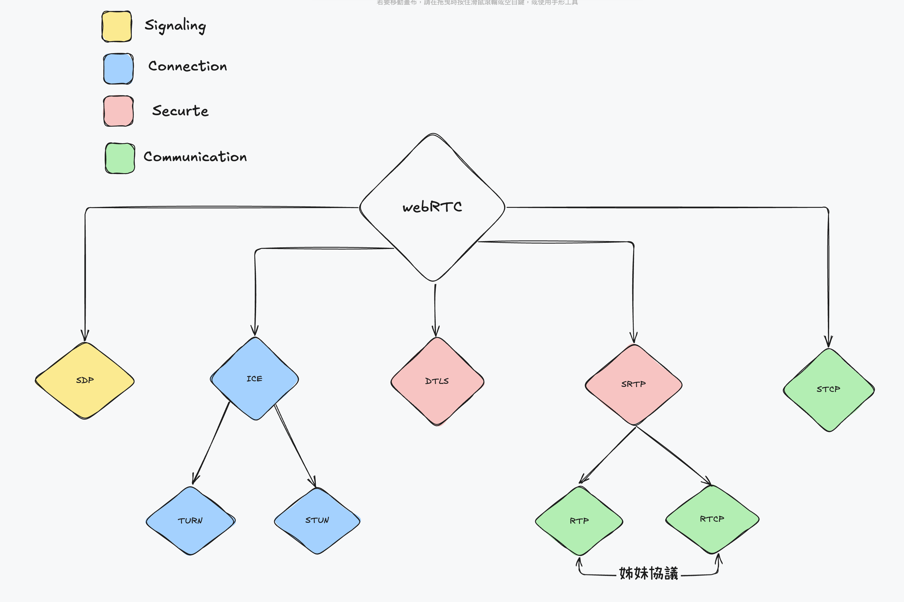
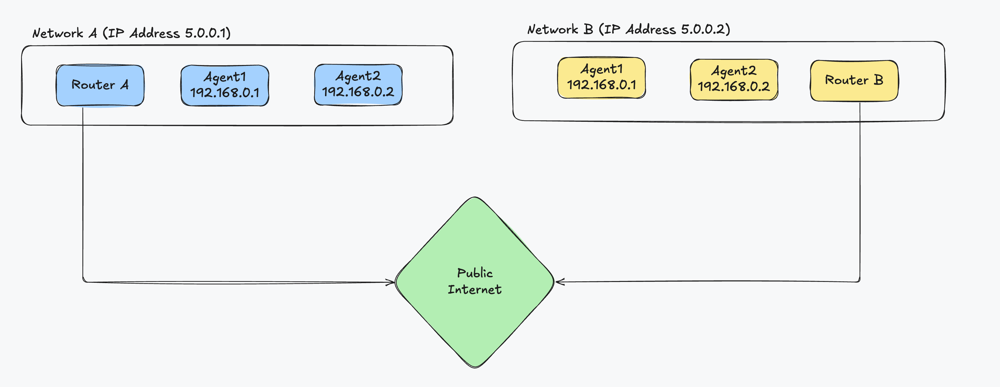

# Introduction to webRTC
- webRTC 是一系列協議的集合,而整個主題可以分為以下四個步驟
1. 信號 Signaling
2. 連接 Connecting
3. 安全加密 Securing
4. 通訊 Communicating
## 簡易步驟流程

### 信號: peer如何在webRTC中找到彼此
- 當webRTC Agent啟動時,他不知道誰通訊以及其通訊的內容,信號解決了這個問題,信號用於引導呼,以便兩個webRTC Agent開始通訊
- 信號使用SDP(會話描述協議),每個SDP消息街有一組Key-Value對,並包含Media sections列表,兩個webRTC Agent交換的SDP包含
1. Agent可供外部訪問(候選)的IP地址和port
2. Agent希望發送多少音頻和video streams
3. Agent支持哪些影音編Communicating碼
4. 連接時需要用到的值(uFrag/uPwd)
5. 加密傳輸時需要用到的值(ICE keys)
### 連接: peer如何建立連接
- 現在兩個webRTC Agent已經知道彼此的訊息,因此嘗試互相連接,這個過程使用ICE技術
- ICE(交互式連接建立)允許兩個Agent之間的連接,這些Agent可以在同一個/不同網路上,ICE無需中央伺服器即可建立直接連接的解決方案
- ICE成功連接後,webRTC 就會繼續建立和加密數據
### 安全加密: peer如何加密連接
- 現在藉由ICE成功建立了雙向通訊,webRTC 接下來會使用基於UDP的TLS協議,也被稱為DLTS(數據報傳輸層安全信)以及需要SRTP(安全實時傳輸協議)
1. webRTC通過ICE建立的連接進行DLTS握手來進行連接,webRTC只判斷通過DTLS交換的證書是否通過信號共享簽名,不會需要相TLS一樣需要CA證書
2. webRTC使用RTP協議進行影音傳輸,使用SRTP加密RTP數據包,SRTP使用DLTS會話來提取密鑰
- 現在還需要處理的是數據包丟失和帶寬限制的問題
### 通訊: peer如何傳輸數據
- 現在我們具備安全且雙向的通訊功能的webRTC Agent,接下來需要使用RTP(實時傳輸協議)和SCTP(流控制傳輸協議)來傳輸數據
- 我們使用RTP來交換使用SRTP加密過後的數據,並且使用SCTP發送和接收那些使用DTLS加密過的Data Channel數據
## webRTC真實面貌
- webRTC看似複雜,但當我們從不同角度看webRTC Agent時,會發現它不過是許多協議的協調器而已

# 信號Signaling
- 當一個webRTC Agent被創建時,他對其他peer一無所知,因此交換訊號會是初始的引導程式,peer間交換彼此的訊息才可以相互通訊
- 訊號消息只是文本,webRTC Agent並不關心傳遞的方式,通常使用webSocet傳輸,但不是一定

## 什麼是會話描述協議(SDP)
- 在webRTC中,兩個webRTC Agent會將建立所需的所有狀態透過SDP來分享
- SDP本身是一個key-value協議,每一row是一個值
- SDP的開頭將一單個符號表示(key),等號後面的都是value
- SDP中的key具有一定的意義,只能使用規定的字母
```text
a=my-sdp-value
a=second-value
```
- 在這一個範例中,每行的key都是a且value分別為my-sdp-value和second-value
## SDP中規範的key值
- WebRTC並未使用SDP所定義的所有key,只有用在JavaScript Session Establishment Protocol([RFC8829](https://datatracker.ietf.org/doc/html/rfc8829))被使用的key

| 符號 | 定義                                                     |
|----|--------------------------------------------------------|
| v  | Version,應為`0`                                          |
| o  | Origin,包含一個唯一ID,用於重新協商                                 |
| s  | Session Name,應為 `-`                                    |
| t  | Timeing,應為`0 0`a                                       |
| m  | Media Description(`m=<media> <port> <proto> <fmt>...`) |
| a  | Attribute,一個自由文本字段,為webRTC中最常見的row                     |
| c  | Connection Data,連接數據,應為`IN IP4 0.0.0.0`                |


### Media Description
- 一個Session中可以包含無限數量的media description
- 一個media description定義中,包含一個格式列表,這廂格式mapping到RTP有效附載類型上,實際的編解碼器由sdp中的`rtpmap`定義

### 開始分析
- 以下用一個sdp的部分內容當作範例
```text
v=0
m=audio 4000 RTP/AVP 111
a=rtpmap:111 OPUS/48000/2
m=video 4000 RTP/AVP 96
a=rtpmap:96 VP8/90000
```
1. v=0代表的是version,應該為0(由上述表格定義)
2. 由m可以得知此sdp表中具有兩個media description分別是audio和video
3. audio 格式為`111`並將有效附載類型mapping到OPUS編解碼器
4. video 格式為`96`並將有效附載類型mapping到VP8編解碼器上

- 完整範例
```text
v=0
o=- 0 0 IN IP4 127.0.0.1
s=-
c=IN IP4 127.0.0.1
t=0 0
m=audio 4000 RTP/AVP 111
a=rtpmap:111 OPUS/48000/2
m=video 4002 RTP/AVP 96
a=rtpmap:96 VP8/90000
```
- `v`,`o`,`s`,`c`,`t` 雖然被定義,但**不會**對webRTC session產生影響
- 這邊存在兩個media description分別為audio和video
- 每個media description都有一個屬性,這個數性配置了RTP管道的詳細訊息

## SDP和WebRTC如何協力工作

- webRTC使用offer和answer模型,一個webRTC Agent發出Offer開始呼叫,如果另一個webRTC Agent接收Offer的內容就會回應Answer
- 這讓兩個webRTC Peer互相理解對發希望交換何種格式的方式

### 用於發送和接收的Transceivers
- Transceivers的作用是將SDP中的media description暴露給javascript api,每個media description都將成為一個transceivers,每此創建trannsceivers時,都會將media description添加到本地sdp中

- webRTC中的每個media description都包含一個direction屬性,webRTC可以聲明: 我將向你發送此邊解碼器,但我不接受任何返回值.
- direction屬性有四個有效值

| 屬性 | 解釋  |
|----|--------------------------------------------------------|
| send  |  只傳送不接收,表示此端只會送出媒體資料,但不接收對方的資料(e.g.直播主的端點)                                        |
| recv  | 只接收不傳送,表使此端只接收媒體資料,不送出自己的資料(e.g. 觀眾端點)                                |
| sendrecv  | 雙向媒體傳輸,表示發送與接收媒體資料(e.g. 視訊通話)                       |
| inactive  | 不傳送也不接收                          |

### webRTC用到的SDP值
|屬性| 解釋|
|----|-----|
|group:BUNDLE| BUNDLE是一種在單連接上傳輸懂種類下的行為|
|fingerprint:sha-256|該屬性是peer用於DTLS證書的Hash值,DTLS握手後會和此證書進行比較|
|setup|該屬性控制了DTLS Agent的行為,在ICE連接後,該屬性用來確定DTLS Agent是作為client還是server|
|     |setup:active 作為DTLS client|
|     |setup:passive 作為DTLS server|
|     |setup:actpass 要求另一個webRTC Agent選擇|
| mid |該屬性是media description的唯一ID,用於標示媒體|
| ice-ufrag| 該屬性是ICE Agent的用戶片段值,用於ICE流量的身份驗證|
| ice-pwd| 該屬性是ICE Agent的password,用於ICE流量的身份驗證|
| rtpmap|該屬性是將特定的邊解碼器mapping到RTP有效負載類型,有效負載為動態,每次呼叫時發起者都需要確定每個邊解碼器的有效負載|
| fmrp| 該屬性為一種有戲負載類型定義的附加值,要傳遞特定的影音配置文件會編碼器設置時用到|
| candidate|該屬性是ICE Agent的ICE候選地址,為可能被webRTC Agent使用的地址|
| ssrc| 一個同步源(SSRC)定義了一個單獨的媒體流|
| label| 是此媒體流的ID|
|mslabel|是容器的ID,該容器中可能存在多個流|

### 一個範例
```text
v=0
o=- 3546004397921447048 1596742744 IN IP4 0.0.0.0
s=-
t=0 0
a=fingerprint:sha-256 0F:74:31:25:CB:A2:13:EC:28:6F:6D:2C:61:FF:5D:C2:BC:B9:DB:3D:98:14:8D:1A:BB:EA:33:0C:A4:60:A8:8E
a=group:BUNDLE 0 1
m=audio 9 UDP/TLS/RTP/SAVPF 111
c=IN IP4 0.0.0.0
a=setup:active
a=mid:0
a=ice-ufrag:CsxzEWmoKpJyscFj
a=ice-pwd:mktpbhgREmjEwUFSIJyPINPUhgDqJlSd
a=rtcp-mux
a=rtcp-rsize
a=rtpmap:111 opus/48000/2
a=fmtp:111 minptime=10;useinbandfec=1
a=ssrc:350842737 cname:yvKPspsHcYcwGFTw
a=ssrc:350842737 msid:yvKPspsHcYcwGFTw DfQnKjQQuwceLFdV
a=ssrc:350842737 mslabel:yvKPspsHcYcwGFTw
a=ssrc:350842737 label:DfQnKjQQuwceLFdV
a=msid:yvKPspsHcYcwGFTw DfQnKjQQuwceLFdV
a=sendrecv
a=candidate:foundation 1 udp 2130706431 192.168.1.1 53165 typ host generation 0
a=candidate:foundation 2 udp 2130706431 192.168.1.1 53165 typ host generation 0
a=candidate:foundation 1 udp 1694498815 1.2.3.4 57336 typ srflx raddr 0.0.0.0 rport 57336 generation 0
a=candidate:foundation 2 udp 1694498815 1.2.3.4 57336 typ srflx raddr 0.0.0.0 rport 57336 generation 0
a=end-of-candidates
m=video 9 UDP/TLS/RTP/SAVPF 96
c=IN IP4 0.0.0.0
a=setup:active
a=mid:1
a=ice-ufrag:CsxzEWmoKpJyscFj
a=ice-pwd:mktpbhgREmjEwUFSIJyPINPUhgDqJlSd
a=rtcp-mux
a=rtcp-rsize
a=rtpmap:96 VP8/90000
a=ssrc:2180035812 cname:XHbOTNRFnLtesHwJ
a=ssrc:2180035812 msid:XHbOTNRFnLtesHwJ JgtwEhBWNEiOnhuW
a=ssrc:2180035812 mslabel:XHbOTNRFnLtesHwJ
a=ssrc:2180035812 label:JgtwEhBWNEiOnhuW
a=msid:XHbOTNRFnLtesHwJ JgtwEhBWNEiOnhuW
a=sendrecv
```
- 我們可以將這SDP拆成以下
#### sdp配置
```text
v=0
o=- 3546004397921447048 1596742744 IN IP4 0.0.0.0
s=-
t=0 0
a=fingerprint:sha-256 0F:74:31:25:CB:A2:13:EC:28:6F:6D:2C:61:FF:5D:C2:BC:B9:DB:3D:98:14:8D:1A:BB:EA:33:0C:A4:60:A8:8E
a=group:BUNDLE 0 1
```

### 第一個media description
- 為audio且使用sendrecv來進行雙向溝通
```text
m=audio 9 UDP/TLS/RTP/SAVPF 111
c=IN IP4 0.0.0.0
a=setup:active
a=mid:0
a=rtcp-mux
a=rtcp-rsize
a=rtpmap:111 opus/48000/2
a=fmtp:111 minptime=10;useinbandfec=1
a=ssrc:350842737 cname:yvKPspsHcYcwGFTw
a=ssrc:350842737 msid:yvKPspsHcYcwGFTw DfQnKjQQuwceLFdV
a=ssrc:350842737 mslabel:yvKPspsHcYcwGFTw
a=ssrc:350842737 label:DfQnKjQQuwceLFdV
a=msid:yvKPspsHcYcwGFTw DfQnKjQQuwceLFdV
a=sendrecv


```

#### 第二個media description
- 為video且使用sendrecv進行雙向溝通
```text
m=video 9 UDP/TLS/RTP/SAVPF 96
c=IN IP4 0.0.0.0
a=setup:active
a=mid:1
a=rtcp-mux
a=rtcp-rsize
a=rtpmap:96 VP8/90000
a=ssrc:2180035812 cname:XHbOTNRFnLtesHwJ
a=ssrc:2180035812 msid:XHbOTNRFnLtesHwJ JgtwEhBWNEiOnhuW
a=ssrc:2180035812 mslabel:XHbOTNRFnLtesHwJ
a=ssrc:2180035812 label:JgtwEhBWNEiOnhuW
a=msid:XHbOTNRFnLtesHwJ JgtwEhBWNEiOnhuW
a=sendrecv
```

#### ICE候選地址,為第一個media description中的內容
- 有ICE候選位址和身份驗證,因此我們可以嘗試連接
```text
a=candidate:foundation 1 udp 2130706431 192.168.1.1 53165 typ host generation 0
a=candidate:foundation 2 udp 2130706431 192.168.1.1 53165 typ host generation 0
a=candidate:foundation 1 udp 1694498815 1.2.3.4 57336 typ srflx raddr 0.0.0.0 rport 57336 generation 0
a=candidate:foundation 2 udp 1694498815 1.2.3.4 57336 typ srflx raddr 0.0.0.0 rport 57336 generation 0
a=end-of-candidates
```

#### 身份驗證
1. video
```text
a=ice-ufrag:CsxzEWmoKpJyscFj
a=ice-pwd:mktpbhgREmjEwUFSIJyPINPUhgDqJlSd
```
2. audio
```text
a=ice-ufrag:CsxzEWmoKpJyscFj
a=ice-pwd:mktpbhgREmjEwUFSIJyPINPUhgDqJlSd
```

#### 證書指紋
- 因為具有證書指紋,因此可以安全呼叫
```text
a=fingerprint:sha-256 0F:74:31:25:CB:A2:13:EC:28:6F:6D:2C:61:FF:5D:C2:BC:B9:DB:3D:98:14:8D:1A:BB:EA:33:0C:A4:60:A8:8E
```

# 連接
- webRTC 不使用一般的P2P連接,因為P2P連接中創建連接的任務會平分給等待的peer,而在webRTC中的peer無法猜測道傳輸地址,而且webRTC在會話的時候可能會變傳輸地址
- 因此webRTC盡可能的收集所有可能的訊息,並盡力實現兩個webRTC Agent之間的通訊,不過可能會遇到以下問題
  1. 兩個客戶端使用不同的網路協議(e.g. `UDP <-> TCP`)
  2. 兩個客戶端使用不同的IP版本(e.g. `IPv4 <-> IPv6`)

- webRTC的連接過程通過Interactive Connectivity Establishment(ICE [rfc8445](https://datatracker.ietf.org/doc/html/rfc8445))實現,但在實現的過程中,會遇到網路特性的問題

### webRTC 相較傳統client/server的優勢
1. 降低帶寬成本
- 由於媒體間的通訊直接發生在peer之間,因此不需要額外服務器來進行流轉發
2. 更低延遲
- 因為peer間直接通訊的關係,不會需要通過服務器上的所有內容
3. 安全的端到端通訊
- 因為沒有通過服務器的關係,不用考慮數據是否被伺服器解密

### 現實網路的限制
- 在大多數情況下,兩個webRTC Agent不會在同個網路下(你和實況主很難是同一個網路吧),因此webRTC典型的呼叫都是在沒有直接連接下的不同網路進行通訊

- 在這一個公共Internet連接兩個不同網路的範例,對相同網路上的主機來說連接非常簡單 `192.168.0.1 -> 192.168.0.2`
- 但Router B沒辦法直接訪問到Router A上的主機,Router B可以發送請求給Router A但就結束了,因為Router A不知道應該將這消息轉發給哪一台主機
- 除此之外,有些網路不允許UDP通訊,也些可以允許,這也會讓不通訊的過程變得困難
- 以及防火牆的問題,因為防火牆或防毒軟題無法辨識webRTC的數據包,由於不知道如何處理,他們就有可能會阻擋這些數據包

## NAT映射
- 使用NAT映射的方式讓webRTC通訊看到了一點可能,以圖下作為範例
- 在 NAT 架構中，內部節點主動對外通訊時,NAT 會建立一筆映射記錄,只要該映射有效且 NAT 類型允許,外部主機向對應的外部映射位址發送封包,便會被 NAT 路由器自動轉發給內部的節點
### Example

<Image src="../../public/webrtc4.png" width="400" height="200" />

- Agent 1（內網 `IP：192.168.0.1`）主動向外發送封包,觸發 Router A（對外 `IP：5.0.0.1`）建立 NAT 映射關係(即一種被動記錄的綁定).此後，只要是從 Router B 發送到該映射位址(`IP: 5.0.0.1:62000`)的流量,Router A 就會根據映射表,自動將封包轉發給原本綁定的 Agent 1(`IP: 192.168.0.1`)

### NAT創建映射
- 當數據包發送到外部網路的地址時,一個NAT映射就被創建(NAT映射只是由NAT分配的一個臨時public IP)

-  NAT映射的創建又可以分成3類
- NAT映射的創建可以想為NAT網路中的主機**發送**數據時,router的處理方式

| 類型 | 作用  |範例|
|----|--------------------------------------------------------|-----|
|端點無關的映射   | NAT網路中所有創建者只創建一個映射|如果將兩數劇包發送到兩個不同的遠程地址,這一個NAT創建的public IP 將會被重用,因此兩個主機所看到的IP地址會是相同的|
|  地址相關的映射| 每次數據包到新地址時都會創建新的映射|如果將兩個數據包發送到不同主機,則會創建兩個映射;如果將兩個數據包發送到同一主機的不同port,不會創建新的映射|
|  地址和port相關的映射 | 如果遠程IP或port不同,創建一個新的映射|如果將兩個數據包發送到同個主機的不同port,則會創建一個新的映射                    |

### NAT映射過濾

- 映射過濾的行爲也可以分為3種
- NAT映射過濾可以想為NAT網路中的主機**接收**數據時,router的處理方式

|類型|作用|範例|
|----|----|----|
|端點無關的過濾|任何人都可以使用該映射|可以和多個peer共享此映射,都可以藉由此映射轉發流量|
|地址相關的過濾|只有創建此映射的主機才能使用|如果將數據包發送到主機`A`則可以回應,如果主機`B`嘗試發送數據包到此映射則被忽略|
|port和地址相關的過濾|只有創建此映射的主機和port才能使用|如果將數據包發送到主機`A:5000`則可以回應,如果主機`A:5001`嘗試發送數據包到此映射則被忽略|

### NAT映射刷新
- 通常如果5min未使用此映射,則將其銷毀,但原則上取決於ISP或硬體製造商

## STUN
- STUN(NAT會話傳輸實用程序)是一種配合NAT使用的協議,現在能夠創建NAT映射,但不知道映射的IP和port為何
  - STUN不僅可以創建NAT映射,還可以獲得和分享創建得這一個NAT映射的所有訊息,因為他允許使用編寫程式的方式創過NAT映射

### 協議結構
```text
 0                   1                   2                   3
 0 1 2 3 4 5 6 7 8 9 0 1 2 3 4 5 6 7 8 9 0 1 2 3 4 5 6 7 8 9 0 1
+-+-+-+-+-+-+-+-+-+-+-+-+-+-+-+-+-+-+-+-+-+-+-+-+-+-+-+-+-+-+-+-+
|0 0|     STUN Message Type     |         Message Length        |
+-+-+-+-+-+-+-+-+-+-+-+-+-+-+-+-+-+-+-+-+-+-+-+-+-+-+-+-+-+-+-+-+
|                         Magic Cookie                          |
+-+-+-+-+-+-+-+-+-+-+-+-+-+-+-+-+-+-+-+-+-+-+-+-+-+-+-+-+-+-+-+-+
|                                                               |
|                     Transaction ID (96 bits)                  |
|                                                               |
+-+-+-+-+-+-+-+-+-+-+-+-+-+-+-+-+-+-+-+-+-+-+-+-+-+-+-+-+-+-+-+-+
|                             Data                              |
+-+-+-+-+-+-+-+-+-+-+-+-+-+-+-+-+-+-+-+-+-+-+-+-+-+-+-+-+-+-+-+-+
```

#### STUN 訊息類型
- 每個STUN數據包都會有一個類型,目前我們只關心以下兩種
  1. Binding Request `0x0001`
  2. Binding Response `0x0101`
- 為了創建NAT 映射,發出一個Binding Reqeust後,服務氣回應一個Binding Response

#### 訊息長度
- 訊息長度包含由訊息類型所定義的任意數據,且長度就是Data的長度

#### Magic Cookie
- STUN流量藉由`0x2112A442`這一個固定值來和其他協議區分(已網路Byte順序傳遞)

#### Transaction ID
- 一個96-bit的標示,用來標示Request/Response對,幫助配對請求和響應

#### 數據
- 一個STUN屬性具有以下結構
```text
0                   1                   2                   3
 0 1 2 3 4 5 6 7 8 9 0 1 2 3 4 5 6 7 8 9 0 1 2 3 4 5 6 7 8 9 0 1
+-+-+-+-+-+-+-+-+-+-+-+-+-+-+-+-+-+-+-+-+-+-+-+-+-+-+-+-+-+-+-+-+
|         Type                  |            Length             |
+-+-+-+-+-+-+-+-+-+-+-+-+-+-+-+-+-+-+-+-+-+-+-+-+-+-+-+-+-+-+-+-+
|                         Value (variable)                ....
+-+-+-+-+-+-+-+-+-+-+-+-+-+-+-+-+-+-+-+-+-+-+-+-+-+-+-+-+-+-+-+-+
```
- STUN Binding Reqeust不包含任何屬性,只有包含Header
- STUN Binding Response 使用XOR-MAPPED-ADDRESS(`0x0020`),此屬性包含一組ip和port,這即是NAT映射的ip和port

### STUN創建NAT映射
- 使用STUN創建NAT映射只需要向STUN server發送一個Reqeust並且等待Response即可,其中Response包含映射地址
  - 如果希望某人像你發送數據包,則應該要共享該映射地址
- 映射地址也被稱為Public ip或Server Reflexive Candidate

### 分析NAT行為

- 由上述NAT Mapping類型和NAT Filtering可以知道,如果NAT類型不同有可能導致無法順利連結,[rfc5780](https://rfc2cn.com/rfc5780.html)提供了一套測試機制,我們可以具體分析 NAT 的實際行為

## TURN
- 當兩個peer的NAT類型不兼容,或者雙方運行不同協議or不同IP版本時,就會需要TURN(使用Relayed穿越NAT)
  - TURN 也可以用於保護隱私的目的,通過TURN所運行的通訊真實地址在對方那邊都是被隱藏的

- TURN使用專業服務器,該服務器充當客戶端的代理,客戶端連接到TURN服務器並創建一個對應的Allocation
  - 通過創建該Allocation客戶端獲得一個臨時的IP/PORT/協議三元組,這一個新的監聽地址被稱為Relayed Transport Address
  - 其他peer就可以通過該IP/PORT/協議將數據發送給客戶端
  - 每個獲得該Relayed傳輸位址的peer必須創建一個新的Permission才允許通訊
- 當通過TURN發送出站流量時,會通過Relayed傳輸位址發送;當遠程peer獲得該出站流量時,他們會看到數據來自TURN服務器

### TURN生命週期
- 對於其他peer而言,客戶端創建TURN allocation時做的所有事情,與使用TURN服務器的客戶端進行通訊和其他客戶端沒有區別
  1. 獲得IP/PORT
  2. 像其他主機一樣通訊

#### Allocations
- Allocations是TURN的核心,本質上allocation就是一個TURN會話,創建一個TURN `allocation`需要和TURN `server Transport Address`進行通訊
  - TURN Server Transport Address(服務器傳輸地址),通常port在3478
- 創建Allocation時,需要提供/確認以下內容
  1. 用戶名/密碼: 創建TURN allocation時需要身份驗證
  2. Allocation傳輸方式: 服務器(Relayed傳輸地址)與peer之間的傳輸協議,為TCP/UDP
  3. 連續port: 可以為多個allocation請求順序排列的一系列port,這點和webRTC無關
- 如果請求成功的話,將會在TURN服務器上獲得Response,Response的數據部分包含以下與STUN有關的屬性
  1. `XOR-MAPPED-ADDRESS`: `TURN Client`的`Mapped Address`,當有人將數據發送到Relayed傳輸位址時將會被轉發到這裡
    - Mapped Address本質上就是Turn Client的實際地址,也就是Turn Server收到數據包時的目標地址
  2. `RELAYED-ADDRESS`: 這是提供給其他客戶端的地址,如果有人將數據包發送到該地址時會被轉發到TURN客戶端
    - Relayed Address是Turn Client名議上的地址,也就是其他webRTC Agent發送數據給這個Turn Client時使用的地址
  3. `LIFETIME`: Allocation被銷毀的時間,可以通過發送`Refersh`請求來延長時間

#### 權限
- 在為遠端主機創建權限之前,遠端主機沒辦法通過其他人創建的Relayed傳輸地址發送數據
  - 所謂的創建權限即是告知TURN server一個可以用來收發流量的IP/PORT

- 遠程主機需要先提供TURN服務器上使用的IP/PORT,意味著先向TURN server發送一個STUN綁定請求
  - 有時候會發生的常見錯誤為主機發送STUN綁定請求到另外一台服務器(非原本目標),然後再要求TURN為此IP創建權限
- 對於這種錯誤,指的是被連接的主機從TURN服務器以外的STUN/TURN服務器獲得本機IP,再告知發起連接主機的情況,當被連接主機使用NAT中的**地址相關的映射**,獲取的IP在當前TURN服務器上是無效的

#### SendIndication/ChannelData
- 這是TURN客戶端將消息發送到遠端peer時所使用的兩個訊息
- SendIndication是一個自包含的訊息,他包含你希望發送的數據,以及希望發送的目標(消耗非常昂貴,因為發送 $N$ 條訊息目標IP就會被重複 $N$ 次)
- ChannelData允許你發送數據但不用重複IP地址
  - 發送時先創建一個具有IP/PORT的channel,然後使用該Channel發送,在發送的時候IP/PORT將會在server端被填充(發送大量消息的好選擇)

#### 刷新
- Allocations將會自動銷毀,如果要避免過早銷毀的話,TURN client必須在創件allocation時指定的LifeTime到來前主動刷新

### TURN使用方法

- 一個peer作為TURN客戶端,另一方直接通訊
  - 單個TURN Allocation指的是一個TURN client和另一個可訪問的UDP client
<Image src="../../public/webrtc5.png" width="1400" height="600" />

- 兩側都使用TURN服務(e.g. 假設兩個客戶端都在禁用UDP的網路當中,只能通過TCP連接到個字的TURN服務器來連接)
  - 雙重TURN Allocation指的是兩個TURN client之間的通訊
<Image src="../../public/webrtc2.png" width="1400" height="600" />
## ICE
- ICE(交互式連接)是webRTC連接兩個Agent的方式,他會確保兩個peer間所有可能的router,然後確保你保持連接的狀態

- 這些router被稱為Candidate Pair(候選地址對),也就是本地地址和遠端地址的配對
  - 這些地址有可能是本地IP,NAT映射或是Relayed傳輸位址,也就是STUN和TURN在ICE中發揮作用的地方
  - 通訊的雙方需要收集他們要使用的所有地址並且交換,連接
- 當兩個ICE Agent使用ICE ping數據包(正式名稱為連通性檢查)通訊已建議連結,一但建立連接後兩個Agent就可以像普通使用socket一樣任意發送數據
  - ping數據包(連通信檢查)使用的是STUN協議

### 創建ICE Agent
- ICE Agent只有兩種狀態
  1. 控制中: 處於控制中的Agent決定選擇Candidate Pair的目標Agengt(通常發送offer的peer會是控制方)
  2. 受控中: 被控制的Agent
- 每一方都會有一個用戶片段和密碼,需要交換這兩個值才能進行連接性檢查
  - 用戶片段以純文本發送,用於多個ICE會話的解復用(demux)
  - 密碼用於生成`Message-INTEGRITY`屬性
    - `Message-INTEGRITY`屬性在每個STUN數據包的末尾,該屬性使用密碼作為金鑰進行對整個數據包進行哈希加密,驗證數據包並未被竄改

### 候選地址升級
- 收集所有可能聯通得地址,這些被收集的地址稱為Candidate

#### 主機
- 主機Candidate直接在本地接口上監聽,可以是TCP or UDP

#### mDNS
- 類似主機Candidate但區別在其IP被隱藏,因此不再需要提供IP地址,只需要提供一個UUID作為主機名,並設置監聽器已在請求UUID時響應
  - 這對保護隱私很有用,在具備mDNS之前,用戶可以通過webRTC使用主機Candidate來找出對方的本地IP,因為有mDNS所以只找得到UUID
- 如果和Agent在相同網路中的話,可以找到彼此,否則無法連接(除非網路管理員明確配置網路允許多播數據包通過)\

#### Server Reflextive
- 通過對STUN服務器執行Binding Request時生成
- 當收到STUN的Binding Response時,`XOR-MAPPED-ADDRESS`就是Server Reflexive Candidate

#### Peer Reflextive
- 當遠端Peer B從之前未知的地址收到本端Peer A發出的請求時,遠端Peer B會將他所看到的本端Peer A地址報告給我們
  - 這個地址就是本端Peer A的Peer Reflextive Candidate,因為ICE需要經過身份驗證,因此遠端Peer B就會認得本端Peer A而非當作其他人

- 發生在當host Candidate與Server Reflextive Candidate進行通訊的時候,由於在子網外部進行通訊,因此創建了一個新的NAT映射
- 因為ICE的連通性檢查實際是檢查STUN數據包,因此STUN Response允許Peer報告Peer Reflextive Candidate

#### Relay
- Relay Candiadate是通過使用TURN服務器生成
  - 在和TURN Server進行初次握手時獲得的`RELAYED-ADDRESS`就是Relay Candiadate

### 連通性檢查
- 現在知道了遠端Agent的用戶片段,密碼以及Candiadate就可以嘗試連接
- 假設每邊有3個候選地址,因為可以相互配對的關係引此有9個候選地址

<Image src="../../public/webrtc6.png" width="800" height="400" />

### Candiadate選擇
- 以下展示Candiadate選則的流程
1. 控制中的Agent和受控中的Agent都開始在每個Candiadate發送流量數據
  - 這是必須的,如果一個Agent位於地址相關映射的網路中會創建Peer Reflextive Candiadate
2. 收到流量數的Candiadate pair會被提升爲有效Candiadate pair
3. 控制中的Agent將指定一個有效Candiadate pair(這行為就是提名Candiadate pair)
4. 控制中的Agent會和受控中的Agent再進行一輪雙向通訊
5. 如果成功,被提名的Candiadate pair將成為選定的Candiadate pair(將會被用在後續的會話中)

### 重新啟動
- 如果選定的Candiadate pair由於任何原因停止工作,則ICE Agent進入失敗狀態,此時可以重新請動兩個Agent再次執行完整流程
  - 原因包括但不限於Nat映射到期,TURN server崩潰等

### ICE Connect Flow Chart
<Image src="../../public/webrtc7.png" width="800" height="600" />

# 參考
[webRTC](https://webRTCforthecurious.com/zh/docs/01-what-why-and-how/)
